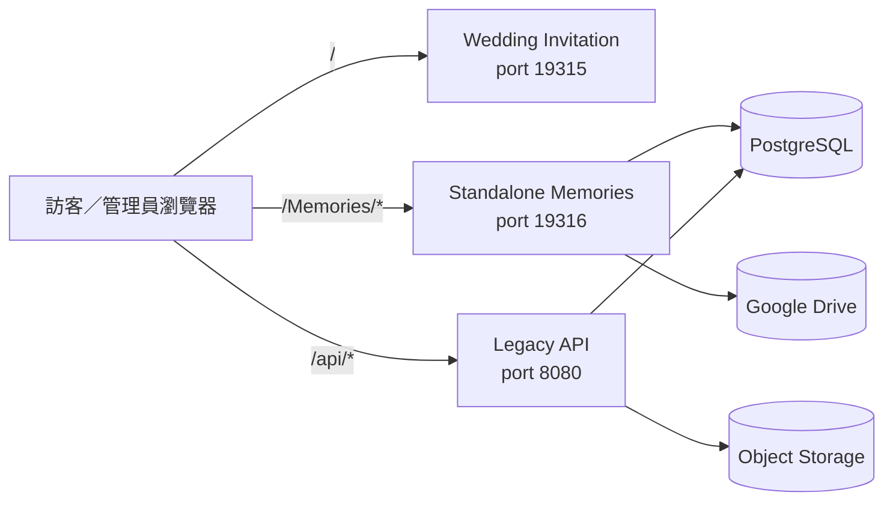

# 詠葉的婚禮

婚禮邀請網站與照片檔案館的 pnpm monorepo。

目前主要開發的是 **Standalone Memories**：部署於 `/Memories/` 的雙語婚禮相簿，包含訪客上傳、私人批次管理、Google Drive 原圖與縮圖、PostgreSQL 索引，以及管理後台。

> 文件與功能盤點日期：2026-08-01

## 從這裡開始

| 你是誰 | 建議先看 |
| --- | --- |
| 親友／賓客 | [婚禮照片網站超簡單使用說明](EASY_USER_GUIDE.md) |
| 網站管理員 | [管理員超簡單操作說明](ADMIN_GUIDE.md) |
| 開發者 | [Standalone Memories 技術文件](artifacts/memories-album/README.md) |
| 維護或重構程式的人 | [程式品質稽核與重構路線](docs/code-health-audit-2026-07.md) |

## 專案組成

| 區域 | 狀態 | 用途 |
| --- | --- | --- |
| Standalone Memories | 主要開發中 | `/Memories/` 公開相簿、上傳、私人管理、後台與獨立 API |
| Wedding Invitation | 既有網站 | 原婚禮邀請頁與舊照片牆 |
| Legacy API | 維護邊界 | 舊版 Express／Object Storage API |
| Mockup Sandbox | 開發工具 | Replit Canvas 元件預覽 |

### 應用邊界

Memories 與舊邀請網站是不同的應用：

- `/Memories/*` 由 Standalone Memories 的 Node server、PostgreSQL repositories、SQL migrations 與 Google Drive connector 負責。
- 舊照片牆使用 legacy `/api/photos*` 與 Object Storage。
- 一般 Memories 變更不應修改邀請網站或 legacy photo-wall；跨界變更由專用 CI 保護。

## Standalone Memories 功能摘要

### 公開相簿

- 繁體中文與英文介面；英文網址在 `/Memories` 後加入 `/en`。
- 相簿、流程、訪客姓名標籤及管理分頁使用**穩定身分網址**；重新排序不會改變既有網址。
- 已刪除或被隱藏而不可使用的標籤網址會被視為找不到，再導向最近的有效相簿網址。
- 點選子分類、直接開啟網址、重新整理，以及瀏覽器上一頁／下一頁，會還原選擇並定位到照片區。
- 婚禮流程可包含 YouTube、雙語文章、Drive 附件、分隔空間、1～3 張置頂照片與瀑布牆。
- 訪客相簿可獨立顯示或隱藏「最新照片」、「所有訪客」與姓名標籤；姓名順序由管理員拖曳，新名字加在最後。
- 「最新照片」標籤可設定顯示最近 30～50 張照片。
- 管理員可編輯公開網站的中英文文字；主標題支援換行。
- 公開頁面會在第一次 React render 前，一次讀取相簿、流程與公開設定。正常載入時，第一個畫面直接使用管理員已儲存的文字、輪盤模式、排序、標籤與置頂設定，不會先顯示 bundled defaults 再切換。
- 圖片使用 lazy loading；大量照片以「載入更多回憶」限制 DOM 與記憶體用量。
- 全螢幕檢視器重用已載入縮圖，並完整顯示直式與橫式照片。

### 訪客上傳與私人管理

- 每批可上傳張數由管理員設定為 **1～100 張**；預設為 **10 張**，前台會顯示目前限制。
- 每張最多 **25 MB**，支援 JPEG、PNG、WebP、HEIC 與 HEIF。
- 管理員可以自訂中英文上傳說明。
- 瀏覽器最多同時處理 3 張，並使用公平兩輪重試；提高選取上限不會讓所有照片同時傳送。
- 同檔名但內容不同的照片可以上傳；重複判斷基於內容，不基於檔名。
- 訪客不能使用保留名稱 `婚禮攝影`；前端與伺服器都會拒絕。
- 上傳完成後會產生私人管理連結：

```text
/Memories/manage/<batch-id>#token=<private-token>
```

- 上傳者可查看該批照片、更新私人連結，以及永久刪除自己的照片。
- token 放在 URL fragment；PostgreSQL 只保存 token hash。

> 永久刪除會移除原圖、縮圖、資料庫關聯與置頂引用，不能復原。

### 管理後台

管理員可以：

- 新增、編輯、排序及顯示／隱藏相簿。
- 新增、改名、排序及維護 Drive-backed 婚禮流程。
- 編輯影片、自動播放、雙語文章、附件、分隔空間與置頂照片。
- 編輯中英文網站文字及多行主標題。
- 在「訪客上傳」相簿內設定三種標籤可見性、姓名標籤順序與最新照片張數。
- 設定訪客與管理員每次可選取 **1～100 張**照片；預設分別為 10 與 30 張。
- 依相簿、流程與作者篩選照片。
- 編輯照片名稱、拍攝時間、作者、公開狀態、相簿與流程關聯。
- 在目前照片頁多選照片，批次調整分類、批次修改上傳者／作者，或永久刪除。
- 重新掃描 Drive、清理縮圖並重建背景衍生圖。
- 使用全域「儲存所有變更」保存一般 draft；失敗時保留未儲存內容。

管理畫面目前使用手動 Accordion；照片預覽每頁 10 張，桌面每列 5 張，窄畫面會自動減少欄數。作者為 `婚禮攝影` 的照片有前端與伺服器端刪除保護。

## 主要網址

| 用途 | 路徑範例 |
| --- | --- |
| 婚禮流程相簿 | `/Memories/albums/wedding` |
| 訪客相簿 | `/Memories/albums/guest` |
| 訪客最新照片 | `/Memories/albums/guest/labels/latest` |
| 訪客姓名標籤 | `/Memories/albums/guest/labels/Leon` |
| 英文訪客相簿 | `/Memories/en/albums/guest` |
| 開啟照片 | 在相簿／標籤網址後加 `/photos/:photoId` |
| 訪客上傳 | `/Memories/upload` 或 `/Memories/en/upload` |
| 私人管理 | `/Memories/manage/:batchId#token=...` |
| 管理員登入 | `/Memories/admin/login` |
| 管理後台分頁 | `/Memories/admin/general`、`albums`、`photos`、`categories` |
| 健康檢查 | `/Memories/api/health` |

`/Memories/`、`/Memories/en/`、舊的 `/groupN/subgroupN` 與 `/Memories/admin/groupN` 仍可作為遷移入口，但會改寫為穩定身分網址。完整規則見 [identity routes](artifacts/memories-album/docs/logical-routes.md)。

## 整體架構



### 公開頁面啟動流程

公開相簿不再讓各元件分別抓取相同設定。`public-bootstrap.mjs` 會在建立 React root 前平行讀取：

1. `/Memories/api/albums`
2. `/Memories/api/settings`
3. `/Memories/api/processes`

完成正規化後，同一份 snapshot 會提供給標題文字、相簿、流程選擇器、訪客標籤、媒體順序、置頂圖片及訪客上傳分類。若個別 endpoint 暫時失敗，成功取得的資源仍保留，失敗的部分才使用安全 fallback；不會先 render 預設內容再二次改畫面。

## Repository 結構

| 路徑 | 套件／內容 | 用途 |
| --- | --- | --- |
| `artifacts/wedding-invitation` | `@workspace/wedding-invitation` | 原婚禮邀請網站與舊照片牆 |
| `artifacts/memories-album` | `@workspace/memories-album` | Standalone Memories 前後端、migration 與測試 |
| `artifacts/api-server` | `@workspace/api-server` | legacy Express API 與 Object Storage 路由 |
| `artifacts/mockup-sandbox` | `@workspace/mockup-sandbox` | Replit Canvas 元件預覽 |
| `lib/api-spec` | `@workspace/api-spec` | OpenAPI 規格與 Orval 設定 |
| `lib/api-zod` | `@workspace/api-zod` | legacy API 使用的 Zod 產物 |
| `lib/db` | `@workspace/db` | legacy API 的 Drizzle／PostgreSQL 層 |
| `scripts` | `@workspace/scripts` | workspace build、安全檢查與邊界工具 |
| `docs` | 技術文件 | 架構、Drive、部署、安全與重構文件 |

## 資料與安全責任

| 資料 | 主要保存位置 |
| --- | --- |
| 原圖 | Google Drive |
| WebP 縮圖 | Google Drive `系統縮圖` |
| 公開狀態、相簿／流程關聯、時間與作者 | PostgreSQL |
| 編號流程名稱與排序 | Google Drive 資料夾，鏡像至 PostgreSQL |
| 影片、文章與附件 metadata | PostgreSQL；附件 bytes 在 Drive |
| 上傳批次、token hash、內容雜湊與續傳狀態 | PostgreSQL |
| UI、網站文字、排序、標籤、置頂圖與上傳模式 | PostgreSQL `memories_app_settings` |
| 管理密碼 | Replit Secret `MEMORIES_ADMIN_TOKEN` |
| 管理 session | 30 分鐘 HMAC-signed HttpOnly cookie |

Drive ID、folder ID、connector 回應、密碼與原始私人 token 不會傳給公開前端。

## 本機開發

需求：Node.js 24、pnpm 10。

```bash
pnpm install
pnpm run typecheck
pnpm run build
```

啟動各 artifact：

```bash
pnpm --filter @workspace/wedding-invitation dev
pnpm --filter @workspace/memories-album dev
pnpm --filter @workspace/api-server dev
pnpm --filter @workspace/mockup-sandbox dev
```

Memories 常用命令：

```bash
pnpm --filter @workspace/memories-album test
pnpm --filter @workspace/memories-album build
pnpm --filter @workspace/memories-album start
pnpm --filter @workspace/memories-album db:migrate
pnpm --filter @workspace/memories-album test:drive-live
```

`test:drive-live` 只能在已連接 Replit Google Drive Integration，並指定安全測試資料夾的環境執行。

## Production 設定

必要設定：

```text
DATABASE_URL
MEMORIES_DRIVE_PHOTOS_FOLDER_ID
MEMORIES_ADMIN_TOKEN
```

Published App 也必須連接 Replit Google Drive Integration。

<details>
<summary>常用選填設定</summary>

```text
MEMORIES_DRIVE_SYNC_INTERVAL_MS=300000
MEMORIES_THUMBNAIL_BATCH_SIZE=12
MEMORIES_THUMBNAIL_MAX_PER_RUN=240
MEMORIES_DRIVE_THUMBNAILS_FOLDER_ID=
MEMORIES_TRUST_PROXY=1
MEMORIES_SKIP_MIGRATIONS=1
```

</details>

Secret、Drive folder ID、OAuth 憑證與私人 token 不得提交到 GitHub、`.replit` 或前端 bundle。

## Migration 與發布安全

Memories 使用 `artifacts/memories-album/db` 內不可變的編號 SQL；目前序號到 `013_drive_resumable_upload.sql`。

Migration runner 會保存 checksum、使用 PostgreSQL advisory lock，並只套用尚未記錄的 migration。Migration 成功後 production listener 才會啟動。

**不得使用 `drizzle-kit push` 管理 Memories tables。**

若 Replit Publish 提議 `DROP TABLE`、`DROP COLUMN` 或移除既有 constraint，請取消 deployment，先確認 migrations，再重新產生 Publish plan。不得以 development data 覆蓋 production。

## 測試與 CI

Standalone Memories CI 目前包含：

1. Node test runner 全套測試，包括 public bootstrap 的 partial-failure、單次載入與訪客標籤行為保存測試。
2. 完整 Vite transform chain 的最終程式結構檢查。
3. Vite production build 與 server bundle。
4. 啟動 `dist/server.mjs` 並檢查 `/Memories/api/health`。
5. Memories／legacy 邊界檢查。

CI 尚未以 Playwright 或其他真實瀏覽器執行完整 React render。涉及 build-time transforms 的變更，仍應檢查最終輸出與實際瀏覽器畫面。

### 變更後結構整理原則

完成並驗證功能變更後，才可另外進行小範圍、行為不變的結構整理。這個 pass 應由既有測試與新增的 preservation tests 保護，只針對剛完成的功能移除重複決策、集中共同規則；不應藉機做 repository-wide cleanup。

## 已知限制

- 目前刪除為立即永久刪除，沒有七天垃圾桶或復原流程。
- 直接從 Drive 刪除原圖不會完成網站資料清理；請使用管理後台或私人管理頁。
- 人物分類與自拍找照片仍是後續功能。
- 仍需更多 iOS Safari、Android Chrome、LINE／Instagram 內建瀏覽器及慢速網路實機驗收。
- 多個 Vite pre-transform 仍以 exact-string replacement 修改 React source，是目前最大的維護風險；公開資料載入與訪客標籤決策已集中到共享純函式，但仍需逐步把相容 transform 搬回正式元件。
- 管理員上傳後的分類仍由前端追加 PATCH，尚未整合成伺服器端原子 command。

## 文件索引

- [親友／賓客使用說明](EASY_USER_GUIDE.md)
- [管理員操作說明](ADMIN_GUIDE.md)
- [Standalone Memories 技術文件](artifacts/memories-album/README.md)
- [穩定身分網址規格](artifacts/memories-album/docs/logical-routes.md)
- [架構邊界](docs/memories/architecture-boundary.md)
- [Google Drive 儲存](docs/memories/storage-drive.md)
- [Drive 流程同步](docs/memories/drive-process-sync.md)
- [Legacy 保護規則](docs/memories/legacy-protection.md)
- [程式品質稽核與重構路線](docs/code-health-audit-2026-07.md)

---

願這個專案留下我們婚禮的每一段回憶，也記錄親友與同工的幫助與祝福。