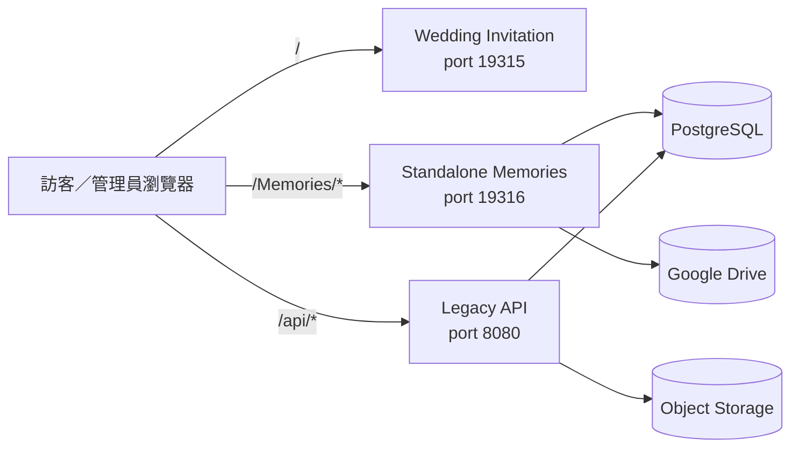

# 詠葉的婚禮

這是一個 pnpm monorepo，包含婚禮邀請網站、獨立婚禮照片檔案館、舊版照片 API，以及 Replit Canvas 預覽工具。

目前持續開發的核心是 **Standalone Memories**：一套在 `/Memories/` 運作的婚禮相簿，包含訪客上傳、Google Drive 原圖與縮圖、PostgreSQL 索引、私人批次管理，以及完整管理後台。

> 最後架構盤點：2026-07-31  
> 程式品質與重構建議：[`docs/code-health-audit-2026-07.md`](docs/code-health-audit-2026-07.md)

## 專案組成

| 路徑 | 套件 | 用途 |
| --- | --- | --- |
| `artifacts/wedding-invitation` | `@workspace/wedding-invitation` | 原婚禮邀請網站與舊照片牆 |
| `artifacts/memories-album` | `@workspace/memories-album` | `/Memories/` 照片檔案館、上傳、私人管理、後台與獨立 API |
| `artifacts/api-server` | `@workspace/api-server` | 舊版 Express API 與 Object Storage 路由 |
| `artifacts/mockup-sandbox` | `@workspace/mockup-sandbox` | Replit Canvas 元件預覽；由 `.replit` 動態使用，不是死亡代碼 |
| `lib/api-spec` | `@workspace/api-spec` | OpenAPI 規格與 Orval 設定 |
| `lib/api-zod` | `@workspace/api-zod` | 舊 API 使用的 Zod 產物 |
| `lib/db` | `@workspace/db` | 舊 API 的 Drizzle/PostgreSQL 層 |
| `scripts` | `@workspace/scripts` | workspace 工具與安全檢查 |

已移除沒有任何 runtime 消費者的 `lib/api-client-react`。目前 Orval 只生成真正被 API server 使用的 Zod schema。

## 整體架構



邀請網站與 Memories 仍是兩個不同邊界：

- 舊照片牆使用 legacy API／Object Storage。
- Memories 使用自己的 Node server、SQL migrations、PostgreSQL repositories 與 Google Drive connector。
- Memories PR 預設不得修改 legacy invitation、legacy `/api/photos*` 或 Object Storage photo-wall 路徑。

## Memories 主要路由

| 路由 | 功能 |
| --- | --- |
| `/Memories/` | 公開婚禮相簿 |
| `/Memories/api/health` | 不初始化完整 runtime 的健康檢查 |
| `/Memories/api/albums` | 公開相簿設定 |
| `/Memories/api/processes` | 公開婚禮流程、影片與文章設定 |
| `/Memories/api/photos*` | 公開照片清單、縮圖與原圖串流 |
| `/Memories/api/upload-batches*` | 訪客批次及逐張照片上傳 |
| `/Memories/manage/:batchId#token=...` | 上傳者私人批次管理與永久刪除 |
| `/Memories/admin/login` | 管理員登入 |
| `/Memories/admin/` | 管理後台 |
| `/Memories/admin/api/*` | 管理員 session、相簿、照片、流程、文章與設定 API |
| `/admin*` | 舊路徑相容轉址 |

## Memories 現有功能

### 公開相簿

- 婚禮流程、訪客上傳、生活照及自訂相簿。
- 傳統按鈕或管理員可選的輪盤式流程選擇器。
- 每個相簿可設定隨機、時間、照片名稱或作者正反排序。
- 流程可包含 YouTube、雙語 Tiptap 文章、Drive 附件、置頂照片與一般瀑布牆。
- 流程媒體順序可由後台調整。
- 圖片使用 IntersectionObserver lazy loading；未接近視窗前不設定真正的 `src`。
- 仍保留「載入更多回憶」作為 DOM／記憶體分批界線。
- Lightbox 支援原圖、上一張／下一張及縮放。

### 訪客上傳

- 一批最多 **10 張**，每張最多 25 MB。
- 支援 JPEG、PNG、WebP、HEIC 與 HEIF。
- 管理員可開關訪客分類選擇；開啟時可選訪客相簿、生活照或婚禮流程。
- 瀏覽器最多同時處理 3 張。
- 公平兩輪排程：第一輪每張最多嘗試 2 次，暫時性失敗先讓出 worker；全部照片走過後才回頭再試。
- 同一自動流程對持續暫時性失敗照片最多 4 次瀏覽器請求。
- 離線等待不消耗重試次數。
- `clientUploadId`、內容雜湊與 durable state 避免重試建立重複檔案。
- 同檔名、不同內容可以正常上傳；重複判斷基於檔案內容，不基於檔名。

### Google Drive 原圖上傳

原圖先建立 Drive resumable session。管理員可在通用設定切換：

- `single`：預設，以同一 resumable session 傳送完整檔案。
- `chunked`：以 4 MiB 分段，保存 session URI 與已接受 byte offset。

無論模式為何，穩定識別碼、Drive session 查詢與 deterministic filename 都用來安全恢復中斷。縮圖由背景服務補建，不阻塞原圖成功回報。

### 私人批次管理

上傳完成後產生：

```text
/Memories/manage/<batch-id>#token=<private-token>
```

- token 保留在 URL fragment，不進入 server access log。
- PostgreSQL 只保存 token hash。
- 上傳者可查看該批照片、永久刪除自己的照片及更新私人連結。
- 永久刪除會移除 Drive 原圖、縮圖、資料庫關聯與置頂引用，無垃圾桶可復原。

### 管理後台

管理員可：

- 新增與編輯相簿。
- 設定相簿顯示、摘要及照片排序方式。
- 新增、改名、排序及維護 Drive-backed 婚禮流程。
- 設定流程影片、自動播放、雙語文章、附件、分隔線與 1～3 張置頂圖。
- 以相簿、流程及作者組合篩選照片。
- 使用與訪客端共用的可靠批次流程，一次上傳最多 30 張管理員照片。
- 編輯名稱、拍攝時間、作者、公開狀態、相簿與流程。
- 永久刪除同一底層照片在所有相簿／流程中的紀錄與檔案。
- 對相簿或流程執行縮圖清理、Drive 重新掃描與背景重建。
- 透過全域「儲存所有變更」保存 JSON 編輯並保留失敗 draft。

婚禮攝影作者的照片有前後端刪除保護。

## 資料責任

| 資料 | 主要來源／保存位置 |
| --- | --- |
| 原圖 | Google Drive |
| WebP 縮圖 | Google Drive `系統縮圖` |
| 公開狀態、相簿、流程關聯、時間、作者 | PostgreSQL |
| 編號流程名稱與排序 | Google Drive 資料夾，鏡像至 PostgreSQL |
| 影片、文章、附件 metadata | PostgreSQL；附件 bytes 在 Drive |
| 上傳批次、token hash、內容雜湊、續傳狀態 | PostgreSQL |
| UI、排序、置頂圖及上傳模式設定 | PostgreSQL `memories_app_settings` |
| 管理密碼 | Replit Secret `MEMORIES_ADMIN_TOKEN` |
| 管理 session | 30 分鐘 HttpOnly cookie |

Drive ID、folder ID、connector 回應、密碼及原始私人 token 不傳給公開前端。

## 開發

需求：Node.js 24、pnpm 10.x。

```bash
pnpm install
pnpm run typecheck
pnpm run build
```

單獨啟動：

```bash
pnpm --filter @workspace/wedding-invitation dev
pnpm --filter @workspace/memories-album dev
pnpm --filter @workspace/api-server dev
pnpm --filter @workspace/mockup-sandbox dev
```

Memories：

```bash
pnpm --filter @workspace/memories-album test
pnpm --filter @workspace/memories-album build
pnpm --filter @workspace/memories-album start
pnpm --filter @workspace/memories-album db:migrate
pnpm --filter @workspace/memories-album test:drive-live
```

`test:drive-live` 只能在已連接 Google Drive Integration，且使用安全測試資料夾的環境執行。

## Production 設定

必要：

```text
DATABASE_URL
MEMORIES_DRIVE_PHOTOS_FOLDER_ID
MEMORIES_ADMIN_TOKEN
```

Published App 也必須連接 Replit Google Drive Integration。

常用選填：

```text
MEMORIES_DRIVE_SYNC_INTERVAL_MS=300000
MEMORIES_THUMBNAIL_BATCH_SIZE=12
MEMORIES_THUMBNAIL_MAX_PER_RUN=240
MEMORIES_DRIVE_THUMBNAILS_FOLDER_ID=
MEMORIES_TRUST_PROXY=1
MEMORIES_SKIP_MIGRATIONS=1
```

Secret、Drive folder ID、OAuth 憑證與私人 token 不得提交至 GitHub、`.replit` 或前端 bundle。

## Migration 安全

Memories 使用 `artifacts/memories-album/db` 內不可變的編號 SQL；目前序號已到 `013_drive_resumable_upload.sql`。

Runner 會：

- 依檔名排序，只套用尚未記錄的 migration。
- 保存 SHA-256 checksum，拒絕修改已套用檔案。
- 使用 PostgreSQL advisory lock。
- migration 成功後才啟動 production listener。

**不得使用 `drizzle-kit push` 管理 Memories tables。**

若 Replit Publish 提議 `DROP TABLE`、`DROP COLUMN` 或刪除既有 constraint：

1. 取消 deployment。
2. 對 development 執行 tracked migrations。
3. 重新產生 Publish plan。
4. 不得用 development data 覆蓋 production。

本次 repo 清理沒有資料庫 schema 變更、沒有 migration，也沒有任何 DROP。

## CI

Standalone Memories PR 應通過：

1. Node test runner 全套測試。
2. Vite production build。
3. `dist/server.mjs` 啟動與 `/Memories/api/health` smoke test。
4. Memories legacy boundary。

跨 legacy 邊界的 repo-wide 變更必須由 owner 明確審核並加上 `owner-approved-legacy-change`。

## 已知限制

- 尚未提供七天垃圾桶、復原與到期清除；目前刪除為立即永久刪除。
- 手動從 Drive 刪除原圖，不等於完整刪除網站資料；請使用管理後台或私人管理頁。
- 人物分類與自拍找照片仍屬 Phase 2。
- 尚需更多 iOS Safari、Android Chrome、Instagram／LINE 內建瀏覽器與慢速網路實機驗收。
- Memories 的 build-time 字串 transform 是目前最大的維護風險；重構路線見 code-health audit。

---

願這個專案留下我們婚禮的每一段回憶，也記錄親友與同工的幫助與祝福。
