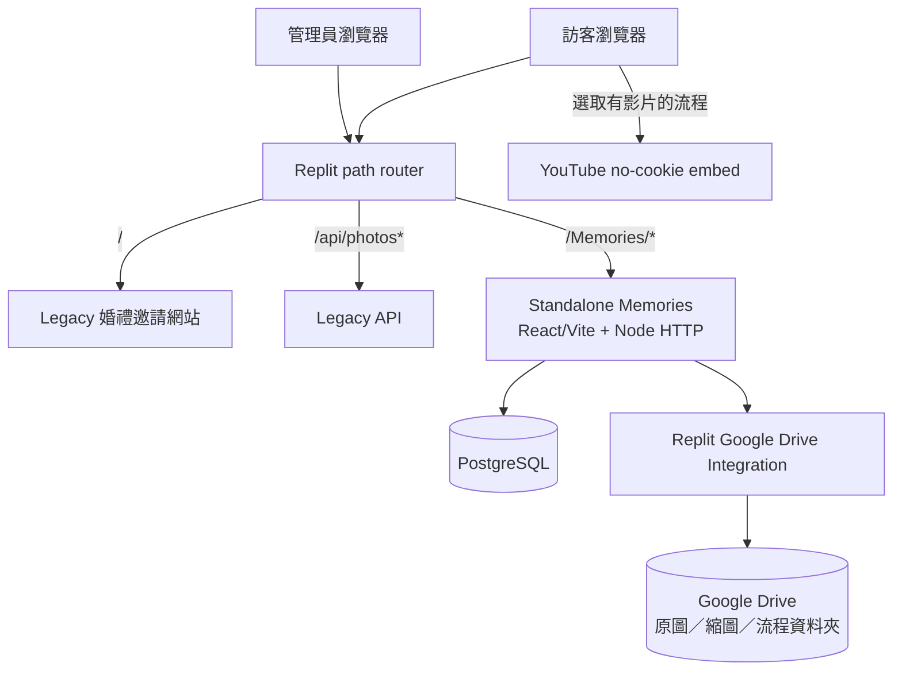
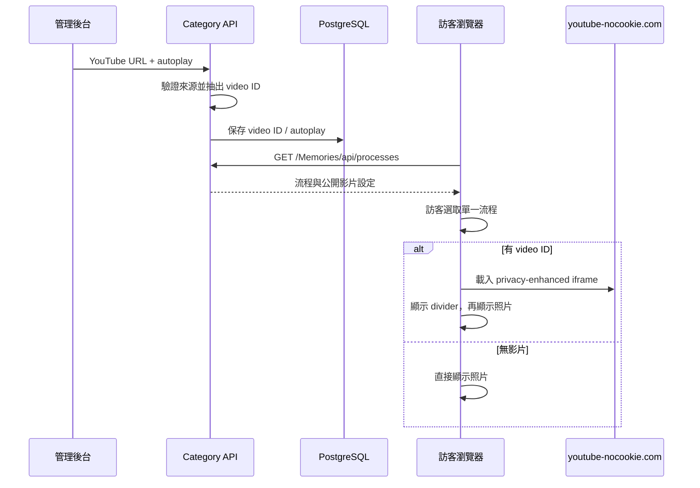
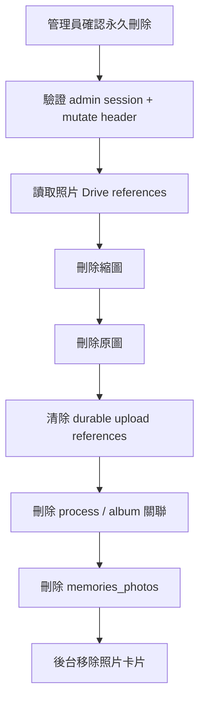

# 詠葉的婚禮

這是 **黃律詠與葉藝慧** 的婚禮專案。Repository 同時保存原有婚禮邀請網站，以及獨立部署、獨立儲存、獨立 API 的 **Memories 婚禮照片檔案館**。

> 文件基準：2026-07-30 的 `main`。Memories 正式路徑是 `/Memories/`，管理後台是 `/Memories/admin/`，管理密碼的 Replit Secret 名稱是 `MEMORIES_ADMIN_TOKEN`。

## 婚禮資訊

- 日期：2026 年 6 月 20 日
- 地點：德光長老教會
- 形式：結婚感恩禮拜

## 最重要的專案邊界

Repository 內有兩套彼此隔離的照片系統：

1. 原有婚禮邀請網站與 legacy 相片牆。
2. 新的 standalone Memories 相簿。

除非 repo owner 明確核准，Memories 開發不得修改、匯入或共用 legacy 邀請網站的相片 API、Object Storage 或前端程式。`artifacts/wedding-invitation/**` 與 legacy `/api/photos*` 是受 CI 保護的邊界。

## Repository 結構

| 路徑 | 用途 | 維護規則 |
| --- | --- | --- |
| `artifacts/wedding-invitation` | 原有婚禮邀請網站與 legacy 相片牆 | Memories 工作不得修改 |
| `artifacts/api-server` | 原有網站 API，包含 legacy `/api/photos*` | 不可被 Memories 共用或改寫 |
| `artifacts/memories-album` | React + Vite、Node HTTP API、PostgreSQL 與 Google Drive | Memories 主要程式碼 |
| `artifacts/mockup-sandbox` | 元件與版面預覽 | 不屬於正式 runtime |
| `docs/memories` | 架構、Drive、migration、部署與故障排除 | 必須與程式一致 |
| `.agents/memory` | 專案 agent 長期規則與已確認事實 | 核心架構變更時同步更新 |
| `.github/workflows` | Memories CI 與 legacy 邊界檢查 | PR 必須通過 |

## 正式路徑

| 路徑 | 用途 |
| --- | --- |
| `/` | 原有婚禮邀請網站 |
| `/Memories/` | 公開婚禮照片檔案館 |
| `/memories/...` | 小寫相容路徑，轉址到 `/Memories/...` |
| `/Memories/api/health` | 獨立健康檢查；不初始化完整 Drive runtime |
| `/Memories/api/photos` | 公開照片清單與 cursor API |
| `/Memories/api/photos/:id/thumbnail` | 受控縮圖串流與修復 |
| `/Memories/api/photos/:id/media` | 受控原圖串流 |
| `/Memories/api/processes` | 婚禮流程、順序與公開影片設定 |
| `/Memories/api/upload-batches` | 建立訪客上傳批次 |
| `/Memories/api/upload-batches/:id/photos` | 每次上傳一張照片 |
| `/Memories/manage/:batchId` | 私人批次管理預留路徑；功能尚未完成 |
| `/Memories/admin/login` | 管理員登入 |
| `/Memories/admin/` | 管理後台 |
| `/Memories/admin/api/changes` | 管理端全域 patch-style 儲存 |
| `/Memories/admin/api/photos/:id` `DELETE` | 永久刪除單張照片 |
| `/Memories/admin/api/*` | session、相簿、照片、分類與影片 API |
| `/admin...` | 舊路徑相容 redirect，不是正式路徑 |

Replit path router 將 `/Memories/admin`、`/Memories`、小寫相容路徑與舊 `/admin` alias 交給 `artifacts/memories-album` 的 19316 服務；healthcheck 使用 `/Memories/api/health`。

## 目前已實作功能

### 公開照片牆

- 手機優先照片牆與全螢幕 lightbox。
- 依 PostgreSQL `created_at ASC, id ASC` 由早到晚排序。
- Drive 匯入時間優先順序：拍攝時間 → Drive 建立時間 → Drive 修改時間。
- 顯示順序由左至右、由上而下。
- 細格 CSS Grid 搭配卡片自然高度計算 row span，盡量填補空缺且不裁切照片。
- iPhone／Safari 重新排版不再先清空全部 row span；只有寬度變化才全體重排，並保留可見照片錨點。
- 上方重複四格導覽已隱藏；主要相簿切換保留於固定底部導覽。
- 切換相簿或流程後自動捲到照片牆起點。
- 標題約 3.5 秒內連點五次會檢查管理員 session。
- 繁體中文與英文介面。

### 訪客姓名子分類

「訪客上傳」相簿不需要管理員手工建立子分類。前端會依公開照片中的 `uploaderName` 自動產生：

```text
全部訪客 (總張數)
小安 (12)
阿慧 (7)
```

姓名會先做 Unicode NFKC 與空白正規化；相同姓名合併計數。點擊姓名只顯示該訪客上傳的照片。

### 訪客上傳

- 姓名必填。
- 訪客介面不再提供婚禮流程或生活照分類選擇；上傳後依姓名自動分組。
- 每批最多 30 張，每張最多 25 MB。
- 支援 JPEG、PNG、WebP、HEIC、HEIF。
- 前端逐張上傳，顯示單張與整體進度，可暫停並續傳未完成照片。
- 每張使用穩定 client upload ID；重試不會重複建立 Drive 檔案。
- `memories_upload_items` durable lease 防止同一張照片同時重複處理。
- `sharp` 驗證、方向正規化、移除 metadata、產生 WebP 縮圖。
- Drive 429／5xx 使用有上限的 exponential backoff。
- 批次回傳私人 management token；資料庫只保存 hash，原始 token 放在 URL fragment。

### 流程 YouTube 影片

- 每個婚禮流程可在管理後台設定一個 YouTube 網址。
- 伺服器只保存驗證後的 11 字元 video ID 與 autoplay boolean。
- 支援一般 watch、`youtu.be`、embed、Shorts 與 live URL。
- 前端只有在訪客選取該流程、且流程有影片時才顯示 iframe。
- 影片置於照片集第一個位置；沒有影片時不產生空容器。
- 手機為完整一行、16:9、置中；影片後立即接 divider，再接照片牆，不保留額外 padding。
- 使用 `youtube-nocookie.com` privacy-enhanced embed。
- 自動播放選項會加入 `autoplay=1&mute=1&playsinline=1`，以符合多數手機瀏覽器政策；瀏覽器仍可自行阻止 autoplay。
- CSP 的 `frame-src` 只允許 `https://www.youtube-nocookie.com`。

### 管理後台

- 使用 `MEMORIES_ADMIN_TOKEN` 登入。
- 密碼只透過登入 POST 的 Bearer header 傳送，不保存於 browser storage。
- 登入成功取得 30 分鐘、HMAC 簽章的 `HttpOnly; Secure; SameSite=Strict` cookie，path 限定 `/Memories/admin`。
- 登入失敗限制保存於 PostgreSQL，可跨 Replit Autoscale instance 共用。
- 可新增及編輯相簿。
- 可新增、改名及排序 Google Drive 流程分類。
- 可替每個流程設定／清除 YouTube 影片與靜音自動播放。
- 可上傳單張正式照片。
- 可編輯照片顯示名稱、拍攝時間、公開狀態、相簿與流程分類。
- 管理員覆寫拍攝時間／相簿歸屬會留下 override flag，Drive reconciliation 不會覆蓋。
- 跨分頁編輯先保存為 React draft，最後按一次「儲存所有變更」。
- `PATCH /Memories/admin/api/changes` 只傳送真正有變動的欄位。
- 每個 operation 有獨立結果；成功草稿移除，失敗草稿保留供重試。
- 新照片是 multipart binary，在 JSON change batch 後個別上傳。
- 離開、重新整理或登出前會保護尚未儲存的變更。

### 永久刪除照片

管理員照片卡片提供紅色垃圾桶按鈕。確認後：

1. 刪除 Google Drive WebP 縮圖。
2. 刪除 Google Drive 原圖。
3. 清除 durable upload item 對照片與 Drive file 的引用。
4. 刪除照片的流程與相簿關聯。
5. 刪除 `memories_photos` 資料列。

此操作立即生效、不可復原。Drive 回傳 404 代表檔案本來就不存在，仍可繼續清資料庫；其他 Drive 錯誤會停止資料庫刪除，讓管理員修復後重試。

目前仍未提供批次刪除、相簿刪除、分類刪除、七天垃圾桶、復原與到期清除。

## 系統總覽



## 訪客分類邏輯鏈

```mermaid
flowchart LR
  Upload[訪客填寫姓名並上傳]
  DB[(memories_photos.uploader_name)]
  Read[公開照片 API]
  Normalize[NFKC + 合併空白]
  Group[依姓名分組並計數]
  Chips[姓名 (張數)]
  Filter[只顯示該姓名照片]

  Upload --> DB --> Read --> Normalize --> Group --> Chips --> Filter
```

## 流程影片邏輯鏈



## 永久刪除邏輯鏈



## Google Drive 與 PostgreSQL 責任

| 資料 | 主要來源／保存位置 | 說明 |
| --- | --- | --- |
| 原圖 | Google Drive | 官方照片在流程、未分類或生活照；訪客原圖在 `訪客上傳` |
| WebP 縮圖 | Google Drive `系統縮圖` | 公開照片牆優先讀取 |
| 公開／隱藏狀態 | PostgreSQL | 公開 API 只查 `visibility = public` |
| 排序時間 | PostgreSQL `memories_photos.created_at` | 可由管理員覆寫 |
| 訪客姓名分組 | PostgreSQL `uploader_name`，前端衍生 | 不建立 Drive 子資料夾 |
| 流程名稱與順序 | 編號 Google Drive 資料夾，鏡像至 PostgreSQL | Drive folder ID 不傳給瀏覽器 |
| 流程 YouTube 設定 | PostgreSQL `memories_processes` | Drive reconciliation 不覆蓋 |
| 系統／自訂相簿 | PostgreSQL | 系統相簿為 wedding、guest、life |
| 上傳批次與 token hash | PostgreSQL | 原始 token 不保存明文 |
| durable upload state | PostgreSQL | 防止重試建立重複檔案 |
| 管理密碼 | Replit Production Secret | `MEMORIES_ADMIN_TOKEN` |
| 管理 session | HttpOnly cookie | 30 分鐘，path `/Memories/admin` |

## Drive reconciliation

- `01 名稱`、`02 名稱` 等編號資料夾是婚禮流程名稱與順序主要來源。
- 後台新增、改名、排序分類時先操作 Drive，再更新 PostgreSQL。
- 正式照片改流程時會 move 原始 Drive 檔，不會複製。
- 訪客原圖固定保留在 `訪客上傳`。
- Drive 中消失的流程資料夾會在資料庫停用。
- 流程 YouTube 設定由 PostgreSQL 擁有，Drive 同步不會覆蓋。
- 目前 Drive reconciliation 不會自動將手動刪除的照片紀錄改成 hidden／trashed。

因此，手動從 Drive 刪檔不等於完整網站刪除；請使用管理後台永久刪除。

## PostgreSQL migrations

Migration 來源是 `artifacts/memories-album/db/001_...sql` 至 `010_...sql`，不是 Drizzle schema push。

Migration 010 新增：

```text
memories_processes.youtube_video_id
memories_processes.youtube_autoplay
```

Runner 規則：

- 依檔名排序，只套用尚未記錄的 SQL。
- 已套用 migration checksum 若改變，啟動失敗；已發布 migration 不可修改。
- 使用 PostgreSQL advisory lock，避免多 instance 同時套用。
- Production server 在 migration 成功後才 listen。
- Replit `postMerge` 對 development 執行同一套 `db:migrate`。
- **不得使用 `drizzle-kit push` 管理 Memories tables。**

若 Replit 預覽出現破壞性 `DROP TABLE`／`DROP COLUMN`：取消 deployment、對 development 執行 tracked migration，再重新 Publish；不要用 development data 覆蓋 production。

## 必要 Production 設定

```text
DATABASE_URL
MEMORIES_DRIVE_PHOTOS_FOLDER_ID
MEMORIES_ADMIN_TOKEN
```

Published App 亦必須連接 Replit Google Drive Integration。

選填：

```text
MEMORIES_DRIVE_SYNC_INTERVAL_MS=300000
MEMORIES_THUMBNAIL_BATCH_SIZE=12
MEMORIES_THUMBNAIL_MAX_PER_RUN=240
MEMORIES_DRIVE_THUMBNAILS_FOLDER_ID=
MEMORIES_TRUST_PROXY=1
MEMORIES_SKIP_MIGRATIONS=1
```

Secret、真實 Drive folder ID、管理密碼與 OAuth 憑證不得提交到 GitHub、`.replit` 或前端 bundle。

## 開發與驗證

需求：Node.js 24、pnpm 10.x。

```bash
pnpm install
pnpm --filter @workspace/memories-album dev
pnpm --filter @workspace/memories-album test
pnpm --filter @workspace/memories-album build
pnpm --filter @workspace/memories-album start
pnpm --filter @workspace/memories-album db:migrate
pnpm --filter @workspace/memories-album test:drive-live
```

每個 Memories PR 應通過：

1. Node test runner 全套測試。
2. Vite production build。
3. 啟動 `dist/server.mjs` 並確認 `/Memories/api/health`。
4. Memories legacy boundary workflow。

`test:drive-live` 只可在已連接 Google Drive Integration、並使用安全測試資料夾的 Replit 環境執行。

## 常見錯誤

| 現象／代碼 | 意思 | 處理方式 |
| --- | --- | --- |
| `ADMIN_TOKEN_NOT_CONFIGURED` | Published App 沒讀到 `MEMORIES_ADMIN_TOKEN` | 檢查 Secret 精確名稱並重新 Publish |
| `ADMIN_RATE_LIMIT_UNAVAILABLE` | PostgreSQL 限流表／連線失敗 | 檢查 DB 與 migration 009 |
| `INVALID_YOUTUBE_URL` | 後台輸入不是支援的 YouTube URL／ID | 改用 watch、youtu.be、embed、Shorts 或 live URL |
| `DRIVE_AUTHORIZATION_REQUIRED` | Connector 收到 401／403 | 重連 Integration 並確認資料夾權限 |
| `DRIVE_RETRYABLE` | Drive／Connector 429 或 5xx | 稍後重試並檢查 timeout／頻率 |
| Drive 刪除後網站仍顯示 | PostgreSQL public row、縮圖或 cache 還在 | 使用管理後台永久刪除 |
| YouTube iframe 不顯示 | video ID 無效、CSP 舊部署或平台阻擋 | 重新 Publish 最新版本並檢查瀏覽器 Console |

## 尚未完成／已知限制

- `/Memories/manage/:batchId` 私人批次管理與撤回 UI／API。
- 管理後台批次刪除、相簿刪除、分類刪除。
- 七天垃圾桶、復原與到期清除。
- 手動從 Drive 刪除圖片後自動停用 PostgreSQL 照片紀錄。
- 初次 runtime 初始化失敗後免重啟恢復。
- 真正按需的 server cursor 分頁；部分前端仍會預取多頁。
- iOS Safari、Android Chrome、Instagram／LINE 內建瀏覽器與慢速網路的完整實機驗收。
- 人物分類與自拍找照片屬於 Phase 2。

---

願這個專案留下我們婚禮的每一段回憶，也記錄親友與同工的幫助與祝福。
