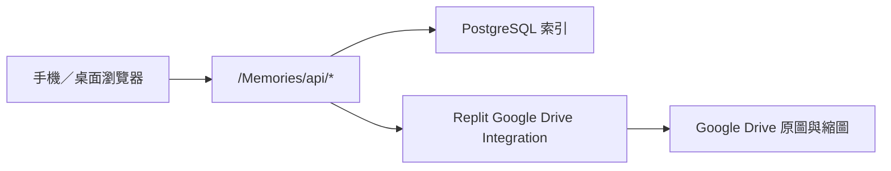

# 詠葉的婚禮

這是 **黃律詠與葉藝慧** 的婚禮專案，包含原有婚禮邀請網站、婚禮資料與獨立的 **Memories 婚禮相簿**。

## 婚禮資訊

- 日期：2026 年 6 月 20 日
- 地點：德光長老教會
- 形式：結婚感恩禮拜

## 專案結構

| 路徑                           | 用途                                     | 狀態                          |
| ------------------------------ | ---------------------------------------- | ----------------------------- |
| `artifacts/wedding-invitation` | 原有婚禮邀請網站與相片牆                 | Legacy；Memories 開發不得修改 |
| `artifacts/memories-album`     | 獨立 React + Vite 婚禮相簿與 Node API    | 開發中；公開路徑 `/Memories/` |
| `artifacts/api-server`         | 原有網站 API，包含 legacy `/api/photos*` | Memories 不得共用或改寫       |
| `docs/memories`                | Memories 架構、Drive、部署與視覺規格     | 維護文件                      |
| `.github/workflows`            | Memories CI 與 legacy 邊界檢查           | 已啟用                        |

## Memories 目前功能

已進入 `main`：

- 手機優先的瀑布流相簿與全螢幕檢視器
- 婚禮流程、訪客上傳、生活照三個系統相簿與自訂相簿
- 固定底部導覽與醒目的中央上傳按鈕
- Google Drive 流程資料夾與網站流程同步
- 訪客姓名必填、多照片逐張上傳、進度、暫停及安全重試
- WebP 縮圖、原圖受控串流與拍攝／建立時間排序
- PostgreSQL 照片、流程、批次與上傳狀態索引
- 獨立 `/admin` 管理後台，可新增／編輯相簿、照片與 Drive 流程分類
- `SECRET_TOKEN` 登入交換短效 HttpOnly session cookie，失敗限流由 PostgreSQL 跨 Autoscale instance 共用；訪客頁不含管理控制
- 繁體中文／英文介面

Phase 1 尚未完成：

- 私人批次管理頁與訪客撤回（Issue #5）
- 相簿關閉與完整管理稽核（Issue #6）
- 七天垃圾桶、復原及到期清除（Issue #7）
- 手機 overlay、safe area、焦點與小螢幕 lightbox 修正（Issue #48）
- Drive／資料庫暫時失敗後免重啟恢復（Issue #49）
- 真正的 server cursor 分頁與響應式圖片（Issue #50）
- 統一其餘跨元件 React state（Issue #51；舊管理 DOM 橋接已移除）
- 手機實機、視覺比對與正式上線驗收（Issues #13、#26）

人物分類與自拍找照片屬於 Phase 2，目前仍為 `即將推出`，統一追蹤於 Issue #24。

## Memories 架構



- Google Drive 保存原圖與技術縮圖；PostgreSQL 保存可查詢的網站索引。
- 瀏覽器只接觸網站 opaque ID 與受控媒體端點，不會收到 Drive file ID、資料夾 ID 或 Google 憑證。
- Drive 存取使用 `@replit/connectors-sdk` 與 Replit Google Drive Integration；不要加入 service-account JSON、OAuth client secret 或手動 refresh token。
- Google Drive 編號資料夾是婚禮流程名稱與順序的來源。
- `訪客上傳`、`生活照`、`系統縮圖` 與 `00 未分類` 由服務在相簿根目錄下發現或建立。
- Memories 與原有婚禮邀請網站、legacy Object Storage 相片牆保持隔離。

## 本機開發

需求：Node.js 24、pnpm。

```bash
pnpm install
pnpm --filter @workspace/memories-album dev
```

常用檢查：

```bash
pnpm --filter @workspace/memories-album test
pnpm --filter @workspace/memories-album build
pnpm --filter @workspace/memories-album db:migrate
```

2026-07-29 管理後台重建：standalone Memories 測試為 118/118 通過，production build 成功。管理員調整的拍攝時間與相簿歸屬會保留，不會被後續 Drive 同步覆寫。正式 Drive smoke test 仍需在已連線 Integration 與 production secrets 的 Replit 環境執行。

管理後台入口為 `/admin/login`。密碼正確後會進入 `/admin`；沒有有效 session 直接開啟 `/admin` 會回到 `/Memories/`。密碼只在登入時送到 `/admin/api/session`，不會保存在 `localStorage` 或 `sessionStorage`。

## Replit 正式環境

先連線 Replit Google Drive Integration，再於 **Production Secrets** 設定：

```text
DATABASE_URL
MEMORIES_DRIVE_PHOTOS_FOLDER_ID
SECRET_TOKEN
```

選填：

```text
MEMORIES_DRIVE_SYNC_INTERVAL_MS
MEMORIES_THUMBNAIL_BATCH_SIZE
MEMORIES_THUMBNAIL_MAX_PER_RUN
```

不要把任何 secret、Drive folder ID 或真實管理密碼寫入 `.replit`、GitHub、前端 bundle 或文件。

正式發布前至少確認：

1. `/Memories/`、大小寫 redirect、refresh 與 `/Memories/api/health`
2. PostgreSQL migration 只執行 pending 檔案
3. Drive 測試檔可建立、讀取、刪除且清理完成
4. 訪客多照片上傳、縮圖、排序與重試
5. `/admin/login`、未登入 redirect，以及相簿／照片／分類新增與編輯
6. iOS Safari、Android Chrome、橫向畫面、safe area、鍵盤與慢速網路
7. legacy 邀請網站與 `/api/photos*` 完全沒有回歸

## 開發規則

- Memories 功能只改 `artifacts/memories-album/**`、對應文件與必要的 additive workspace／routing 設定。
- 不修改 `artifacts/wedding-invitation/**` 或 legacy 相片 API，除非 repo owner 明確核准例外。
- 每張 ticket／PR 要列出可修改路徑、禁止路徑、依賴、decision gate 與驗證方式。
- 已完成或失效的 feature branch 應在 PR 結束後刪除，保持遠端只留下仍在使用的分支。

---

願這個專案留下我們籌備婚禮的每一段回憶，也記錄所有親友與同工的幫助與祝福。
