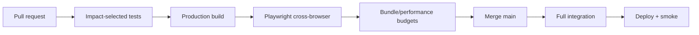

# 詠葉的婚禮

婚禮邀請網站與 **Standalone Memories** 照片檔案館的 pnpm monorepo。

[](https://github.com/royleon4/huang_yeh_wedding/actions/workflows/memories-ci.yml)
[](https://github.com/royleon4/huang_yeh_wedding/actions/workflows/memories-cross-browser.yml)
[](https://github.com/royleon4/huang_yeh_wedding/actions/workflows/memories-legacy-boundary.yml)

> **目前階段：** Product Phase 1 已完成；Phase 2.1 瀏覽器、In-App Browser 與效能 gate 進行中  
> **文件基準：** `09293817935f5548aa4c7ef6918db9afd0a62b98`  
> **從零架站與多雲部署：** [`docs/site-handbook/`](docs/site-handbook/README.md)  
> **文件總索引：** [`DOCUMENTATION.md`](DOCUMENTATION.md)


## 專案內容

| 應用 | Package | Route／Port | 責任 |
| --- | --- | --- | --- |
| Wedding Invitation | `@workspace/wedding-invitation` | `/` · `19315` | 婚禮邀請與 legacy UI |
| Standalone Memories | `@workspace/memories-album` | `/Memories/*` · `19316` | 相簿、上傳、留言、內容與管理後台 |
| Legacy API | `@workspace/api-server` | `/api/*` · `8080` | 舊照片牆與 Object Storage 邊界 |
| Mockup Sandbox | `@workspace/mockup-sandbox` | `/__mockup` · `8081` | Replit Canvas／元件預覽 |

Ordinary Memories changes must not modify the legacy invitation/photo API boundary without explicit owner approval. GitHub Actions enforces this separation.

## Standalone Memories 現有能力

| 領域 | 已實作 |
| --- | --- |
| 公開網站 | 中文／English、stable routes、albums、album labels、process navigation、photo deep links |
| 照片 | Masonry、lazy loading、progressive cursor feed、pagination、featured photos、fullscreen viewer |
| 婚禮內容 | YouTube、Tiptap、Word import、image attachments、divider、pinned photos |
| 訪客互動 | 批次照片上傳、private management link、guestbook/message album |
| 管理後台 | Appearance、copy、albums、labels、messages、processes、photos、bulk actions、refresh tools |
| 資料 | PostgreSQL metadata；Google Drive originals／attachments／WebP thumbnails |
| 安全 | HttpOnly admin session、hashed private tokens、upload limits、migration checksum、legacy boundary |
| 品質 | Impact PR CI、full `main` integration、Playwright cross-browser/In-App profiles |
| 效能 | Route code splitting、first page 24 photos、Web Vitals diagnostic、bundle report/budgets |

自動化 In-App profile 是 engine、viewport 與 representative user-agent 驗證；真實 LINE、WeChat、Facebook、Instagram、Samsung Internet 與 Safari 仍需獨立真機證據。

## 技術棧

| Layer | Technology |
| --- | --- |
| Runtime／Workspace | Node.js 24、pnpm 10、GitHub Actions |
| Frontend | React 19、Vite 7、Tiptap |
| Server／Data | Node HTTP APIs、PostgreSQL、immutable SQL migrations |
| Media | Replit Google Drive Integration、Sharp、WebP derivatives |
| Import | Mammoth、docx-preview |
| Testing | Node test runner、focused Chrome、Playwright Chromium／Firefox／WebKit |
| Diagnostics | `window.__MEMORIES_WEB_VITALS__`、Vite manifest、bundle budgets |

詳細說明：[`docs/site-handbook/01-technology-stack.md`](docs/site-handbook/01-technology-stack.md)

## 快速開始

```bash
git clone https://github.com/royleon4/huang_yeh_wedding.git
cd huang_yeh_wedding
corepack enable
pnpm install --frozen-lockfile
pnpm run typecheck
pnpm --filter @workspace/memories-album test
pnpm --filter @workspace/memories-album build
pnpm --filter @workspace/memories-album dev
```

本機開啟：

```text
http://localhost:19316/Memories/
http://localhost:19316/Memories/admin/login
http://localhost:19316/Memories/api/health
```

Development 仍需要 PostgreSQL。普通本機環境沒有 Replit Google Drive Integration；Live Drive 功能需在已連接 Integration 的 Replit 環境，或先實作 portable media adapter。

完整步驟：[`docs/site-handbook/03-local-development.md`](docs/site-handbook/03-local-development.md)

## 必要 Production 設定

```text
DATABASE_URL
MEMORIES_DRIVE_PHOTOS_FOLDER_ID
MEMORIES_ADMIN_TOKEN
```

Replit Published App 還必須連接 Google Drive Integration。Secret、database URL、OAuth credential、Drive folder ID、private token 與 signed URL 不得提交 repository 或送到 browser bundle。

## 主要 Routes

| 功能 | Route |
| --- | --- |
| 公開首頁 | `/Memories/` |
| English | `/Memories/en/` |
| Album | `/Memories/albums/:albumKey` |
| Label | `/Memories/albums/:albumKey/labels/:labelKey` |
| Upload | `/Memories/upload`、`/Memories/en/upload` |
| Private batch | `/Memories/manage/:batchId#token=...` |
| Admin login | `/Memories/admin/login` |
| Health | `/Memories/api/health` |

## Migration 與資料安全

Memories migration 位於 `artifacts/memories-album/db`，目前延伸到：

```text
016_explicit_guest_album_membership.sql
```

- 只新增 migration，不修改已套用檔案。
- 不使用 `drizzle-kit push` 管理 Memories production schema。
- 發布計畫出現意外 `DROP TABLE`／`DROP COLUMN` 時立即停止。
- 原圖不要直接從 Google Drive 手動刪除；使用 Admin 或 private management flow。
- Permanent delete 目前沒有七天垃圾桶。

## 測試、瀏覽器與效能 Gate



Cross-browser gate 包含 desktop/mobile Chromium、Firefox、WebKit，以及 Samsung Internet、WeChat、LINE、Facebook、Instagram representative profiles。失敗保存 screenshot、trace、video 與 HTML report。

Current performance gate：

- Public route 不 eager-load Admin/login/private-management modules。
- First photo request 為 24 records。
- `window.__MEMORIES_WEB_VITALS__` 記錄 LCP、CLS、interaction diagnostic 與 navigation timing。
- `?performance=1` 只在 console 顯示，不上傳第三方。
- Build 產生 `dist/performance/bundle-report.json` 與 `.md`。
- Public entry、single chunk 與 total JS gzip 有 regression ceilings。

- 測試策略：[`docs/memories/testing-strategy.md`](docs/memories/testing-strategy.md)
- Device evidence：[`docs/memories/phase-2-device-validation-2026-08-05.md`](docs/memories/phase-2-device-validation-2026-08-05.md)
- Performance record：[`docs/memories/phase-2-performance-gate-2026-08-05.md`](docs/memories/phase-2-performance-gate-2026-08-05.md)
- Performance handbook：[`docs/site-handbook/12-performance.md`](docs/site-handbook/12-performance.md)

## 從零架站與多雲部署


新文件中心提供：

| 環境 | 文件 |
| --- | --- |
| Replit | [`replit.md`](docs/site-handbook/deployments/replit.md) |
| On-premise／VPS | [`on-premise.md`](docs/site-handbook/deployments/on-premise.md) |
| Google Cloud | [`google-cloud.md`](docs/site-handbook/deployments/google-cloud.md) |
| AWS | [`aws.md`](docs/site-handbook/deployments/aws.md) |
| Microsoft Azure | [`microsoft-azure.md`](docs/site-handbook/deployments/microsoft-azure.md) |
| Oracle Cloud | [`oracle-cloud.md`](docs/site-handbook/deployments/oracle-cloud.md) |
| Kubernetes | [`kubernetes.md`](docs/site-handbook/deployments/kubernetes.md) |

目前 Google Drive 層使用 Replit 專屬 connector。部署到其他雲端前，必須實作 Google Drive API 或對應 Object Storage adapter；部署文件不會把此必要改造假裝成已完成。

## 文件入口

| 讀者 | 文件 |
| --- | --- |
| 親友／上傳者 | [`EASY_USER_GUIDE.md`](EASY_USER_GUIDE.md) |
| 內容管理員 | [`ADMIN_GUIDE.md`](ADMIN_GUIDE.md) |
| 部署／維運 | [`OPERATIONS_GUIDE.md`](OPERATIONS_GUIDE.md) |
| 開發／維護 | [`MAINTAINER_GUIDE.md`](MAINTAINER_GUIDE.md) |
| 從零架站／多雲 | [`docs/site-handbook/`](docs/site-handbook/README.md) |
| 技術 contract | [`artifacts/memories-album/README.md`](artifacts/memories-album/README.md) |
| 完整 lifecycle | [`DOCUMENTATION.md`](DOCUMENTATION.md) |

---

願這個網站保存婚禮當天、生活片段，以及每一位親友留下的祝福。
