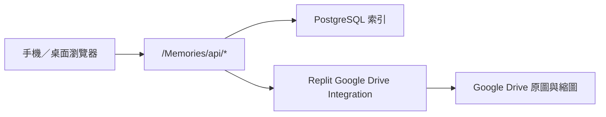

# 詠葉的婚禮

這是 **黃律詠與葉藝慧** 的婚禮專案，包含原有婚禮邀請網站、婚禮資料與獨立的 **Memories 婚禮相簿**。

## 婚禮資訊

- 日期：2026 年 6 月 20 日
- 地點：德光長老教會
- 形式：結婚感恩禮拜

## 專案結構

| 路徑 | 用途 | 狀態 |
| --- | --- | --- |
| `artifacts/wedding-invitation` | 原有婚禮邀請網站與相片牆 | Legacy；Memories 開發不得修改 |
| `artifacts/memories-album` | 獨立 React + Vite 婚禮相簿與 Node API | 開發中；公開路徑 `/Memories/` |
| `artifacts/api-server` | 原有網站 API，包含 legacy `/api/photos*` | Memories 不得共用或改寫 |
| `docs/memories` | Memories 架構、Drive、部署與視覺規格 | 維護文件 |
| `.github/workflows` | Memories CI 與 legacy 邊界檢查 | 已啟用 |

## Memories 目前功能

目前 launch-readiness 實作：

- 手機優先的瀑布流相簿與全螢幕檢視器
- 婚禮流程、訪客上傳、生活照三個分類
- 固定底部導覽與醒目的中央上傳按鈕
- Google Drive 流程資料夾與網站流程同步
- 訪客姓名必填但不公開、多照片預覽／移除、逐張進度、暫停及安全重試
- 私人批次管理連結、訪客撤回與管理 token 旋轉
- 真正的 12 筆 opaque cursor 分頁、480／960 WebP `srcset`
- 清除 EXIF/GPS 的受控公開原圖與拍攝／建立時間排序
- PostgreSQL 照片、流程、批次、上傳狀態、設定、稽核與 cleanup jobs
- 可自行從 Drive／Database 暫時失敗恢復的 runtime 與 `/ready`
- 30 分鐘 HttpOnly 管理 session、相簿開關、流程／批次管理、單張／批次垃圾桶操作與稽核
- 七天垃圾桶、到期清理、還原與 retryable cleanup
- 共用 accessible dialog、safe area、320px lightbox 與 React shared state
- CSP、安全 headers、管理與上傳 rate limit
- 繁體中文／英文介面

Phase 1 的 #5、#6、#7、#49、#51 已完成程式與 Node 測試實作；#48、#50 已完成核心程式，但其 browser-level 與實機驗收尚未完成。合併前仍需 review／CI，正式上線前仍缺：

- Production migrations、真實 Drive 建立／讀取／刪除 smoke test（Issue #13）
- 八個指定 viewport 的真實 browser checks、iOS Safari／Android Chrome 實機矩陣、慢速／離線操作與效能量測（Issues #48、#50、#13）
- Legacy 相片牆 list、upload、preview、lightbox 與部署前後 regression 證據（Issue #19）
- 視覺 baseline、主要 viewport 截圖與 go／no-go 紀錄（Issue #26）

人物分類與自拍找照片屬於 Phase 2，目前仍為 `即將推出`，統一追蹤於 Issue #24。

## Memories 架構



- Google Drive 保存原圖與技術縮圖；PostgreSQL 保存可查詢的網站索引。
- 瀏覽器只接觸網站 opaque ID 與受控媒體端點，不會收到 Drive file ID、資料夾 ID 或 Google 憑證。
- Drive 存取使用 `@replit/connectors-sdk` 與 Replit Google Drive Integration；不要加入 service-account JSON、OAuth client secret 或手動 refresh token。
- Google Drive 編號資料夾是婚禮流程名稱與順序的來源。
- `訪客上傳`、`生活照`、`系統縮圖` 與 `00 未分類` 由服務在相簿根目錄下發現或建立。
- Memories 與原有婚禮邀請網站、legacy Object Storage 相片牆保持隔離。

## 本機開發

需求：Node.js 24、pnpm。

```bash
pnpm install
pnpm --filter @workspace/memories-album dev
```

常用檢查：

```bash
pnpm --filter @workspace/memories-album test
pnpm --filter @workspace/memories-album build
pnpm --filter @workspace/memories-album db:migrate
```

2026-07-28 launch-readiness 分支：standalone Memories Node 測試與 production build 通過；精確測試數以 PR 的最新 CI 為準。這不取代 browser-level、真實 Drive 或 iOS／Android 實機驗收。

## Replit 正式環境

先連線 Replit Google Drive Integration，再於 **Production Secrets** 設定：

```text
DATABASE_URL
MEMORIES_DRIVE_PHOTOS_FOLDER_ID
MEMORIES_ADMIN_TOKEN
```

選填：

```text
MEMORIES_DRIVE_SYNC_INTERVAL_MS
MEMORIES_RUNTIME_RETRY_DELAY_MS
MEMORIES_THUMBNAIL_BATCH_SIZE
MEMORIES_THUMBNAIL_MAX_PER_RUN
MEMORIES_TRASH_CLEANUP_INTERVAL_MS
MEMORIES_TRASH_CLEANUP_BATCH_SIZE
MEMORIES_TRASH_CLEANUP_LEASE_MS
```

不要把任何 secret、Drive folder ID 或真實管理密碼寫入 `.replit`、GitHub、前端 bundle 或文件。

正式發布前至少確認：

1. `/Memories/`、大小寫 redirect、refresh 與 `/Memories/api/health`
2. PostgreSQL migration 只執行 pending 檔案
3. Drive 測試檔可建立、讀取、刪除且清理完成
4. 訪客多照片上傳、縮圖、排序與重試
5. iOS Safari、Android Chrome、橫向畫面、safe area、鍵盤與慢速網路
6. legacy 邀請網站與 `/api/photos*` 完全沒有回歸

完整步驟見：

- [`docs/memories/launch-readiness.md`](docs/memories/launch-readiness.md)
- [`docs/memories/mobile-acceptance.md`](docs/memories/mobile-acceptance.md)
- [`docs/memories/trash-retention.md`](docs/memories/trash-retention.md)

## 開發規則

- Memories 功能只改 `artifacts/memories-album/**`、對應文件與必要的 additive workspace／routing 設定。
- 不修改 `artifacts/wedding-invitation/**` 或 legacy 相片 API，除非 repo owner 明確核准例外。
- 每張 ticket／PR 要列出可修改路徑、禁止路徑、依賴、decision gate 與驗證方式。
- 已完成或失效的 feature branch 應在 PR 結束後刪除，保持遠端只留下仍在使用的分支。

---

願這個專案留下我們籌備婚禮的每一段回憶，也記錄所有親友與同工的幫助與祝福。
