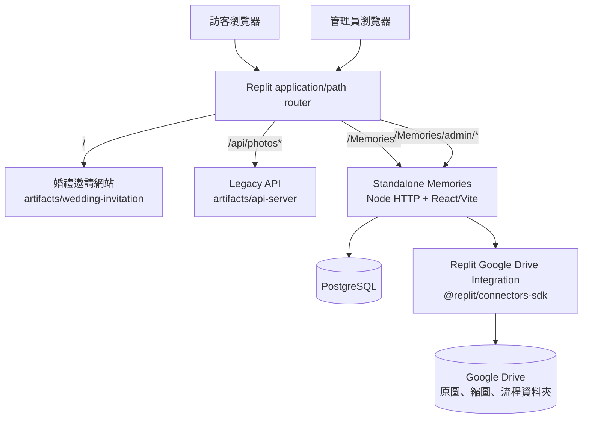
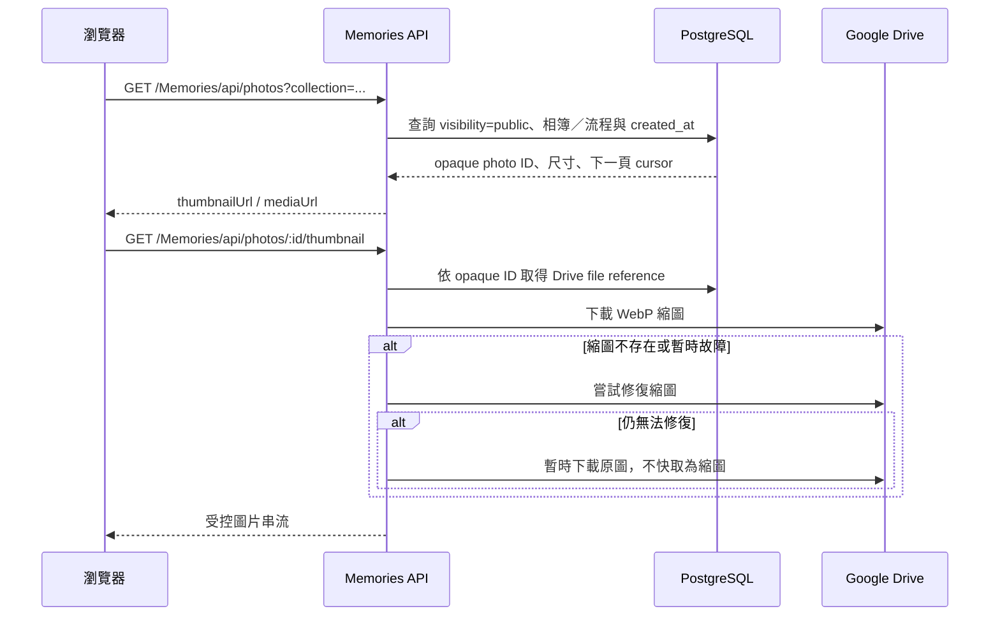
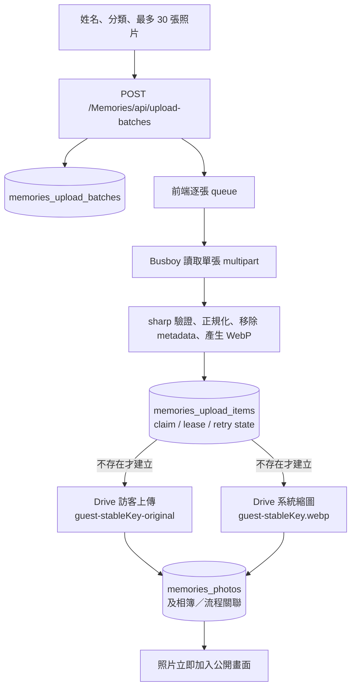
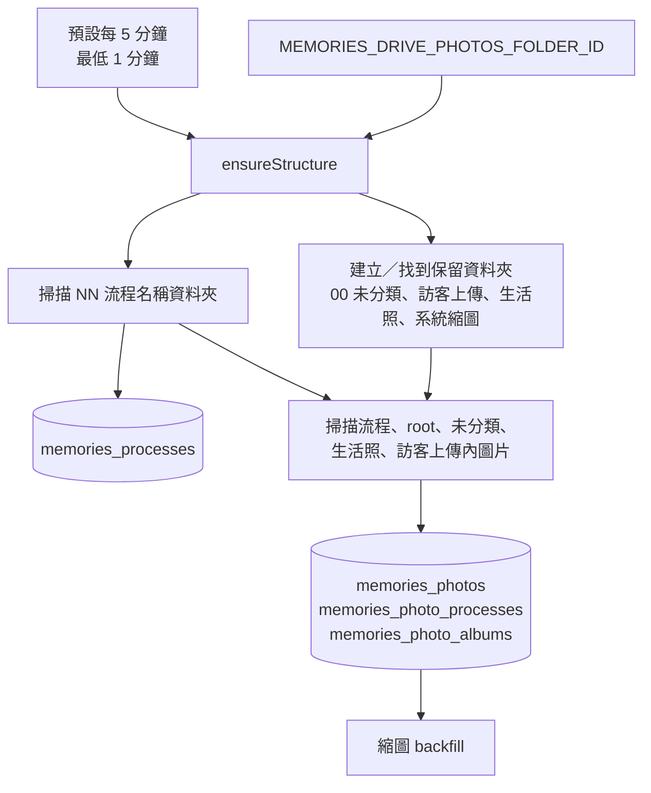
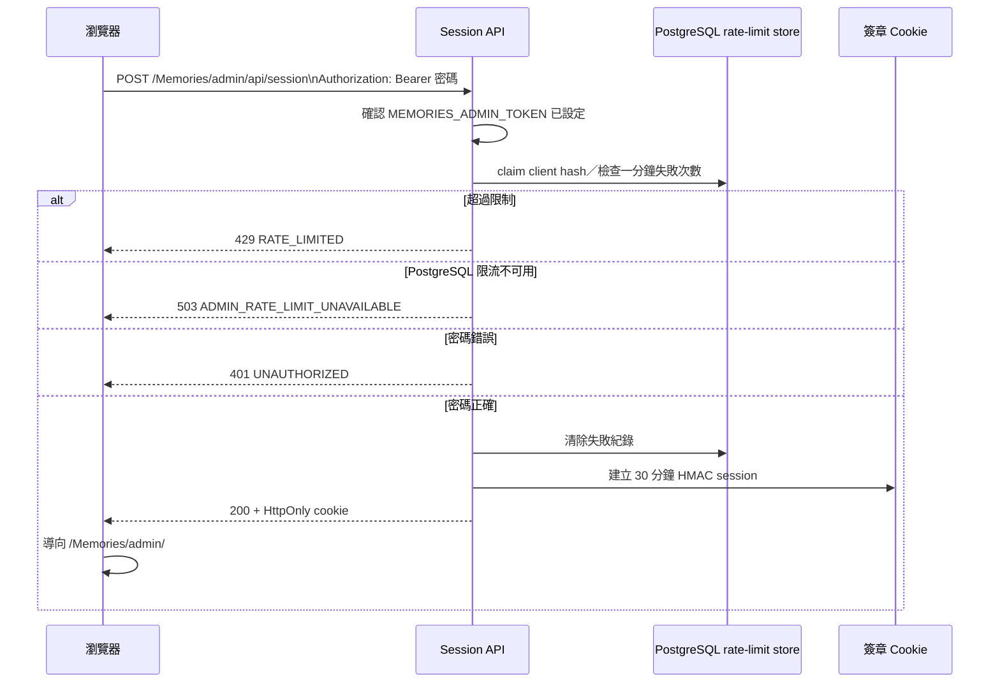

# 詠葉的婚禮

這是 **黃律詠與葉藝慧** 的婚禮專案。Repository 同時保存原有婚禮邀請網站，以及獨立部署、獨立儲存、獨立 API 的 **Memories 婚禮照片檔案館**。

> 文件基準：2026-07-29 的 `main`。目前管理後台的正式路徑是 `/Memories/admin/`，管理密碼的 Replit Secret 名稱是 `MEMORIES_ADMIN_TOKEN`。

## 婚禮資訊

- 日期：2026 年 6 月 20 日
- 地點：德光長老教會
- 形式：結婚感恩禮拜

## 最重要的專案邊界

這個 repository 內有兩套彼此隔離的照片系統：

1. 原有婚禮邀請網站與 legacy 相片牆。
2. 新的 standalone Memories 相簿。

除非 repo owner 明確核准，Memories 開發不得修改、匯入或共用 legacy 邀請網站的相片 API、Object Storage 或前端程式。`artifacts/wedding-invitation/**` 與 legacy `/api/photos*` 是受 CI 保護的邊界。

## Repository 結構

| 路徑 | 用途 | 維護規則 |
| --- | --- | --- |
| `artifacts/wedding-invitation` | 原有婚禮邀請網站與 legacy 相片牆 | Memories 工作不得修改 |
| `artifacts/api-server` | 原有網站 API，包含 legacy `/api/photos*` | 不可被 Memories 共用或改寫 |
| `artifacts/memories-album` | React + Vite 前端、Node HTTP API、PostgreSQL 與 Google Drive 整合 | Memories 的主要程式碼 |
| `artifacts/mockup-sandbox` | 元件與版面預覽環境 | 不屬於正式 Memories runtime |
| `docs/memories` | 架構、部署、Drive、migration 與故障排除文件 | 必須與程式保持一致 |
| `.agents/memory` | 專案 agent 的長期規則與已確認事實 | 變更核心架構時同步更新 |
| `.github/workflows` | Memories 測試、build、production smoke test 與 legacy 邊界檢查 | PR 必須通過 |

## 正式路徑

| 路徑 | 用途 |
| --- | --- |
| `/` | 原有婚禮邀請網站 |
| `/Memories/` | 公開婚禮照片檔案館 |
| `/memories/...` | 小寫相容路徑，重新導向 `/Memories/...` |
| `/Memories/api/health` | Memories artifact 健康檢查；不初始化 Drive 或 PostgreSQL runtime |
| `/Memories/api/photos` | 公開照片清單與 cursor API |
| `/Memories/api/photos/:id/thumbnail` | 受控縮圖串流；必要時嘗試修復或暫時回退原圖 |
| `/Memories/api/photos/:id/media` | 受控原圖串流 |
| `/Memories/api/upload-batches` | 建立訪客上傳批次 |
| `/Memories/api/upload-batches/:id/photos` | 每次上傳一張照片 |
| `/Memories/manage/:batchId` | 已產生私人管理 URL，但完整管理／撤回 UI 尚未完成 |
| `/Memories/admin/login` | 管理員登入頁 |
| `/Memories/admin/` | 管理後台 |
| `/Memories/admin/api/*` | 管理員 session、相簿、照片與分類 API |
| `/admin...` | 舊路徑相容 redirect，正式文件與前端不應再使用 |

Replit path router 將 `/Memories/admin`、`/Memories`、小寫相容路徑與舊 `/admin` alias 都交給 `artifacts/memories-album` 的 19316 服務；healthcheck 使用 `/Memories/api/health`。

## 目前已實作的功能

### 公開照片牆

- 手機優先的照片牆與全螢幕 lightbox。
- 圖片依 `created_at` 由早到晚排序；Drive 匯入時優先使用圖片拍攝時間，其次使用 Drive 建立時間、修改時間。
- 顯示順序為由左至右、由上而下。
- 以細格 CSS Grid 與實際卡片高度計算 row span，盡量填補不同長寬比造成的空缺。
- 上方重複的四格導覽已隱藏；主要分類保留在固定底部導覽。
- 切換流程或相簿後，自動捲到照片牆起點。
- 標題在約 3.5 秒內連點五次會檢查管理員 session，已登入前往 `/Memories/admin/`，未登入前往 `/Memories/admin/login`。
- 繁體中文與英文介面。

### 訪客上傳

- 姓名必填。
- 每批最多選擇 30 張照片，每張最大 25 MB。
- 支援 JPEG、PNG、WebP、HEIC、HEIF。
- 前端逐張上傳，顯示單張與整體進度，可暫停並繼續未完成照片。
- 每張照片使用穩定的 client upload ID；相同批次重試不會重複建立 Drive 檔案。
- 伺服器以 durable upload lease 防止同一張照片同時重複處理。
- 圖片經 `sharp` 驗證、方向正規化、metadata 移除，並產生 WebP 縮圖。
- 暫時性 Drive 429／5xx 錯誤使用有上限的 exponential backoff。
- 批次建立後回傳私人 management token；資料庫只保存 token hash，原始 token 放在使用者收到的 URL fragment。

### 管理後台

- 以 `MEMORIES_ADMIN_TOKEN` 登入。
- 密碼只在登入 POST 的 Bearer header 中傳送，不保存到 `localStorage` 或 `sessionStorage`。
- 登入成功後交換 30 分鐘、簽章的 `HttpOnly; Secure; SameSite=Strict` cookie，cookie path 限定為 `/Memories/admin`。
- 登入失敗限制保存在 PostgreSQL，可跨 Replit Autoscale instance 共用。
- 可新增與編輯相簿。
- 可新增、重新命名與排序 Google Drive 流程分類。
- 可由管理後台上傳單張正式照片。
- 可編輯照片顯示名稱、拍攝時間、公開狀態、相簿歸屬與流程分類。
- 管理員覆寫的拍攝時間及相簿歸屬會留下 override flag，後續 Drive reconciliation 不會覆蓋。

目前重建後台 **尚未重新提供** 照片刪除、批次刪除、相簿刪除、分類刪除、垃圾桶與復原；不要把舊版管理畫面的功能當作現行 API 能力。

## 系統總覽



## 公開照片讀取邏輯鏈



瀏覽器不會收到 Drive file ID、資料夾 ID、Connector 回應、OAuth token 或 Drive URL。

## 訪客上傳邏輯鏈



原圖與縮圖各有固定檔名及 durable state；重送相同 upload ID 時，伺服器會尋找並重用既有 Drive 檔案。

## Google Drive 與分類同步邏輯鏈



同步規則：

- `01 名稱`、`02 名稱` 這類編號 Drive 資料夾是婚禮流程名稱與順序的主要來源。
- 後台新增、改名、排序分類時，先操作 Drive 資料夾，再更新 PostgreSQL。
- 正式照片移到不同流程時，原始 Drive 檔案會被 move，不會複製。
- 訪客原圖固定保留在 `訪客上傳`；其婚禮流程或生活照歸屬是網站邏輯分類。
- Drive 中已消失的流程資料夾會在資料庫停用。
- **目前 Drive reconciliation 不會自動把已從 Drive 手動刪除的照片紀錄改成 hidden／trashed。** 只在 Drive 刪原圖可能仍留下公開 PostgreSQL 紀錄、另一份縮圖及瀏覽器快取，因此手動刪 Drive 檔案不等同完整刪除網站照片。

## 管理員登入邏輯鏈



`POST /Memories/admin/api/session` 不需要 Google Drive runtime。它回傳 `503 ADMIN_TOKEN_NOT_CONFIGURED` 時，代表 Published App 沒有讀到 **`MEMORIES_ADMIN_TOKEN`**；不是 Drive 同步錯誤。

## 資料來源與責任

| 資料 | 主要來源／保存位置 | 說明 |
| --- | --- | --- |
| 原始照片 | Google Drive | 官方照片在流程、`00 未分類` 或 `生活照`；訪客原圖在 `訪客上傳` |
| WebP 縮圖 | Google Drive `系統縮圖` | 公開照片牆優先讀取；失效時可嘗試修復 |
| 公開／隱藏／垃圾狀態 | PostgreSQL | 公開 API 只查 `visibility = public` |
| 排序時間 | PostgreSQL `memories_photos.created_at` | 依拍攝／Drive 建立時間匯入，可由管理員覆寫 |
| 流程名稱及順序 | 編號 Google Drive 資料夾，鏡像至 PostgreSQL | Drive folder ID 永不傳到瀏覽器 |
| 系統與自訂相簿 | PostgreSQL | 系統相簿為 wedding、guest、life |
| 上傳批次與管理 token hash | PostgreSQL | 原始 management token 不保存明文 |
| 單張 durable upload state | PostgreSQL | 防止重試造成重複檔案 |
| UI 設定 | PostgreSQL | 例如主導覽顯示設定 |
| 管理密碼 | Replit Production Secret | 名稱必須是 `MEMORIES_ADMIN_TOKEN` |
| 管理 session | 瀏覽器 HttpOnly cookie | 30 分鐘、HMAC 簽章、path 限定 `/Memories/admin` |

## PostgreSQL migration 與主要資料表

Migration 來源是 `artifacts/memories-album/db/001_...sql` 至 `009_...sql`，不是 Drizzle schema push。

| 資料表 | 用途 |
| --- | --- |
| `memories_schema_migrations` | migration 檔名、checksum 與套用時間 |
| `memories_upload_batches` | 訪客姓名、分類、management token hash、批次狀態 |
| `memories_upload_items` | 每張照片的 stable upload ID、lease、Drive IDs、錯誤與完成狀態 |
| `memories_processes` | 流程名稱、順序、Drive folder ID、同步狀態 |
| `memories_photos` | opaque UUID、Drive references、尺寸、hash、collection、visibility、時間與 overrides |
| `memories_photo_processes` | 照片與婚禮流程多對多關聯 |
| `memories_drive_sync_runs` | Drive 同步執行紀錄欄位；目前主要 runtime log 仍輸出至 console |
| `memories_app_settings` | JSONB 應用設定 |
| `memories_albums` | 系統與自訂相簿 |
| `memories_photo_albums` | 照片與相簿關聯 |
| `memories_admin_login_failures` | 跨 Autoscale instance 的登入失敗限流 |

Migration runner：

- 依檔名排序，只套用尚未記錄的 SQL。
- 已套用 migration 的 checksum 若改變，啟動會失敗；已發布 migration 不可修改。
- 使用 PostgreSQL advisory lock，避免多個 Autoscale instance 同時套用。
- Production server 在 migration 成功後才開始 listen。
- Build 會把 `db/` 與 server modules 複製到 `dist/`。
- Replit `postMerge` 會在有 development `DATABASE_URL` 時執行同一套 `db:migrate`，維持 development／production schema parity。
- **不得使用 `drizzle-kit push` 管理 Memories tables。**

## Replit 部署邏輯鏈

```mermaid
flowchart LR
  Merge[合併 main]
  PostMerge[postMerge\npnpm install + db:migrate development]
  Publish[Replit Publish]
  Build[Vite build + 複製 server、db、route modules 到 dist]
  Start[Production node dist/server.mjs]
  Migrate[對 production DATABASE_URL\n執行 pending migrations]
  Listen[listen 19316]
  Health[/Memories/api/health = 200]
  Router[Replit router 開始導流]

  Merge --> PostMerge
  Merge --> Publish --> Build --> Start --> Migrate --> Listen --> Health --> Router
```

若 Replit migration 預覽出現要 `DROP memories_albums`、`DROP memories_photo_albums`、`DROP memories_admin_login_failures` 或刪除 `memories_photos` override 欄位：

1. 立即取消 deployment。
2. 在 development 環境執行 `pnpm --filter @workspace/memories-album run db:migrate`。
3. 不要選擇用 development data 覆蓋 production。
4. 重新 Publish，確認預覽不再出現破壞性 DROP。

## 環境設定

### 必要的 Replit Production Secrets

```text
DATABASE_URL
MEMORIES_DRIVE_PHOTOS_FOLDER_ID
MEMORIES_ADMIN_TOKEN
```

此外必須在 Published App 環境連接 Replit Google Drive Integration。

### 選填調校

```text
MEMORIES_DRIVE_SYNC_INTERVAL_MS=300000
MEMORIES_THUMBNAIL_BATCH_SIZE=12
MEMORIES_THUMBNAIL_MAX_PER_RUN=240
MEMORIES_DRIVE_THUMBNAILS_FOLDER_ID=
MEMORIES_TRUST_PROXY=1
MEMORIES_SKIP_MIGRATIONS=1
```

- `MEMORIES_DRIVE_SYNC_INTERVAL_MS` 最低為 60000 ms。
- `MEMORIES_DRIVE_THUMBNAILS_FOLDER_ID` 是 legacy override；正常情況由 runtime 在 root 下發現或建立 `系統縮圖`。
- `MEMORIES_SKIP_MIGRATIONS=1` 僅供受控診斷，不應成為一般 production 設定。
- Secret、真實 Drive folder ID、管理密碼與 OAuth 憑證不得提交到 GitHub、`.replit` 或前端 bundle。

## 本機與 Replit 開發

需求：Node.js 24、pnpm 10.x。

```bash
pnpm install
pnpm --filter @workspace/memories-album dev
```

常用命令：

```bash
pnpm --filter @workspace/memories-album test
pnpm --filter @workspace/memories-album build
pnpm --filter @workspace/memories-album start
pnpm --filter @workspace/memories-album db:migrate
pnpm --filter @workspace/memories-album test:drive-live
```

`test:drive-live` 只可在已連接 Google Drive Integration、並使用測試資料夾的受控 Replit 環境執行。

## CI 與變更規則

每個 Memories PR 應通過：

1. Node test runner 全套測試。
2. Vite production build。
3. 啟動 `dist/server.mjs` 並確認 `/Memories/api/health` 回傳成功。
4. Memories legacy boundary workflow，確認沒有修改受保護的邀請網站與 legacy 相片 API。

開發規則：

- 從最新 `main` 建立 branch。
- PR 說明列出可修改路徑、禁止路徑、依賴、decision gate 與驗證方式。
- 核心路由、Secret 名稱、資料來源、migration 或 Drive 規則變更時，同步更新根 README、artifact README、`docs/memories` 與 `.agents/memory`。
- 已完成或失效的 branch 在 PR 結束後刪除。

## 常見錯誤判讀

| 現象／代碼 | 意思 | 處理方式 |
| --- | --- | --- |
| `ADMIN_TOKEN_NOT_CONFIGURED` | Published App 沒有讀到 `MEMORIES_ADMIN_TOKEN` | 檢查 Secret 精確名稱並重新 Publish |
| `ADMIN_RATE_LIMIT_UNAVAILABLE` | PostgreSQL 限流表或連線失敗 | 檢查 `DATABASE_URL`、migration 009 與 DB log |
| PostgreSQL `42P01` | 查詢的 table 不存在 | 執行 tracked migration；不要手工猜 schema |
| `DRIVE_AUTHORIZATION_REQUIRED` | Connector 收到 401／403 | 重新連接 Integration，確認 root 與子資料夾編輯權限 |
| `DRIVE_RETRYABLE` | Drive／Connector 429 或 5xx | 稍後重試；檢查長時間 timeout 與呼叫頻率 |
| `DRIVE_REQUEST_FAILED` | Drive 拒絕非暫時性請求 | 檢查授權、folder access 與 Connector 回應 |
| thumbnail backfill `attempted: 12, created: 0` | 預設第一批 12 張全部失敗 | 先修復共同的 Drive 授權／連線原因 |
| Drive 刪除後網站仍顯示 | PostgreSQL public 紀錄、縮圖或瀏覽器 cache 仍存在 | 不要把手動 Drive 刪除視為完整網站刪除 |
| 首次 runtime 初始化失敗後持續 503 | rejected runtime Promise 目前可能被快取 | 修正依賴後重啟／重新 Publish；後續需完成 recovery 改善 |

## 尚未完成／已知限制

- `/Memories/manage/:batchId` 私人批次管理與撤回 UI／API。
- 管理後台的照片單張／批次刪除、相簿刪除、分類刪除。
- 七天垃圾桶、復原與到期清除。
- 手動從 Drive 刪除圖片後，自動停用對應 PostgreSQL 照片紀錄。
- 初次 runtime 初始化失敗後的免重啟恢復。
- 真正按需的 server cursor 分頁；部分前端仍會預取多頁後再做 client-side paging。
- 其餘跨元件 DOM observer／隱藏 click bridge 的 React state 統一。
- iOS Safari、Android Chrome、Instagram 內建瀏覽器、橫向畫面與慢速網路的完整實機驗收。
- 人物分類與自拍找照片屬於 Phase 2，目前仍為「即將推出」。

---

願這個專案留下我們婚禮的每一段回憶，也記錄親友與同工的幫助與祝福。
