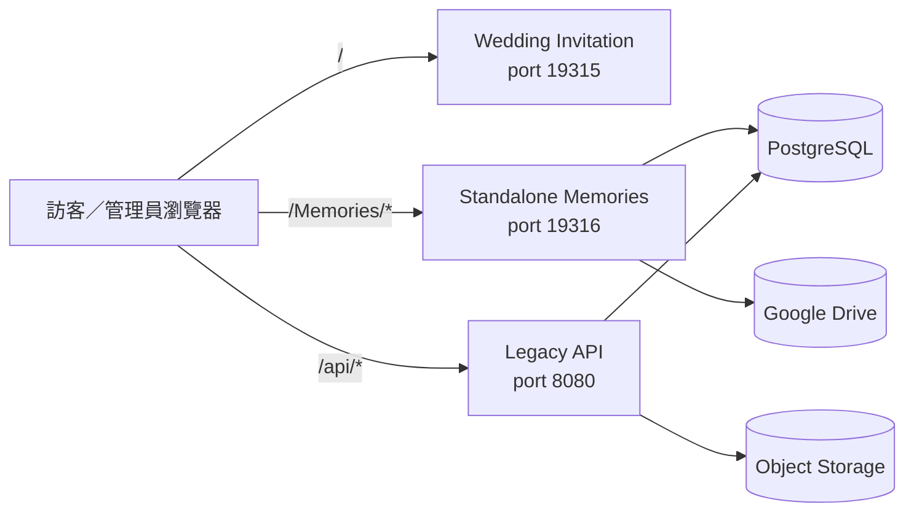

# 詠葉的婚禮

婚禮邀請網站與照片檔案館的 pnpm monorepo。

目前持續開發的核心是 **Standalone Memories**：一套部署於 `/Memories/` 的雙語婚禮相簿，提供訪客上傳、私人批次管理、Google Drive 原圖與縮圖、PostgreSQL 索引，以及完整管理後台。

> 架構與功能盤點日期：2026-07-31  
> 深入技術文件：[`artifacts/memories-album/README.md`](artifacts/memories-album/README.md)  
> 程式品質與重構路線：[`docs/code-health-audit-2026-07.md`](docs/code-health-audit-2026-07.md)

## 專案狀態

| 區域 | 狀態 | 說明 |
| --- | --- | --- |
| Standalone Memories | 主要開發中 | 公開相簿、上傳、私人管理、管理後台與獨立 API |
| Wedding Invitation | 既有網站 | 原婚禮邀請頁與舊照片牆 |
| Legacy API | 維護邊界 | 舊版 Express／Object Storage API |
| Mockup Sandbox | 開發工具 | Replit Canvas 元件預覽，由 `.replit` 動態使用 |

Memories 與舊邀請網站是不同的應用邊界：

- `/Memories/*` 由 Standalone Memories 的 Node server、PostgreSQL repositories、SQL migrations 與 Google Drive connector 負責。
- 舊照片牆仍使用 legacy `/api/photos*` 與 Object Storage。
- Memories 的一般變更不應修改邀請網站或 legacy photo-wall 實作；跨界變更由專用 CI 保護。

## 現有功能

### 公開婚禮相簿

- 繁體中文與英文介面；英文網址在 `/Memories` 後加入 `/en`。
- 使用依目前顯示順序產生的邏輯網址，例如 `group1/subgroup2`，不把資料庫 ID 或可變標題暴露在網址中。
- 直接開啟子分類網址、點選子分類、重新整理，以及瀏覽器上一頁／下一頁，都會還原相同選擇並定位到照片區。
- 管理員可編輯公開網站的中英文標題、說明與介面文字；主標題保留換行。
- 婚禮流程可顯示 YouTube 影片、雙語 Tiptap 文章、Drive 附件、分隔空間、1～3 張置頂照片，以及連續瀑布牆。
- 可選傳統按鈕或置中的輪盤式流程選擇器。
- 全域媒體群組順序保持優先；各相簿的隨機、時間、照片名稱與作者排序只作用於照片群組內。
- 圖片接近可視範圍前不設定真正的 `src`；「載入更多回憶」繼續作為 DOM 與記憶體的分批界線。
- 全螢幕檢視器重用已載入縮圖、不預載所有原圖，並以 contain-fit 顯示直式與橫式照片。

### 訪客上傳

- 每批最多 **10 張**；每張最多 **25 MB**。
- 支援 JPEG、PNG、WebP、HEIC 與 HEIF。
- 瀏覽器最多同時處理 3 張照片。
- 公平兩輪重試：每張先有兩次機會，暫時性失敗讓出 worker；所有照片走過後，再進行第二輪最多兩次嘗試。
- 離線等待不消耗重試次數。
- `clientUploadId`、SHA-256 內容雜湊與 durable upload state 避免重試建立重複檔案。
- 同檔名但內容不同的照片可以上傳；重複判斷不依賴檔名。
- 管理員可決定訪客是否能選擇訪客相簿、生活照或婚禮流程分類。

### Google Drive 原圖上傳

所有新原圖先建立 Drive resumable session。管理員可在通用設定選擇：

- `single`：預設，以同一 resumable session 傳送完整檔案。
- `chunked`：以 4 MiB 分段，保存 session URI 與已接受的 byte offset。

中斷後會沿用穩定識別碼、既有 Drive session 與 deterministic filename 繼續處理。縮圖由背景服務補建，不阻塞原圖成功回報。

### 私人批次管理

上傳完成後會產生：

```text
/Memories/manage/<batch-id>#token=<private-token>
```

- token 放在 URL fragment，不會進入一般 server access log。
- PostgreSQL 只保存 token hash。
- 上傳者可查看該批照片、永久刪除自己的照片，以及更新私人管理連結。
- 永久刪除會移除 Drive 原圖、縮圖、資料庫關聯與置頂引用，沒有垃圾桶可復原。

### 管理後台

管理員可：

- 新增、編輯、排序及顯示／隱藏相簿。
- 設定相簿摘要與照片排序方式。
- 新增、改名、排序及維護 Drive-backed 婚禮流程。
- 編輯影片、自動播放、雙語文章、附件、分隔空間與置頂照片。
- 編輯公開網站的中英文文字與多行主標題。
- 依相簿、流程及作者組合篩選照片。
- 沿用可靠批次上傳核心，一次上傳最多 **30 張**管理員照片。
- 編輯照片名稱、拍攝時間、作者、公開狀態、相簿與流程關聯。
- 在目前照片頁多選照片，批次增加／取代相簿、變更流程分類或永久刪除；受保護的婚禮攝影照片會自動略過刪除。
- 永久刪除同一底層照片在所有相簿／流程中的紀錄與檔案。
- 對相簿或流程執行縮圖清理、Drive 重新掃描與背景重建。
- 以全域「儲存所有變更」保存一般 JSON draft，並在失敗時保留尚未儲存的內容。

管理介面目前也包含：

- 「重新整理原始照片」、「新增相簿」、各相簿、「新增照片」及各分類的手動 Accordion。
- 分類摘要同時顯示編號、中文名稱與英文名稱。
- 管理員照片預覽每頁 10 張；桌面寬度每列 5 張，較窄畫面會自動降為 4、3、2 或 1 欄。
- 置頂照片候選每頁 10 張；切頁時會停止隱藏頁面的縮圖請求並釋放不再使用的 blob URL。
- 網站標籤與按鈕文字允許換行，不以省略號截斷。

作者為 `婚禮攝影` 的照片有前端與伺服器端刪除保護。

## 網址規則

目前公開網址依「儲存後的顯示順序」編號：

| 用途 | 範例 |
| --- | --- |
| 第一個相簿 | `/Memories/group1` |
| 第二個相簿的第三個子分類 | `/Memories/group2/subgroup3` |
| 英文第一個相簿 | `/Memories/en/group1` |
| 開啟特定照片 | 在相簿／子分類網址後加 `/photos/:photoId` |
| 訪客上傳 | `/Memories/upload` 或 `/Memories/en/upload` |
| 私人批次管理 | `/Memories/manage/:batchId#token=...` |
| 管理員登入 | `/Memories/admin/login` |
| 管理後台分頁 | `/Memories/admin/group1`、`group2`、`group3`… |
| 健康檢查 | `/Memories/api/health` |

`/Memories/` 與 `/Memories/en/` 是各語言第一個相簿的相容入口。舊 semantic routes 仍可讀取，前端會轉成目前的邏輯網址。詳細規則見 [`artifacts/memories-album/docs/logical-routes.md`](artifacts/memories-album/docs/logical-routes.md)。

## Repository 結構

| 路徑 | 套件 | 用途 |
| --- | --- | --- |
| `artifacts/wedding-invitation` | `@workspace/wedding-invitation` | 原婚禮邀請網站與舊照片牆 |
| `artifacts/memories-album` | `@workspace/memories-album` | `/Memories/` 公開相簿、上傳、私人管理、後台與獨立 API |
| `artifacts/api-server` | `@workspace/api-server` | 舊版 Express API 與 Object Storage 路由 |
| `artifacts/mockup-sandbox` | `@workspace/mockup-sandbox` | Replit Canvas 元件預覽 |
| `lib/api-spec` | `@workspace/api-spec` | OpenAPI 規格與 Orval 設定 |
| `lib/api-zod` | `@workspace/api-zod` | legacy API 使用的 Zod 產物 |
| `lib/db` | `@workspace/db` | legacy API 的 Drizzle／PostgreSQL 層 |
| `scripts` | `@workspace/scripts` | workspace build、安全檢查與邊界工具 |
| `docs` | — | 架構、Drive、部署、安全及重構文件 |

## 整體架構



## 資料責任

| 資料 | 主要來源／保存位置 |
| --- | --- |
| 原圖 | Google Drive |
| WebP 縮圖 | Google Drive `系統縮圖` |
| 公開狀態、相簿、流程關聯、拍攝時間、作者 | PostgreSQL |
| 編號流程名稱與排序 | Google Drive 資料夾，鏡像至 PostgreSQL |
| 影片、文章與附件 metadata | PostgreSQL；附件 bytes 在 Drive |
| 上傳批次、token hash、內容雜湊、續傳狀態 | PostgreSQL |
| UI、網站文字、排序、置頂圖及上傳模式設定 | PostgreSQL `memories_app_settings` |
| 管理密碼 | Replit Secret `MEMORIES_ADMIN_TOKEN` |
| 管理 session | 30 分鐘 HMAC-signed HttpOnly cookie |

Drive ID、folder ID、connector 回應、密碼與原始私人 token 不會傳給公開前端。

## 本機開發

需求：

- Node.js 24
- pnpm 10（CI 使用 10.15.1）

安裝、檢查與建置整個 workspace：

```bash
pnpm install
pnpm run typecheck
pnpm run build
```

單獨啟動各 artifact：

```bash
pnpm --filter @workspace/wedding-invitation dev
pnpm --filter @workspace/memories-album dev
pnpm --filter @workspace/api-server dev
pnpm --filter @workspace/mockup-sandbox dev
```

Memories 常用命令：

```bash
pnpm --filter @workspace/memories-album test
pnpm --filter @workspace/memories-album build
pnpm --filter @workspace/memories-album start
pnpm --filter @workspace/memories-album db:migrate
pnpm --filter @workspace/memories-album test:drive-live
```

`test:drive-live` 只能在已連接 Replit Google Drive Integration，並指定安全測試資料夾的環境執行。

## Production 設定

必要設定：

```text
DATABASE_URL
MEMORIES_DRIVE_PHOTOS_FOLDER_ID
MEMORIES_ADMIN_TOKEN
```

Published App 也必須連接 Replit Google Drive Integration。

常用選填設定：

```text
MEMORIES_DRIVE_SYNC_INTERVAL_MS=300000
MEMORIES_THUMBNAIL_BATCH_SIZE=12
MEMORIES_THUMBNAIL_MAX_PER_RUN=240
MEMORIES_DRIVE_THUMBNAILS_FOLDER_ID=
MEMORIES_TRUST_PROXY=1
MEMORIES_SKIP_MIGRATIONS=1
```

Secret、Drive folder ID、OAuth 憑證與私人 token 不得提交到 GitHub、`.replit` 或前端 bundle。

## Migration 安全

Memories 使用 `artifacts/memories-album/db` 內不可變的編號 SQL；目前序號到 `013_drive_resumable_upload.sql`。

Migration runner 會：

- 依檔名排序，只套用尚未記錄的 migration。
- 保存 SHA-256 checksum，拒絕修改已套用檔案。
- 使用 PostgreSQL advisory lock。
- migration 成功後才啟動 production listener。

**不得使用 `drizzle-kit push` 管理 Memories tables。**

若 Replit Publish 提議 `DROP TABLE`、`DROP COLUMN` 或移除既有 constraint，應取消 deployment，先確認 development migrations，再重新產生 Publish plan；不得以 development data 覆蓋 production。

## 測試與 CI

Standalone Memories CI 目前執行：

1. Node test runner 全套測試。
2. Vite production build 與 server bundle 建置。
3. 啟動 `dist/server.mjs`，檢查 `/Memories/api/health` 回應。
4. Memories／legacy 邊界檢查。

目前 CI 尚未以 Playwright 或其他真實瀏覽器執行完整 React render，因此 build-time transform 的變更仍需特別檢查最終輸出與實際瀏覽器畫面。

## 已知限制與技術債

- 尚未提供七天垃圾桶、復原與到期清除；目前刪除為立即永久刪除。
- 手動從 Drive 刪除原圖，不等於完整刪除網站資料；請使用管理後台或私人管理頁。
- 人物分類與自拍找照片仍屬後續階段。
- 尚需更多 iOS Safari、Android Chrome、Instagram／LINE 內建瀏覽器與慢速網路實機驗收。
- 多個 Vite pre-transform 仍以 exact-string replacement 修改 `App.jsx` 與 `AdminApp.jsx`，是目前最大的維護與 production-only regression 風險。
- 管理員上傳後的分類仍由前端進行後續 PATCH，尚未整合成伺服器端單一原子 command。

詳細重構順序見 [`docs/code-health-audit-2026-07.md`](docs/code-health-audit-2026-07.md)。

---

願這個專案留下我們婚禮的每一段回憶，也記錄親友與同工的幫助與祝福。
