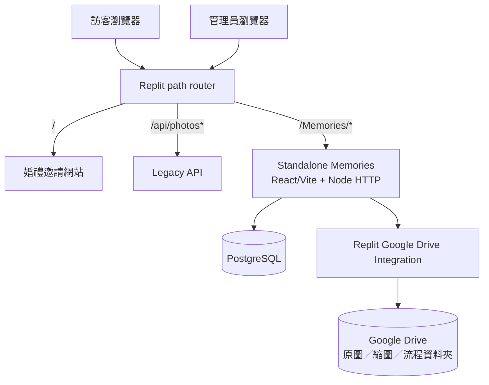
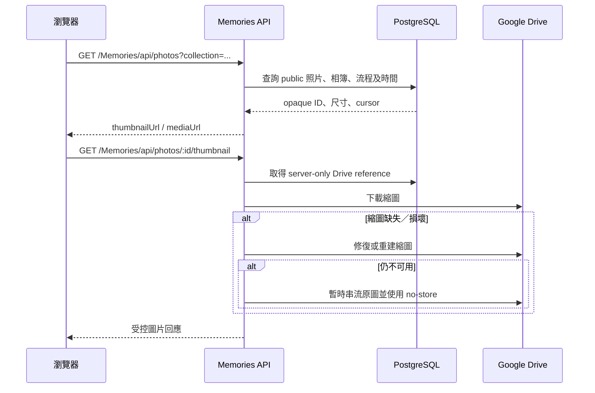
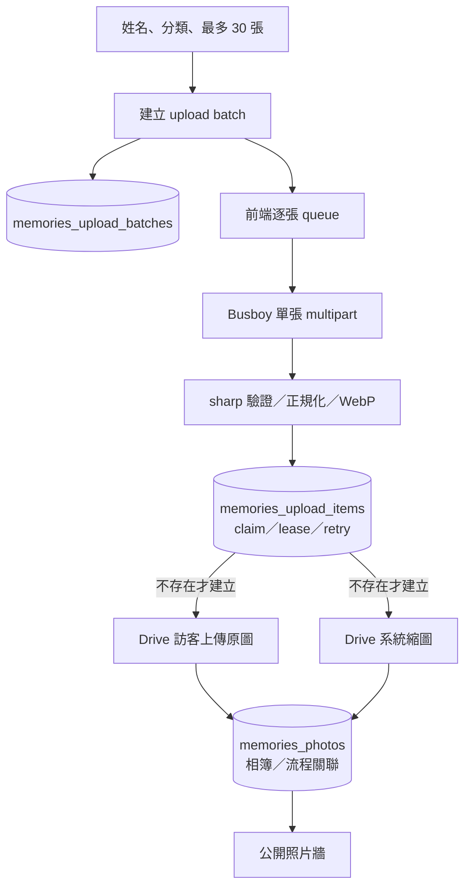
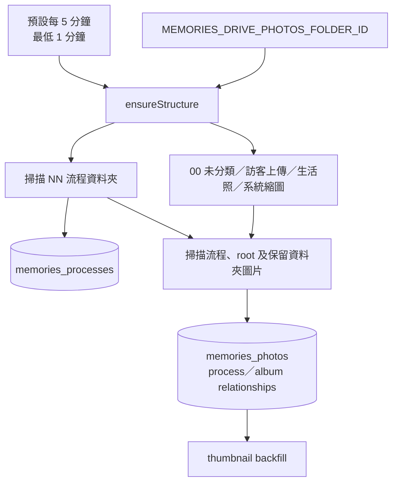
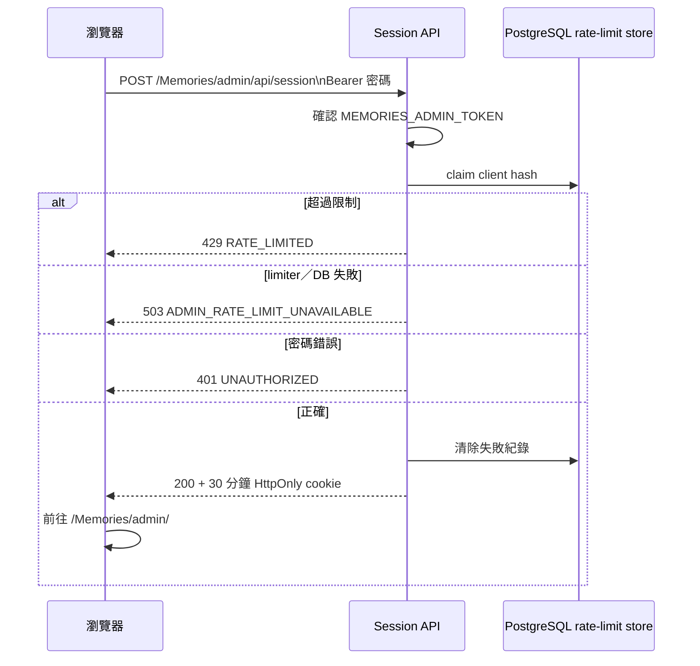
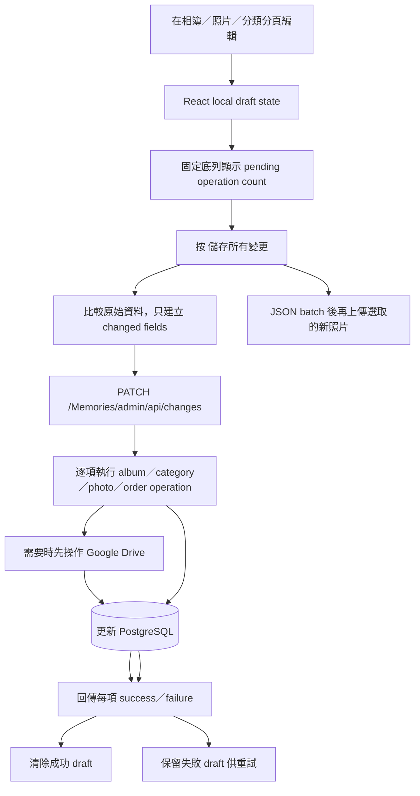

# 詠葉的婚禮

這是 **黃律詠與葉藝慧** 的婚禮專案。Repository 同時保存原有婚禮邀請網站，以及獨立部署、獨立儲存、獨立 API 的 **Memories 婚禮照片檔案館**。

> 文件基準：2026-07-29 最新 `main`。管理後台正式路徑是 `/Memories/admin/`；管理密碼的 Replit Production Secret 名稱是 `MEMORIES_ADMIN_TOKEN`。

## 婚禮資訊

- 日期：2026 年 6 月 20 日
- 地點：德光長老教會
- 形式：結婚感恩禮拜

## 最重要的系統邊界

Repository 內有兩套彼此隔離的照片系統：

1. 原有婚禮邀請網站與 legacy 相片牆。
2. Standalone Memories 婚禮照片檔案館。

除非 repo owner 明確核准，Memories 開發不得修改、匯入或共用 legacy 相片 API、Object Storage 或邀請網站前端。`artifacts/wedding-invitation/**` 與 legacy `/api/photos*` 由 CI 邊界測試保護。

## Repository 結構

| 路徑 | 用途 | 規則 |
| --- | --- | --- |
| `artifacts/wedding-invitation` | 原有婚禮邀請網站與 legacy 相片牆 | Memories 工作不得修改 |
| `artifacts/api-server` | 原有網站 API，包含 legacy `/api/photos*` | Memories 不可共用或改寫 |
| `artifacts/memories-album` | React、Vite、Node HTTP API、PostgreSQL、Google Drive | Memories 主程式 |
| `artifacts/mockup-sandbox` | 元件與版面預覽 | 不屬於 production runtime |
| `docs/memories` | Drive、部署、migration、故障排除 | 核心規格改動時同步更新 |
| `.agents/memory` | Agent 長期規則與已確認架構 | 必須與 `main` 保持一致 |
| `.github/workflows` | 測試、build、production smoke、legacy boundary | PR 必須通過 |

## 正式路徑

| 路徑 | 用途 |
| --- | --- |
| `/` | 原有婚禮邀請網站 |
| `/Memories/` | 公開照片檔案館 |
| `/memories/...` | 小寫相容路徑，轉址至 `/Memories/...` |
| `/Memories/api/health` | 輕量 healthcheck；不初始化完整 Drive／DB runtime |
| `/Memories/api/photos*` | 公開照片列表、縮圖及原圖串流 |
| `/Memories/api/upload-batches*` | 訪客上傳批次與逐張上傳 |
| `/Memories/manage/:batchId` | 私人批次管理保留路徑；完整 UI／API 尚未完成 |
| `/Memories/admin/login` | 管理員登入 |
| `/Memories/admin/` | 管理後台 |
| `/Memories/admin/api/session` | 登入、session 檢查、登出 |
| `/Memories/admin/api/changes` | 管理後台「儲存所有變更」patch-style batch API |
| `/Memories/admin/api/albums*` | 相簿管理 API |
| `/Memories/admin/api/photos*` | 照片讀取、上傳與編輯 API |
| `/Memories/admin/api/categories*` | Drive-backed 流程分類 API |
| `/admin...` | 舊路徑相容 redirect；不可作為正式文件路徑 |

Replit path router 將 `/Memories/admin`、`/Memories`、小寫相容路徑及舊 `/admin` alias 交給 Memories 服務的 port 19316；healthcheck 使用 `/Memories/api/health`。

## 已實作功能

### 公開照片牆

- 手機優先的照片牆與全螢幕 lightbox。
- 依 PostgreSQL `created_at ASC, id ASC` 由早到晚排序。
- Drive 匯入時間優先順序：圖片拍攝時間 → Drive 建立時間 → Drive 修改時間。
- 顯示順序為由左至右、由上而下。
- 細格 CSS Grid 搭配實際卡片高度計算 row span，盡量填補不同長寬比造成的空缺。
- 上方重複四格導覽已隱藏；主要相簿切換保留在固定底部導覽。
- 切換相簿或流程後自動捲至照片牆起點。
- 標題在約 3.5 秒內連點五次會檢查 admin session；已登入前往 `/Memories/admin/`，未登入前往 `/Memories/admin/login`。
- 繁體中文與英文介面。

### 訪客上傳

- 姓名必填。
- 每批最多選擇 30 張照片，每張最多 25 MB。
- 支援 JPEG、PNG、WebP、HEIC、HEIF。
- 前端逐張上傳，顯示單張及整體進度，可暫停並繼續未完成照片。
- 每張照片使用穩定 client upload ID；相同批次重試不會重複建立 Drive 檔案。
- `memories_upload_items` 使用 durable lease 防止同一張照片同時重複處理。
- `sharp` 驗證圖片、正規化方向、移除 metadata、產生 WebP 縮圖。
- Drive 429／5xx 使用有上限的 exponential backoff。
- 批次回傳私人 management token；資料庫僅保存 hash，原始 token 放在 URL fragment。

### 管理後台

- 使用 `MEMORIES_ADMIN_TOKEN` 登入。
- 密碼只透過登入 POST 的 Bearer header 傳送，不保存至 browser storage。
- 成功後取得 30 分鐘、HMAC 簽章的 `HttpOnly; Secure; SameSite=Strict` cookie，path 限定 `/Memories/admin`。
- 登入失敗限制保存於 PostgreSQL，可跨 Replit Autoscale instance 共用。
- 可新增及編輯相簿。
- 可新增、改名及排序 Google Drive 流程分類。
- 可上傳單張正式照片。
- 可編輯照片顯示名稱、拍攝時間、公開狀態、相簿與流程分類。
- 管理員覆寫拍攝時間／相簿歸屬會留下 override flag，Drive reconciliation 不會覆蓋。
- 跨分頁編輯先保存為本機 React draft，不會每改一欄就寫入伺服器。
- 固定底部列顯示待儲存操作數，按一次「儲存所有變更」才提交。
- JSON 變更透過 `PATCH /Memories/admin/api/changes` 批次處理；只送真正改變的欄位。
- 每個 operation 都有獨立結果；成功項目從草稿移除，失敗項目保留以便重試。
- 新照片是 binary multipart，因此在 JSON change batch 後個別上傳；失敗檔案仍保留選取狀態。
- 離開、重新載入或登出前會保護尚未儲存的變更。

目前重建後台尚未提供照片單張／批次刪除、相簿刪除、分類刪除、七天垃圾桶、復原及到期清除。

## 系統總覽



## 公開照片讀取邏輯鏈



瀏覽器不會收到 Drive file ID、folder ID、Drive URL、Connector 回應或 OAuth token。

## 訪客上傳邏輯鏈



## Drive reconciliation 邏輯鏈



規則：

- 編號 Drive 資料夾是流程名稱及順序的主要來源。
- 後台分類新增、改名、排序會先寫 Drive，再更新 PostgreSQL。
- 正式照片重新分類會 move 原始 Drive 檔案，不複製。
- 訪客原圖固定留在 `訪客上傳`；其 wedding／life 歸屬是邏輯分類。
- Drive 中消失的流程資料夾會在資料庫停用。
- 現行 reconciliation **不會**自動把手動從 Drive 刪除的照片 row 改為 hidden／trashed；PostgreSQL public row、另一份縮圖或瀏覽器 cache 仍可能存在。

## 管理員登入邏輯鏈



登入 endpoint 不需要 Google Drive runtime。`ADMIN_TOKEN_NOT_CONFIGURED` 代表 Published App 沒有讀到 `MEMORIES_ADMIN_TOKEN`。

## 管理員「儲存所有變更」邏輯鏈



## 資料來源與責任

| 資料 | 保存／主要來源 | 說明 |
| --- | --- | --- |
| 原始照片 | Google Drive | 官方照片在流程、`00 未分類`、root 或 `生活照`；訪客在 `訪客上傳` |
| WebP 縮圖 | Drive `系統縮圖` | 公開牆優先讀取，可按需修復 |
| visibility、排序、處理狀態 | PostgreSQL | 公開 API 只查 `visibility = public` |
| 流程名稱／順序 | 編號 Drive folder，鏡像至 PostgreSQL | Drive ID 不出 server |
| 系統／自訂相簿 | PostgreSQL | 系統相簿：wedding、guest、life |
| Upload batch／token hash | PostgreSQL | 原始 management token 不存明文 |
| Durable upload state | PostgreSQL | 防重複與安全續傳 |
| 管理草稿 | 瀏覽器 React state | 尚未按「儲存所有變更」不寫入 server |
| 管理密碼 | Replit Production Secret | 必須名為 `MEMORIES_ADMIN_TOKEN` |
| 管理 session | HttpOnly cookie | 30 分鐘，path `/Memories/admin` |

## PostgreSQL migration 與主要資料表

Migration 來源是 `artifacts/memories-album/db/001_...sql` 至 `009_...sql`；不可使用 Drizzle push 取代。

| 資料表 | 用途 |
| --- | --- |
| `memories_schema_migrations` | migration filename、checksum、套用時間 |
| `memories_upload_batches` | 訪客資料、分類、management token hash、狀態 |
| `memories_upload_items` | stable upload ID、lease、Drive IDs、錯誤及完成狀態 |
| `memories_processes` | 流程名稱、順序、Drive folder、sync state |
| `memories_photos` | opaque UUID、Drive references、hash、尺寸、visibility、時間、overrides |
| `memories_photo_processes` | 照片與流程關聯 |
| `memories_drive_sync_runs` | Drive sync run schema |
| `memories_app_settings` | JSONB UI 設定 |
| `memories_albums` | 系統及自訂相簿 |
| `memories_photo_albums` | 照片與相簿關聯 |
| `memories_admin_login_failures` | 跨 instance 登入限流 |

Migration runner 會檢查 checksum、使用 PostgreSQL advisory lock、只執行 pending files；production 只有在 migration 成功後才 listen。`postMerge` 使用同一套 runner 更新 development database，避免 Replit 誤產生破壞性 DROP。

## Replit 部署邏輯鏈

```mermaid
flowchart LR
  Merge[合併 main]
  Dev[postMerge\ninstall + development db:migrate]
  Publish[Replit Publish]
  Build[Vite build + package server/db]
  Start[node dist/server.mjs]
  ProdMig[production db:migrate]
  Listen[listen 19316]
  Health[/Memories/api/health = 200]
  Route[router 導流]

  Merge --> Dev
  Merge --> Publish --> Build --> Start --> ProdMig --> Listen --> Health --> Route
```

若 Replit migration 預覽要 DROP Memories tables／columns：取消 deployment、執行 tracked `db:migrate` 更新 development schema、不要用 development data 覆蓋 production，再重新 Publish。

## 環境設定

必要的 Production Secrets：

```text
DATABASE_URL
MEMORIES_DRIVE_PHOTOS_FOLDER_ID
MEMORIES_ADMIN_TOKEN
```

此外 Published App 必須連接 Replit Google Drive Integration。

選填：

```text
MEMORIES_DRIVE_SYNC_INTERVAL_MS=300000
MEMORIES_THUMBNAIL_BATCH_SIZE=12
MEMORIES_THUMBNAIL_MAX_PER_RUN=240
MEMORIES_DRIVE_THUMBNAILS_FOLDER_ID=
MEMORIES_TRUST_PROXY=1
MEMORIES_SKIP_MIGRATIONS=1
```

`MEMORIES_DRIVE_THUMBNAILS_FOLDER_ID` 是 legacy override；正常情況由 runtime 建立／發現 `系統縮圖`。Secret、真實 Drive ID、管理密碼及 OAuth 憑證不得提交到 GitHub 或前端。

## 開發與驗證

需求：Node.js 24、pnpm 10.x。

```bash
pnpm install
pnpm --filter @workspace/memories-album dev
pnpm --filter @workspace/memories-album test
pnpm --filter @workspace/memories-album build
pnpm --filter @workspace/memories-album start
pnpm --filter @workspace/memories-album db:migrate
pnpm --filter @workspace/memories-album test:drive-live
```

每個 Memories PR 應通過：Node tests、Vite production build、`dist/server.mjs` health smoke，以及 legacy boundary workflow。

## 常見錯誤

| 代碼／現象 | 意思 | 處理 |
| --- | --- | --- |
| `ADMIN_TOKEN_NOT_CONFIGURED` | Published App 沒有 `MEMORIES_ADMIN_TOKEN` | 精確設定 Secret 後重新 Publish |
| `ADMIN_RATE_LIMIT_UNAVAILABLE` | PostgreSQL limiter／table 失敗 | 檢查 `DATABASE_URL`、migration 009、DB log |
| PostgreSQL `42P01` | table 不存在 | 執行 tracked migrations |
| `DRIVE_AUTHORIZATION_REQUIRED` | Connector 401／403 | 重新連接 Integration、確認 folder 編輯權限 |
| `DRIVE_RETRYABLE` | Connector／Drive 429 或 5xx | 稍後安全重試、檢查呼叫頻率 |
| thumbnail batch 12 全失敗 | 第一批預設 12 張均未成功 | 先修共同授權／連線問題 |
| Drive 刪除後仍顯示 | DB public row／縮圖／cache 仍存在 | 不把手動 Drive 刪除視為完整網站刪除 |
| 首次 runtime 失敗後持續 503 | rejected initialization Promise 可能被快取 | 修正後 restart／re-publish |
| 儲存所有變更部分失敗 | API 回傳逐項結果 | 成功草稿已清除；保留失敗草稿修正後重試 |

## 尚未完成／已知限制

- `/Memories/manage/:batchId` 私人管理／撤回 UI 與 API。
- 管理後台照片單張／批次刪除、相簿刪除、分類刪除。
- 七天垃圾桶、復原及到期清除。
- 手動 Drive 刪除圖片後自動停用 PostgreSQL photo row。
- 初次 runtime 初始化失敗後免重啟恢復。
- 真正按需的 server cursor 分頁；部分前端仍預取全部頁面。
- 部分 frontend 仍使用 document-wide observer／hidden DOM bridge。
- 完整 iOS Safari、Android Chrome、Instagram WebView、橫向及慢網實機驗收。
- People／Find-me／人臉處理屬 Phase 2。

---

願這個專案留下我們婚禮的每一段回憶，也記錄親友與同工的幫助與祝福。
