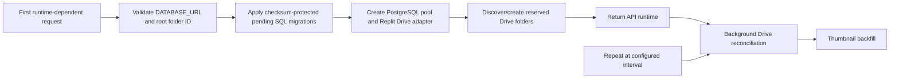

# Standalone Memories album

This artifact owns the independent wedding archive under `/Memories/`, including the public gallery, guest upload flow, administrator application, Node HTTP APIs, PostgreSQL schema and Google Drive integration.

It does **not** own the legacy invitation photo wall or legacy `/api/photos*` implementation.

## Canonical routes

| Route | Purpose |
| --- | --- |
| `/Memories/` | Public gallery |
| `/Memories/api/health` | Lightweight healthcheck; does not initialize the full runtime |
| `/Memories/api/photos*` | Public photo list and controlled thumbnail/original streaming |
| `/Memories/api/upload-batches*` | Guest batch and per-photo upload APIs |
| `/Memories/manage/:batchId` | Reserved private batch-management route; full UI/API is incomplete |
| `/Memories/admin/login` | Administrator login |
| `/Memories/admin/` | Administrator application |
| `/Memories/admin/api/*` | Protected session, album, photo and category APIs |
| `/admin...` | Compatibility redirect to `/Memories/admin...`; do not use as canonical documentation |

The Replit artifact path router explicitly owns `/Memories/admin`, `/Memories`, lowercase compatibility paths and the old `/admin` alias on port 19316.

## Stack

- React + Vite frontend
- Node.js 24 HTTP server
- PostgreSQL index, upload state, settings, albums and administrator rate limits
- Google Drive originals and WebP thumbnails
- Replit Google Drive Integration through `@replit/connectors-sdk`
- `sharp` image validation, orientation normalization, metadata removal and thumbnail generation
- Busboy single-photo multipart parsing
- Node test runner and dedicated GitHub Actions workflows

## Source-of-truth model

Google Drive is the media source of truth for originals, technical thumbnails and numbered wedding-process folders. PostgreSQL is the query and logical-state source of truth for public visibility, chronological ordering, albums, process relationships, upload batches, durable upload leases, application settings and administrator overrides.

Numbered Drive folders such as `01 進場` determine wedding-process labels and ordering. The runtime discovers or creates the reserved folders:

```text
00 未分類
訪客上傳
生活照
系統縮圖
```

Browser responses expose only opaque Memories UUIDs and controlled `/Memories/api/photos/:id/*` URLs. Drive file IDs, folder IDs, connector payloads and credentials stay server-side.

## Main runtime sequence



Only the small root-folder structure lookup blocks runtime readiness. The expensive folder/photo scan runs in the background after the runtime is ready.

## Public gallery

- Public photos are selected from PostgreSQL with `visibility = 'public'`.
- Default order is `created_at ASC, id ASC`.
- Drive imports use image capture time when available, then Drive creation time, then modified time.
- The frontend renders row-major order, left-to-right and top-to-bottom.
- A measured CSS Grid masonry layout reduces empty gaps without cropping photos.
- Thumbnail responses are immutable for one year; media responses use shorter cache and stale-while-revalidate.
- A missing/broken thumbnail is repaired when possible and may temporarily fall back to the original with `no-store`.
- The redundant top navigation is hidden; the bottom collection navigation remains.
- Five taps on the title within roughly 3.5 seconds check the admin session and navigate to the admin or login route.

## Guest upload

1. `POST /Memories/api/upload-batches` creates a PostgreSQL batch and returns a private management token.
2. The client sends one photo at a time to `/Memories/api/upload-batches/:id/photos`.
3. Busboy enforces one photo per request and the configured byte limit.
4. `sharp` validates and normalizes the image and creates a WebP thumbnail.
5. `memories_upload_items` claims a stable `(batch_id, client_upload_id)` lease.
6. The server reuses deterministic Drive filenames when a retry already created the original or thumbnail.
7. The completed photo and album/process relationships are inserted into PostgreSQL.

The UI accepts up to 30 selected files, with a 25 MB maximum per file, and supports JPEG, PNG, WebP, HEIC and HEIF. Drive retryable errors use bounded exponential backoff.

## Administrator security and capabilities

The administrator password is the Replit Secret:

```text
MEMORIES_ADMIN_TOKEN
```

Do not use the obsolete `SECRET_TOKEN` name.

A successful login exchanges the password for a 30-minute, HMAC-signed cookie:

```text
HttpOnly; Secure; SameSite=Strict; Path=/Memories/admin
```

The password is never stored in browser storage. PostgreSQL-backed failure limits are shared across Autoscale instances through `memories_admin_login_failures`.

Current administrator capabilities:

- create and edit albums;
- create, rename and reorder Drive-backed categories;
- upload one official photo;
- edit photo display name, capture time, visibility, albums and category;
- preserve administrator capture-time and album overrides across later Drive reconciliation.

Current rebuilt admin limitations:

- no photo single/batch delete;
- no album delete;
- no category delete;
- no seven-day trash/restore/expiry workflow;
- no completed private guest-batch management/withdrawal screen.

## Drive reconciliation

Reconciliation runs immediately after runtime readiness and periodically every five minutes by default, never more frequently than once per minute.

It:

- creates missing reserved folders;
- imports numbered process folders into PostgreSQL;
- imports official images from process folders, the root, `00 未分類` and `生活照`;
- imports guest originals from `訪客上傳` while preserving logical website classification;
- deactivates process rows whose Drive folder disappeared;
- backfills missing WebP thumbnails.

It currently does **not** deactivate or trash a photo row when its Drive file is manually deleted. Manual Drive deletion can therefore leave a public PostgreSQL record, a separate thumbnail and browser cache.

## PostgreSQL migrations

Tracked migrations live under `db/001_...sql` through `db/009_...sql`. The runner:

- uses `memories_schema_migrations` with SHA-256 checksums;
- refuses modified already-applied migrations;
- uses a PostgreSQL advisory lock;
- applies only pending files;
- starts the production HTTP listener only after migration success.

Never manage Memories tables with `drizzle-kit push`. Replit `postMerge` applies the same tracked migrations to the development database to keep publish previews non-destructive.

## Required production configuration

Connect the Replit Google Drive Integration and set these Production Secrets:

```text
DATABASE_URL
MEMORIES_DRIVE_PHOTOS_FOLDER_ID
MEMORIES_ADMIN_TOKEN
```

Optional tuning:

```text
MEMORIES_DRIVE_SYNC_INTERVAL_MS=300000
MEMORIES_THUMBNAIL_BATCH_SIZE=12
MEMORIES_THUMBNAIL_MAX_PER_RUN=240
MEMORIES_DRIVE_THUMBNAILS_FOLDER_ID=
MEMORIES_TRUST_PROXY=1
MEMORIES_SKIP_MIGRATIONS=1
```

`MEMORIES_DRIVE_THUMBNAILS_FOLDER_ID` is a legacy override. The normal runtime discovers or creates `系統縮圖` below the configured root. `MEMORIES_SKIP_MIGRATIONS=1` is for controlled diagnostics only.

## Commands

Run from the repository root:

```bash
pnpm install
pnpm --filter @workspace/memories-album dev
pnpm --filter @workspace/memories-album test
pnpm --filter @workspace/memories-album build
pnpm --filter @workspace/memories-album start
pnpm --filter @workspace/memories-album db:migrate
```

The live Drive smoke test must run only in a configured Replit environment and against a safe test folder:

```bash
pnpm --filter @workspace/memories-album test:drive-live
```

## CI and hard boundary

Standalone Memories CI runs the Node test suite, production build and a real `dist/server.mjs` health smoke test. A separate legacy-boundary workflow prevents Memories PRs from modifying:

- `artifacts/wedding-invitation/**`;
- the legacy `/api/photos*` implementation;
- legacy Replit Object Storage photo-wall files.

Do not add service-account JSON, `GOOGLE_APPLICATION_CREDENTIALS`, OAuth client secrets, refresh tokens, Drive provider IDs, raw guest-management tokens or the real administrator password to the repository.
