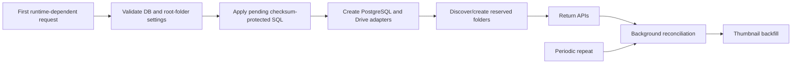

# Standalone Memories album

This artifact owns the independent wedding archive under `/Memories/`: the public gallery, guest uploads, administrator application, Node HTTP APIs, PostgreSQL schema and Google Drive integration.

It does **not** own the legacy invitation photo wall or legacy `/api/photos*` implementation.

## Canonical routes

| Route | Purpose |
| --- | --- |
| `/Memories/` | Public gallery |
| `/Memories/api/health` | Lightweight healthcheck; no full runtime initialization |
| `/Memories/api/photos*` | Public list and controlled image streaming |
| `/Memories/api/upload-batches*` | Guest batch and per-photo uploads |
| `/Memories/manage/:batchId` | Reserved private batch-management route; incomplete |
| `/Memories/admin/login` | Administrator login |
| `/Memories/admin/` | Administrator application |
| `/Memories/admin/api/session` | Login/session/logout |
| `/Memories/admin/api/changes` | Patch-style global save API |
| `/Memories/admin/api/albums*` | Album API |
| `/Memories/admin/api/photos*` | Photo read/upload/edit/permanent-delete API |
| `/Memories/admin/api/categories*` | Drive-backed category and YouTube-setting API |
| `/admin...` | Compatibility redirect only |

The Replit artifact router sends `/Memories/admin`, `/Memories`, lowercase compatibility paths and the old `/admin` alias to port 19316. Production health uses `/Memories/api/health`.

## Stack

- React + Vite
- Node.js 24 HTTP server
- PostgreSQL
- Google Drive originals and WebP thumbnails
- Replit Google Drive Integration via `@replit/connectors-sdk`
- `sharp` image processing
- Busboy multipart parsing
- Node test runner and GitHub Actions

## Source-of-truth model

Google Drive owns originals, generated thumbnails and numbered process-folder metadata. PostgreSQL owns visibility, ordering, albums, process relationships, per-process YouTube settings, upload batches, durable upload state, settings, administrator overrides and shared login-failure limits.

Numbered folders such as `01 進場` determine process labels and order. The runtime discovers or creates:

```text
00 未分類
訪客上傳
生活照
系統縮圖
```

Browser responses expose only opaque Memories UUIDs and controlled `/Memories/api/photos/:id/*` URLs. Drive IDs, folder IDs, connector payloads and credentials stay server-side.

## Runtime sequence



Only the reserved-folder lookup blocks readiness; the expensive folder/photo scan runs in the background.

## Public gallery

- Public rows require `visibility = 'public'`.
- Default order is `created_at ASC, id ASC`.
- Drive imports prefer capture time, then Drive creation time, then modified time.
- Rendering is row-major: left-to-right, then top-to-bottom.
- Measured CSS Grid masonry reduces gaps without cropping.
- Missing thumbnails are repaired when possible and may temporarily fall back to the original with `no-store`.
- Guest uploads are grouped automatically by normalized uploader name. The Guest uploads album shows `Name (count)` filters plus an all-guests total.
- Selecting a wedding process with a configured YouTube video renders that video before the process photos. Mobile uses a centered full-row 16:9 frame, followed immediately by a divider and gallery.
- YouTube embeds use `youtube-nocookie.com`. Autoplay is optional and muted so supported mobile browsers may allow it.
- Five title taps within about 3.5 seconds check the nested admin session route.

## Guest upload

1. Create a PostgreSQL upload batch using the required uploader name.
2. Send one photo per multipart request.
3. Validate and normalize with `sharp`; generate WebP.
4. Claim stable `(batch_id, client_upload_id)` durable state.
5. Reuse deterministic Drive files on retries.
6. Insert the completed photo into Guest uploads.
7. Build public guest subcategories automatically from the stored uploader name.

Visitors do not choose a wedding process or life-photo classification in the upload interface. The UI accepts up to 30 files, 25 MB each: JPEG, PNG, WebP, HEIC and HEIF. Retryable Drive errors use bounded exponential backoff.

## Administrator authentication

The exact Production Secret is:

```text
MEMORIES_ADMIN_TOKEN
```

The obsolete `SECRET_TOKEN` name is not read.

Successful login creates a 30-minute HMAC-signed cookie:

```text
HttpOnly; Secure; SameSite=Strict; Path=/Memories/admin
```

The password is never stored in browser storage. PostgreSQL-backed failure limits are shared across Autoscale instances.

## Administrator save workflow

Album, category, photo, ordering, process-video and new-record edits remain in local React draft state. A persistent footer displays the pending-operation count.

Pressing `儲存所有變更` builds operations containing only changed fields. General JSON edits use:

```text
PATCH /Memories/admin/api/changes
```

Per-process YouTube settings use the protected category item endpoint during the same global save action. The server returns or reports an independent result for every operation. Successful drafts are cleared; failed drafts remain pending for correction and retry. Drive-backed category/photo operations report precise partial failures rather than falsely marking the entire batch successful.

A selected new photo is binary multipart data, so it uploads after the JSON change batch. A failed upload remains selected. Reload, archive navigation and logout protect unsaved changes.

Current admin capabilities:

- create and edit albums;
- create, rename and reorder Drive-backed categories;
- assign or clear a YouTube link per process and choose muted autoplay;
- upload one official photo;
- edit photo display name, capture time, visibility, albums and category;
- permanently delete one photo with an explicit confirmation;
- delete both Drive media files and the corresponding PostgreSQL record/relationships;
- preserve administrator capture-time and album overrides across reconciliation;
- save cross-tab edits in one global action with partial-failure recovery.

Permanent deletion is intentionally immediate and irreversible. A Drive `404` is treated as already deleted; other Drive failures stop database deletion so the administrator can retry.

Current limitations:

- no batch photo delete;
- no album or category delete;
- no seven-day trash/restore/expiry workflow;
- incomplete private guest-batch management/withdrawal.

## Drive reconciliation

Reconciliation runs after readiness and every five minutes by default, never more often than once per minute. It creates missing reserved folders, imports numbered processes and photos, deactivates missing process folders and backfills thumbnails.

Process YouTube settings live in PostgreSQL and are not overwritten when Drive folder names/order are reconciled.

Guest originals stay physically in `訪客上傳`; uploader-name groups are derived from PostgreSQL photo metadata. Manual Drive deletion does **not** currently trash/deactivate the corresponding PostgreSQL photo row, so a public record, separate thumbnail and browser cache may remain. Use the administrator permanent-delete action for a complete deletion.

## Migrations

Tracked migrations live under `db/001_...sql` through `db/010_...sql`. Migration 010 adds `youtube_video_id` and `youtube_autoplay` to `memories_processes`. The runner:

- records filenames and SHA-256 checksums in `memories_schema_migrations`;
- refuses changed already-applied files;
- uses a PostgreSQL advisory lock;
- applies only pending files;
- starts production listening only after success.

Never manage Memories tables with `drizzle-kit push`. Replit `postMerge` applies the same migrations to development to keep publish previews non-destructive.

## Required production configuration

Connect Replit Google Drive Integration and set:

```text
DATABASE_URL
MEMORIES_DRIVE_PHOTOS_FOLDER_ID
MEMORIES_ADMIN_TOKEN
```

Optional:

```text
MEMORIES_DRIVE_SYNC_INTERVAL_MS=300000
MEMORIES_THUMBNAIL_BATCH_SIZE=12
MEMORIES_THUMBNAIL_MAX_PER_RUN=240
MEMORIES_DRIVE_THUMBNAILS_FOLDER_ID=
MEMORIES_TRUST_PROXY=1
MEMORIES_SKIP_MIGRATIONS=1
```

The thumbnail-folder ID is a legacy override. Normal runtime discovers or creates `系統縮圖`. Skipping migrations is for controlled diagnosis only.

## Commands

```bash
pnpm install
pnpm --filter @workspace/memories-album dev
pnpm --filter @workspace/memories-album test
pnpm --filter @workspace/memories-album build
pnpm --filter @workspace/memories-album start
pnpm --filter @workspace/memories-album db:migrate
pnpm --filter @workspace/memories-album test:drive-live
```

The live Drive test must run only in a configured Replit environment against a safe folder.

## CI and boundary

Standalone CI runs Node tests, production build and a real `dist/server.mjs` health smoke. A separate workflow prevents Memories PRs from modifying:

- `artifacts/wedding-invitation/**`;
- legacy `/api/photos*`;
- legacy Object Storage photo-wall files.

Do not commit service-account JSON, `GOOGLE_APPLICATION_CREDENTIALS`, OAuth client secrets, refresh tokens, Drive provider IDs, raw guest-management tokens or the real administrator password.
