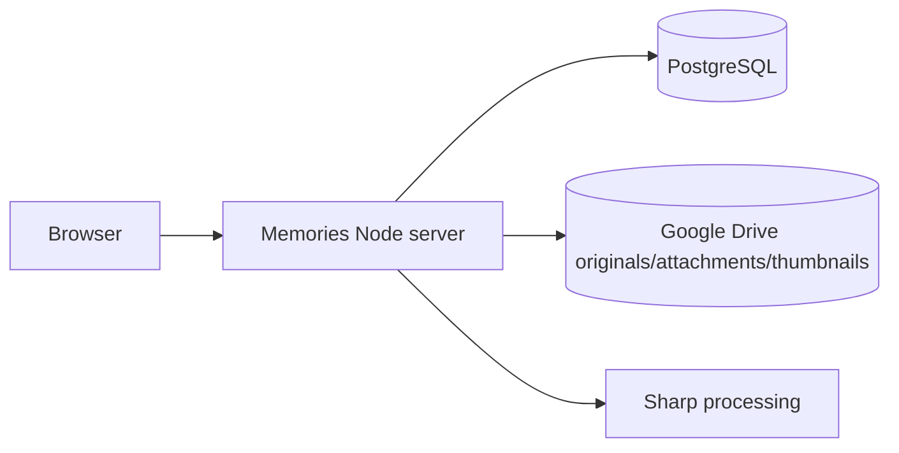
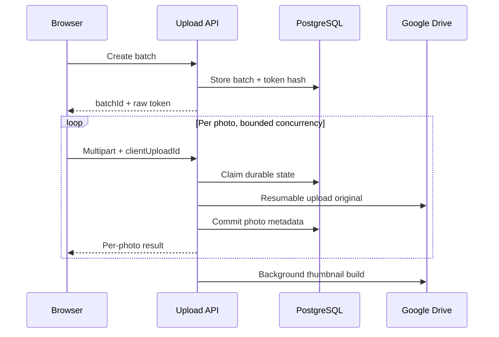

# Standalone Memories

`@workspace/memories-album` owns the wedding archive under `/Memories/*`: public gallery、guest uploads、private batch management、guestbook、administrator application、Node APIs、PostgreSQL migrations and Google Drive media。

It does **not** own the legacy invitation photo wall or legacy `/api/photos*` Object Storage implementation。

| Start here | Document |
| --- | --- |
| Role-based index | [`../../DOCUMENTATION.md`](../../DOCUMENTATION.md) |
| Maintainer guide | [`../../MAINTAINER_GUIDE.md`](../../MAINTAINER_GUIDE.md) |
| Operations | [`../../OPERATIONS_GUIDE.md`](../../OPERATIONS_GUIDE.md) |
| From-zero/multi-cloud | [`../../docs/site-handbook/`](../../docs/site-handbook/README.md) |
| Device evidence | [`../../docs/memories/phase-2-device-validation-2026-08-05.md`](../../docs/memories/phase-2-device-validation-2026-08-05.md) |
| Performance gate | [`../../docs/memories/phase-2-performance-gate-2026-08-05.md`](../../docs/memories/phase-2-performance-gate-2026-08-05.md) |

## Runtime

| Item | Current contract |
| --- | --- |
| Runtime | Node.js 24 |
| Frontend/build | React 19 + Vite 7 |
| Package manager | pnpm 10 workspace |
| Replit port | `19316` |
| Base path | `/Memories` |
| Health | `/Memories/api/health` |
| Database | PostgreSQL |
| Media | Google Drive via `@replit/connectors-sdk` |
| Images | Sharp + WebP derivatives |
| Rich content | Tiptap、Mammoth、docx-preview |
| Browser gate | Playwright Chromium、Firefox、WebKit and In-App representatives |

## Canonical routes

| Route | Purpose |
| --- | --- |
| `/Memories/` | Default public entry |
| `/Memories/en/` | English entry |
| `/Memories/albums/:albumKey` | Stable album identity |
| `/Memories/albums/:albumKey/labels/:labelKey` | Stable album label |
| `.../photos/:photoId` | Open photo on current gallery route |
| `/Memories/upload` | Guest upload |
| `/Memories/manage/:batchId#token=...` | Private batch management |
| `/Memories/admin/login` | Admin login |
| `/Memories/admin/general` | General tab |
| `/Memories/admin/albums` | Albums/labels tab |
| `/Memories/admin/photos` | Photos tab |
| `/Memories/admin/categories` | Processes/content/messages tab |

Display order never defines canonical URLs. Old ordinal/semantic routes are migration aliases only。See [`docs/logical-routes.md`](docs/logical-routes.md)。

## System boundary and data ownership



| Data | Owner |
| --- | --- |
| Originals and image attachments | Google Drive |
| WebP thumbnails | Google Drive `系統縮圖` |
| Albums、labels、processes、visibility、author、capture time | PostgreSQL |
| Guestbook messages | PostgreSQL |
| Upload batches、token/content hashes、resume state | PostgreSQL |
| Rich content、video、pinned/featured settings、site settings | PostgreSQL |
| Admin secret | Replit Secret `MEMORIES_ADMIN_TOKEN` |

Browser payloads expose opaque Memories IDs and controlled media routes, never provider IDs、credentials、token hashes or connection strings。

## Public bootstrap

Before the first public render, `src/client/public-bootstrap.mjs` requests in parallel:

```text
/Memories/api/albums
/Memories/api/settings
/Memories/api/processes
```

The normalized snapshot drives album types、labels、processes、copy/style/icon、navigation/wheel、featured/pinned photos and upload classification。Resources fail independently and use bounded fallback behavior。

## Albums、Labels and Messages

### Photo albums

- Every non-guest album can own album-scoped labels。
- Generated **全部{相簿名}** remains first。
- Custom labels support create、rename、reorder、show/hide and delete。
- Photo album membership can exist independently of labels。
- Changing album resolves a valid label for that album。
- Wedding-process bilingual titles may override public label text。

### Guest album

Guest virtual labels include all visitors、latest photos and uploader names。Visibility、latest count and uploader-name order are configurable。

### Message album

A message album uses the same stable album route but renders PostgreSQL-backed guestbook content:

- Public listing、sorting、composer and modal。
- Admin moderation and import/export tools。
- Admin accordion stays collapsed and does not load messages until opened。
- Initial async load reuses shared content-positioning logic。

## Photos and Media

- Public API returns only public visibility rows。
- Album sort applies inside photo groups, not video/rich-content/pinned groups。
- Masonry、lazy loading、controlled originals and fullscreen viewing。
- Featured-photo selection is scoped to active album、label/filter、eligible set and page-load seed。
- Changing context must discard previous featured IDs。
- Missing derivatives may temporarily fall back to originals with bounded caching。

## Current performance gate

| Area | Current implementation |
| --- | --- |
| Public entry splitting | Admin、admin login and private management are dynamic imports |
| First request | 24 photo records |
| Progressive loading | First page renders immediately；later cursor pages yield to idle/timer |
| First image | First thumbnail remains high priority |
| Browser metrics | `window.__MEMORIES_WEB_VITALS__` |
| Debug | `?performance=1` prints current snapshot only |
| Reports | `dist/performance/bundle-report.json` and `.md` |

Build regression ceilings:

| Budget | Ceiling |
| --- | ---: |
| Public entry gzip | 450 KiB |
| Any JS chunk gzip | 800 KiB |
| Total JS gzip | 2 MiB |

`src/client/performance-monitor.mjs` records LCP、CLS、largest observed interaction duration and navigation timing。`scripts/analyze-bundle.mjs` validates Vite manifest output、dynamic route splitting and bundle budgets。

Responsive image variants and truly on-demand server cursor loading remain future work。

## Process content

Processes may contain YouTube video/autoplay、bilingual Tiptap content、Word import、image attachments、divider spacing、1–3 pinned photos and a continuous photo wall。

| Input | Current status |
| --- | --- |
| Word-related documents | Supported |
| PDF/PPT import | Not supported |
| General image attachment | Supported |
| General non-image attachment | Not supported |

Imported tables/images/filenames must remain within mobile and desktop viewports。

## Guest upload



Current rules:

- Guest/Admin selection limits: 1–100 configurable；defaults 10/30。
- Fixed worker concurrency, independent of selection limit。
- JPEG、PNG、WebP、HEIC、HEIF；25 MB per photo。
- Durable `(batchId, clientUploadId)` identity。
- Duplicate identity is content-based, not filename-based。
- Bounded first/deferred retry passes and resumable sessions。
- Reserved uploader `婚禮攝影` receives validation/delete protection。

## Private batch management

Raw token is carried in the URL fragment and sent explicitly as a Bearer token；PostgreSQL stores only its hash。The uploader can list the exact batch、permanently delete eligible photos and rotate the private link。

Permanent deletion handles original、thumbnail、relations、photo row and pinned references。A non-404 storage failure must not produce a false successful DB deletion。There is no trash/restore lifecycle。

## Administrator application

Admin authentication uses `MEMORIES_ADMIN_TOKEN` and an approximately 30-minute signed cookie:

```text
HttpOnly; Secure; SameSite=Strict; Path=/Memories/admin
```

Admin capabilities include appearance/copy/icon、albums/types/sort/featured ranges、album labels、process video/content/Word/image attachments、pinned photos、upload settings、guest labels、guestbook moderation、photo filters/upload/edit/bulk actions and refresh/rebuild tools。

Admin upload classification still completes through follow-up PATCH calls and remains a known atomicity limitation。

## Background synchronization

Background work discovers reserved folders、reconciles process/photo metadata and backfills thumbnails。A run may complete while reporting individual failures；operators must inspect attempted、successful and failure codes。

Manual Drive deletion is not complete application deletion。

## Migrations

Current latest:

```text
016_explicit_guest_album_membership.sql
```

The runner records filename/checksum、refuses modified applied files、uses a PostgreSQL advisory lock and starts production listening only after success。

Never use `drizzle-kit push` for Memories production tables。Stop deployment on unexpected DROP operations。

## Commands

```bash
pnpm install --frozen-lockfile
pnpm --filter @workspace/memories-album dev
pnpm --filter @workspace/memories-album test
pnpm --filter @workspace/memories-album run test:impact
pnpm --filter @workspace/memories-album run test:layout-browser
pnpm --filter @workspace/memories-album build
pnpm --filter @workspace/memories-album start
pnpm --filter @workspace/memories-album db:migrate
pnpm --filter @workspace/memories-album test:drive-live
```

## CI

| Workflow | Purpose |
| --- | --- |
| `memories-fast-ci.yml` | Draft PR impact validation |
| `memories-ci.yml` | Ready PR impact validation and full `main` integration |
| `memories-cross-browser.yml` | Production Playwright cross-browser/In-App gate |
| `memories-legacy-boundary.yml` | Protect invitation/legacy API paths |

Automated In-App profiles are not physical-device proof。Use the Phase 2 evidence matrix for real-device acceptance。

## Required production configuration

```text
DATABASE_URL
MEMORIES_DRIVE_PHOTOS_FOLDER_ID
MEMORIES_ADMIN_TOKEN
```

Published App also requires Replit Google Drive Integration。Never commit Secrets、OAuth、Drive IDs、private tokens、resumable session URIs、signed URLs or provider raw responses。

## Current architecture risks

- Exact-string Vite transforms still modify `App.jsx`／`AdminApp.jsx`。
- Settings remain distributed across multiple layers。
- Admin upload/classification is not one atomic command。
- Direct Drive deletion does not fully clean PostgreSQL state。
- Permanent delete has no recovery period。
- People classification/selfie search are not approved or implemented。
- Other clouds require a portable media adapter and explicit worker/job model。
