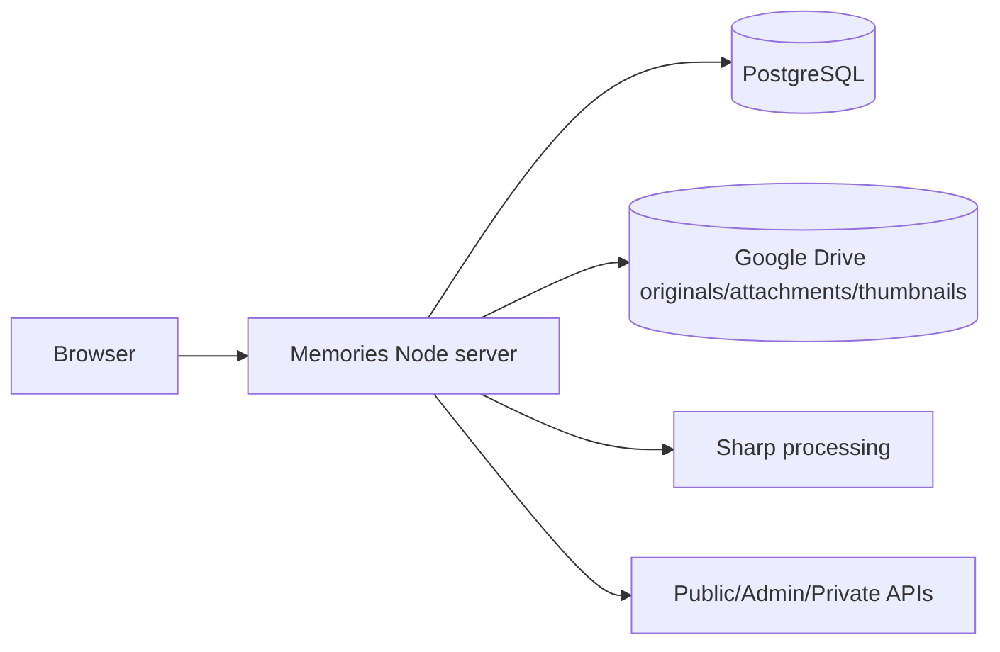
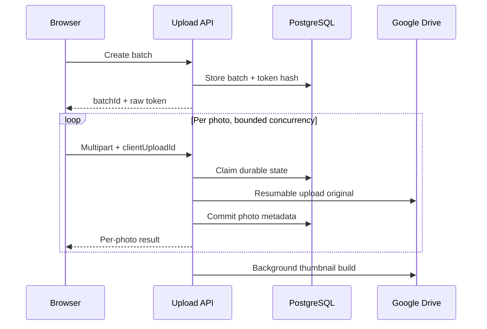

# Standalone Memories

`@workspace/memories-album` owns the independent wedding archive under `/Memories/*`：public gallery、guest uploads、private batch management、guestbook、administrator app、Node APIs、PostgreSQL migrations 與 Google Drive media。

它不負責 legacy invitation photo wall 或 legacy `/api/photos*` Object Storage。

- 文件索引：[`../../DOCUMENTATION.md`](../../DOCUMENTATION.md)
- Maintainer guide：[`../../MAINTAINER_GUIDE.md`](../../MAINTAINER_GUIDE.md)
- 從零架站／多雲：[`../../docs/site-handbook/README.md`](../../docs/site-handbook/README.md)
- Replit operations：[`../../OPERATIONS_GUIDE.md`](../../OPERATIONS_GUIDE.md)

## Runtime 與 Route

| 項目 | Current contract |
| --- | --- |
| Runtime | Node.js 24 |
| Dev/build | React 19 + Vite 7 |
| Package | pnpm 10 workspace |
| Port | `19316` in Replit artifact；cloud runtime uses `$PORT` |
| Base path | `/Memories` |
| Health | `/Memories/api/health` |
| Database | PostgreSQL |
| Media | Google Drive via `@replit/connectors-sdk` |

### Canonical public routes

| Route | Purpose |
| --- | --- |
| `/Memories/` | Default public entry |
| `/Memories/en/` | English entry |
| `/Memories/albums/:albumKey` | Stable album identity |
| `/Memories/albums/:albumKey/labels/:labelKey` | Stable album label |
| `.../photos/:photoId` | Open photo on current gallery route |
| `/Memories/upload` | Guest upload |
| `/Memories/manage/:batchId#token=...` | Private batch management |
| `/Memories/admin/login` | Admin login |
| `/Memories/admin/general` | General tab |
| `/Memories/admin/albums` | Album/label tab |
| `/Memories/admin/photos` | Photo tab |
| `/Memories/admin/categories` | Process/content/message tab |

Display order 不定義 URL。舊 ordinal/semantic routes 只作 migration aliases。完整規則：[`docs/logical-routes.md`](docs/logical-routes.md)。

## 系統邊界



### Data ownership

| Data | Owner |
| --- | --- |
| Originals／image attachments | Google Drive |
| WebP thumbnails | Google Drive `系統縮圖` |
| Album/label/process relations | PostgreSQL |
| Visibility、author、capture time | PostgreSQL |
| Guestbook messages | PostgreSQL |
| Upload batch、token hash、content hash、resume state | PostgreSQL |
| Rich content、video、pinned/featured settings | PostgreSQL |
| Site copy/appearance/settings | PostgreSQL |
| Admin secret | Replit Secret `MEMORIES_ADMIN_TOKEN` |

Browser 不取得 Drive ID、folder ID、connector raw response、credential、token hash 或 database URL。

## Public bootstrap

`src/client/public-bootstrap.mjs` 在第一次 render 前平行取得：

```text
/Memories/api/albums
/Memories/api/settings
/Memories/api/processes
```

Normalized snapshot 供：

- albums／album types；
- labels／guest virtual labels；
- processes／media order；
- site copy/style/icon；
- wheel/navigation settings；
- featured/pinned photos；
- upload classification UI。

各 resource 可獨立 fallback，避免成功資料被單一 endpoint failure 全部覆蓋。

## Albums、Labels 與 Messages

### Photo albums

- 每個 non-guest album 可有 album-scoped labels。
- Generated **全部{相簿名}** label 固定第一位。
- Custom labels 可 create、rename、reorder、show/hide、delete。
- Photo 可有 explicit album membership，不必只靠 label。
- Changing album resets active label to a valid identity。
- Wedding process bilingual titles 可覆蓋 public label text。

### Guest album

Guest album 使用 virtual labels：

- All visitors；
- Latest photos；
- Uploader names。

Latest count、visibility 與 name order 可由 Admin 設定。

### Message album

Message album 使用同一 stable album route，但 renderer 改為 guestbook：

- Public message listing／sorting／composer／modal；
- PostgreSQL persistence；
- Admin moderation；
- Admin accordion 預設收合，展開後才 load；
- Initial async load 完成後使用 shared content-navigation positioning。

## Photos 與 Featured Photos

- Public 只回 `visibility = public`。
- Album sort 只影響 photo group，不重排 video/rich content/pinned group。
- Cursor/API loading 與 explicit “load more” 控制 DOM growth。
- Masonry layout、lazy loading、fullscreen viewer。
- Original 經 controlled route 新分頁開啟。
- Missing derivative 可暫時 fallback original，使用 bounded cache policy。

每個 album 可獨立設定 random featured-photo enablement 與 min/max range。

Selection context 包含：

```text
active album
active label/filter
eligible photo set
page-load seed
```

Changing album/label 必須建立新 context，不能保留 previous featured IDs。

## Process Content

Wedding process 可包含：

- YouTube video/autoplay；
- bilingual Tiptap content；
- Word document import；
- image attachments；
- divider spacing；
- 1–3 pinned photos；
- continuous photo wall。

Current import contract：

| Input | Status |
| --- | --- |
| Word-related documents | Supported |
| PDF | Not supported |
| PowerPoint | Not supported |
| General image attachment | Supported |
| Non-image general attachment | Not supported |

Mammoth/docx-preview 內容需在 mobile/desktop viewport 內顯示；table、image、filename 不得水平溢出。

## Guest Upload

流程：



Current rules：

- Guest/Admin selection limits：1–100 configurable；defaults 10/30。
- Fixed worker concurrency；limit 不直接增加 parallel work。
- JPEG、PNG、WebP、HEIC、HEIF；25 MB per photo。
- `(batchId, clientUploadId)` durable identity。
- Duplicate 依 content，不依 filename。
- Bounded first/deferred retry pass。
- Offline wait 不消耗 attempt。
- Resume 使用相同 batch/upload ID/session。
- Reserved uploader `婚禮攝影` 受 guest validation 與 delete protection。

## Drive Upload 與 Background Sync

New originals 使用 resumable session：

- `single`：同一 resumable session 內一次 PUT 完整檔案。
- `chunked`：4 MiB chunks，保存 session URI／offset／updated time。

Background sync：

- discovery reserved folders；
- process/photo reconciliation；
- missing process deactivation；
- thumbnail backfill；
- default periodic interval 5 minutes；
- job summary 可同時是 completed + failures。

Operator 必須看 `attempted`、`createdOrAttached`、`failureCount`、`failureCodes`。

## Private Batch Management

Raw token 放 URL fragment，request 時以 Bearer token 明確送出；PostgreSQL 只存 hash。

Uploader 可：

- list exact batch photos；
- permanent delete own eligible photos；
- rotate private link。

Delete 必須處理 original、thumbnail、relations、photo row、pinned references。Storage non-404 failure 不得先刪 DB 再回 success。

Current product 沒有 trash/restore。

## Administrator App

Admin secret：

```text
MEMORIES_ADMIN_TOKEN
```

Login 產生約 30 分鐘 HMAC-signed cookie：

```text
HttpOnly; Secure; SameSite=Strict; Path=/Memories/admin
```

Capabilities：

- site appearance、hero、copy、icon；
- selector/wheel/media order；
- albums/types/sort/featured range；
- album-scoped labels；
- Drive-backed processes、video、content、Word/image attachments；
- pinned photos；
- upload limits/mode/guidance；
- guest labels；
- guestbook moderation；
- photo filters、pagination、upload、edit、bulk actions；
- refresh/rescan/rebuild derivatives；
- global save coordinator。

Admin upload classification 目前由 upload 後 follow-up PATCH 完成，仍是待原子化的架構限制。

## Migrations

Migrations 在 `db/`，current latest：

```text
016_explicit_guest_album_membership.sql
```

Runner：

- filename + SHA-256 checksum；
- applied file immutable；
- PostgreSQL advisory lock；
- pending-only；
- production listen after success。

禁止：

```text
drizzle-kit push
```

Unexpected `DROP TABLE`／`DROP COLUMN`／constraint removal → stop deployment。

## Commands

```bash
pnpm install --frozen-lockfile
pnpm --filter @workspace/memories-album dev
pnpm --filter @workspace/memories-album test
pnpm --filter @workspace/memories-album run test:impact
pnpm --filter @workspace/memories-album run test:layout-browser
pnpm --filter @workspace/memories-album build
pnpm --filter @workspace/memories-album start
pnpm --filter @workspace/memories-album db:migrate
pnpm --filter @workspace/memories-album test:drive-live
```

## CI 與 Browser Gate

| Workflow | Purpose |
| --- | --- |
| `memories-fast-ci.yml` | Draft PR impact-selected validation |
| `memories-ci.yml` | Ready PR impact validation；full `main` integration |
| `memories-cross-browser.yml` | Production Playwright Chromium/Firefox/WebKit/In-App profiles |
| `memories-legacy-boundary.yml` | Protect invitation/legacy API paths |

Cross-browser profiles：

- Chromium desktop/mobile；
- Firefox desktop；
- WebKit desktop/mobile；
- Samsung Internet representative；
- WeChat、LINE、Facebook、Instagram Android/iOS representative。

Failure artifacts：screenshot、trace、video、HTML report。

Automated UA profile 不是 physical-device proof。真機 matrix：[`../../docs/memories/phase-2-device-validation-2026-08-05.md`](../../docs/memories/phase-2-device-validation-2026-08-05.md)。

## Current Architecture Risks

- Exact-string Vite transforms 仍修改 `App.jsx`／`AdminApp.jsx`。
- Settings 分散多層，需 central registry。
- Admin upload/classification 尚非 atomic command。
- Direct Drive delete 不會完整 DB cleanup。
- Permanent delete 無 recovery period。
- People classification/selfie search 尚未批准或實作。
- 其他雲端需 portable media adapter/background job model。

重構順序：[`../../docs/code-health-audit-2026-07.md`](../../docs/code-health-audit-2026-07.md)。

## Production Requirements

```text
DATABASE_URL
MEMORIES_DRIVE_PHOTOS_FOLDER_ID
MEMORIES_ADMIN_TOKEN
```

Published App 還需 Replit Google Drive Integration。

不提交：Secret、Database URL、OAuth、Drive IDs、private token、resumable session URI、signed URL、provider raw response。
