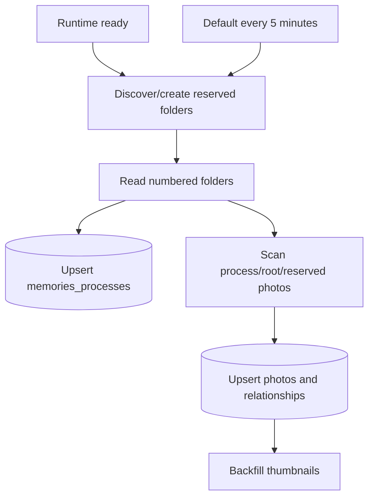

# Google Drive process-folder synchronization

> **Status:** Current  
> **Reviewed:** 2026-08-01T19:33:00+08:00 (Asia/Taipei)

Standalone Memories maps numbered Google Drive folders to public wedding-process categories while keeping provider identifiers server-side.

## Drive structure

```text
00 未分類
01 進場
02 祈禱
03 讚美
...
訪客上傳
生活照
系統縮圖
```

The numbered labels above are examples. The current production process list is discovered from Drive and is not a bundled fixed twelve-item application constant.

Photos directly under the root remain visible as unclassified compatibility content and are not moved automatically.

## Source-of-truth rules

- `NN 名稱` becomes a website wedding process.
- Folder numbering controls public process order.
- Renaming or adding numbered folders updates PostgreSQL after reconciliation.
- Removing a numbered folder deactivates the matching process row.
- Official images in process folders inherit that process.
- Moving an official image between managed folders changes its website process.
- Guest originals remain in `訪客上傳`; wedding/life classification is logical PostgreSQL state.
- Generated WebP derivatives remain in `系統縮圖`.
- Drive IDs never leave the server.

Manual Drive photo deletion is not currently reconciled into hidden/trashed PostgreSQL state. Process-folder cleanup and missing-photo cleanup are different behaviors.

## Runtime reconciliation



The default interval is five minutes; `MEMORIES_DRIVE_SYNC_INTERVAL_MS` overrides it with a one-minute minimum. A second sync does not start while one is active.

A job reaching its end does not guarantee every photo succeeded. Operators must inspect attempted, successful and failure counts plus safe failure codes.

## Administrator write-through

Canonical routes:

```text
/Memories/admin/login
/Memories/admin/categories
/Memories/admin/api/categories*
/Memories/admin/api/changes
```

Authentication uses `MEMORIES_ADMIN_TOKEN` and a signed HttpOnly cookie scoped beneath `/Memories/admin`.

Category changes are drafted locally and committed by `儲存所有變更`. The patch-style changes API executes category operations independently:

- create: create the next numbered folder, then upsert PostgreSQL;
- rename: validate and rename the Drive folder, then upsert PostgreSQL;
- reorder: rename folders to new sequential numbers, then reload Drive order;
- official-photo category edit: move the original Drive file, then update PostgreSQL.

Partial failure returns one result per operation. Successful drafts clear; failed drafts remain pending for retry.

The gallery title also has a hidden administrator entry gesture. It checks the canonical nested session route and opens the administrator or login page; it does not create a second authentication system.

Old `/admin*` is redirect-only. Removed `/Memories/api/admin/*` is not accepted.

## Failure and consistency rules

- A Drive write must not be reported as persisted when the PostgreSQL follow-up fails.
- A PostgreSQL update must not claim a physical move that Drive rejected.
- Retryable Drive failures should preserve enough state for a safe retry.
- Reconciliation must not overwrite PostgreSQL-owned video, rich content, settings or administrator metadata with folder defaults.
- Guest logical classification must not move guest originals out of `訪客上傳`.
- A manual folder rename and a website rename must converge on the same Drive-backed identity.

## Required production configuration

```text
DATABASE_URL
MEMORIES_DRIVE_PHOTOS_FOLDER_ID
MEMORIES_ADMIN_TOKEN
```

Published App Google Drive Integration must have edit access to the root and managed children. Never commit the real folder ID, password or Connector credentials.

## Maintainer verification

When synchronization behavior changes, test:

1. reserved-folder discovery is idempotent;
2. new, renamed, reordered and removed numbered folders;
3. official photo movement between managed folders;
4. guest logical classification without physical movement;
5. partial Drive/PostgreSQL failures and retry state;
6. background overlap prevention;
7. provider identifiers remain server-side.

See [`storage-drive.md`](storage-drive.md), [`../../MAINTAINER_GUIDE.md`](../../MAINTAINER_GUIDE.md) and [`../../OPERATIONS_GUIDE.md`](../../OPERATIONS_GUIDE.md).
