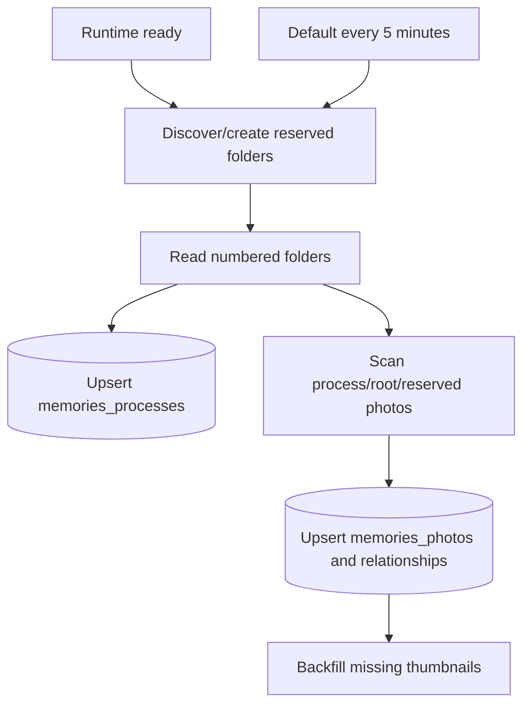

# Google Drive process-folder synchronization

The standalone Memories service maps numbered Google Drive folders to public wedding-process categories while keeping provider identifiers server-side.

## Drive structure

The configured root contains numbered process folders plus reserved folders:

```text
00 未分類
01 進場
02 祈禱
03 讚美
04 聖經
05 勉勵
06 證婚
07 謝親恩
08 祝福
09 答禮
10 影片
11 退場
12 分組照相
訪客上傳
生活照
系統縮圖
```

Photos directly under the root remain visible as unclassified compatibility content. They are not moved automatically.

## Source-of-truth rules

- A folder matching `NN 名稱` becomes a website wedding process.
- Folder numbering controls public process order.
- Renaming or adding a numbered Drive folder changes PostgreSQL after reconciliation.
- Removing a numbered folder deactivates the matching process row.
- An official image inside a process folder is associated with that process.
- Moving an official image between managed Drive folders changes its website process after reconciliation.
- Official images outside a process use the root, `00 未分類` or `生活照` collection as appropriate.
- Guest originals remain physically in `訪客上傳`; their website wedding-process or life-photo classification is logical PostgreSQL state.
- Generated WebP derivatives remain in `系統縮圖`.
- Drive folder and file IDs never leave the server.

Manual deletion of a Drive photo is not currently reconciled into a trashed or hidden PostgreSQL photo row. A public database record, separate thumbnail and browser cache may therefore remain. Process-folder cleanup and missing-photo cleanup are different behaviors.

## Runtime reconciliation



Reconciliation runs after runtime readiness and periodically. The default interval is five minutes; `MEMORIES_DRIVE_SYNC_INTERVAL_MS` may override it, with a one-minute minimum. A second synchronization does not start while the previous one is still active.

## Administrator write-through

The canonical administrator surface is:

```text
/Memories/admin/login
/Memories/admin/
/Memories/admin/api/categories*
```

The administrator enters `MEMORIES_ADMIN_TOKEN` at login. Successful authentication creates a short-lived signed HttpOnly cookie; the password is not stored in browser storage.

Category operations write through to Drive:

- create: creates the next numbered folder, then upserts PostgreSQL;
- rename: validates the current Drive folder, renames it, then upserts PostgreSQL;
- reorder: renames each folder to its new sequential number, then reloads the Drive order;
- official-photo category edit: moves the original Drive file, then updates PostgreSQL.

The gallery title still provides a hidden entry: five taps within about 3.5 seconds check `/Memories/admin/api/session`, then open `/Memories/admin/` or `/Memories/admin/login`.

The old `/admin*` path is compatibility redirect only. The removed `/Memories/api/admin/*` namespace is not accepted.

## Required production configuration

```text
DATABASE_URL
MEMORIES_DRIVE_PHOTOS_FOLDER_ID
MEMORIES_ADMIN_TOKEN
```

The Replit Google Drive Integration must be connected to the Published App and have edit access to the configured root and its children. Do not place the real root folder ID, administrator password or connector credentials in `.replit`, GitHub or browser code.
