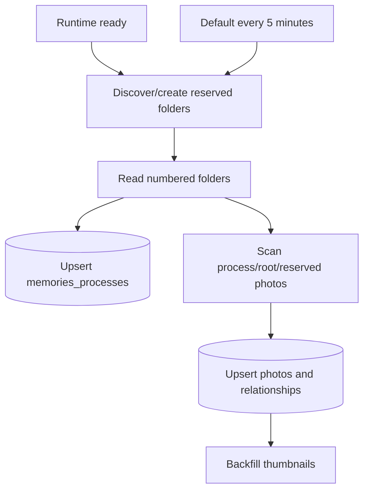

# Google Drive process-folder synchronization

Standalone Memories maps numbered Google Drive folders to public wedding-process categories while keeping provider identifiers server-side.

## Drive structure

```text
00 未分類
01 進場
02 祈禱
03 讚美
04 聖經
05 勉勵
06 證婚
07 謝親恩
08 祝福
09 答禮
10 影片
11 退場
12 分組照相
訪客上傳
生活照
系統縮圖
```

Photos directly under the root remain visible as unclassified compatibility content and are not moved automatically.

## Source-of-truth rules

- `NN 名稱` becomes a website wedding process.
- Folder numbering controls public order.
- Renaming or adding numbered folders updates PostgreSQL after reconciliation.
- Removing a numbered folder deactivates the matching process row.
- Official images in process folders inherit that process.
- Moving an official image between managed folders changes its website process.
- Guest originals remain in `訪客上傳`; wedding/life classification is logical PostgreSQL state.
- Generated WebP derivatives remain in `系統縮圖`.
- Drive IDs never leave the server.

Manual Drive photo deletion is not currently reconciled into hidden/trashed PostgreSQL state. Process-folder cleanup and missing-photo cleanup are different behaviors.

## Runtime reconciliation



The default interval is five minutes; `MEMORIES_DRIVE_SYNC_INTERVAL_MS` overrides it with a one-minute minimum. A second sync does not start while one is active.

## Administrator write-through

Canonical routes:

```text
/Memories/admin/login
/Memories/admin/
/Memories/admin/api/categories*
/Memories/admin/api/changes
```

Authentication uses `MEMORIES_ADMIN_TOKEN` and a signed HttpOnly cookie.

Category changes are drafted locally and committed by `儲存所有變更`. The patch-style changes API executes category operations independently:

- create: create the next numbered folder, then upsert PostgreSQL;
- rename: validate and rename Drive folder, then upsert PostgreSQL;
- reorder: rename folders to new sequential numbers, then reload Drive order;
- official-photo category edit: move the original Drive file, then update PostgreSQL.

Partial failure returns one result per operation. Successful drafts clear; failed drafts remain pending for retry.

The gallery title still provides a hidden entry: five taps within about 3.5 seconds check `/Memories/admin/api/session` and open the admin or login page.

Old `/admin*` is redirect-only. Removed `/Memories/api/admin/*` is not accepted.

## Required production configuration

```text
DATABASE_URL
MEMORIES_DRIVE_PHOTOS_FOLDER_ID
MEMORIES_ADMIN_TOKEN
```

Published App Google Drive Integration must have edit access to the root and managed children. Never commit the real folder ID, password or Connector credentials.
