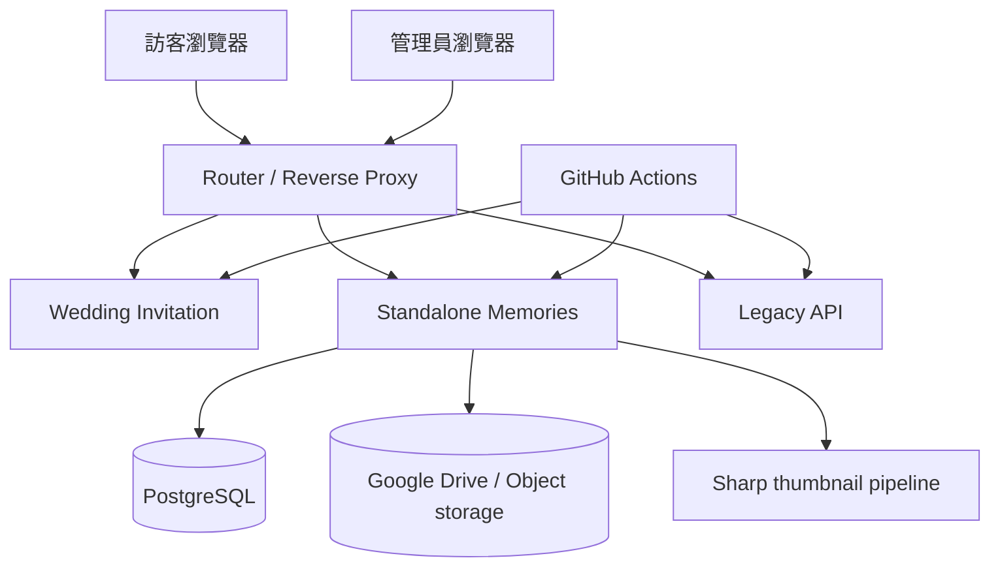
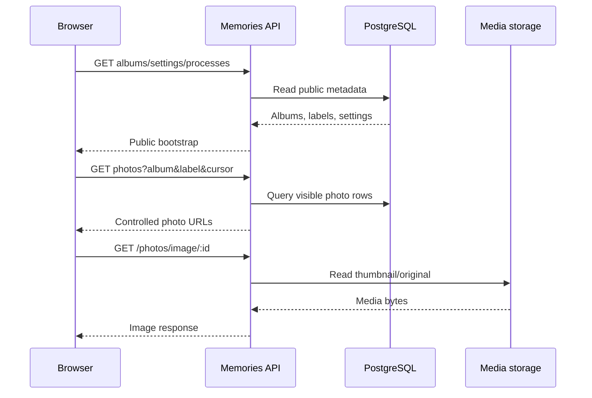
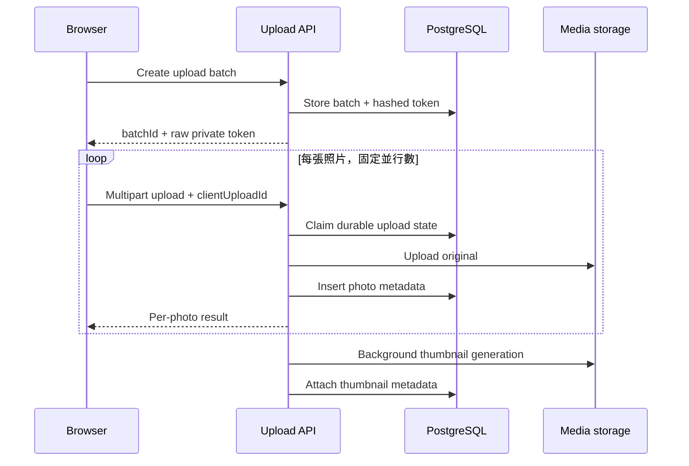
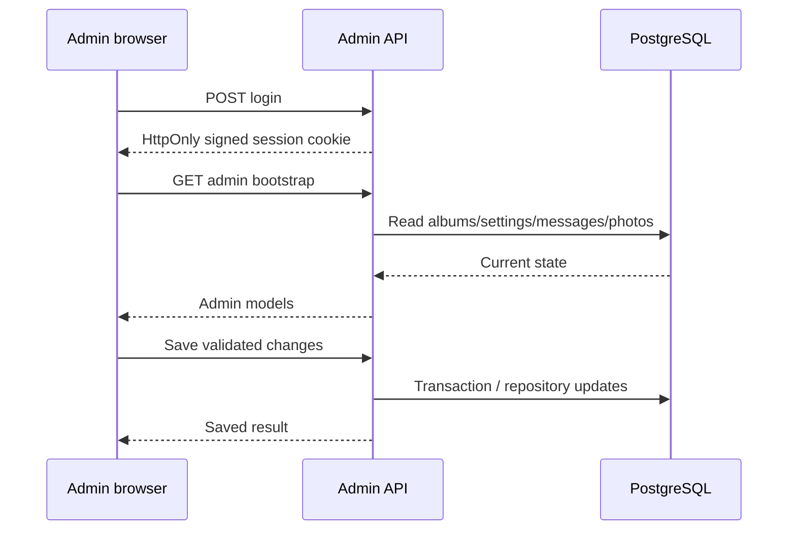

# 00｜產品、角色與系統邊界

> **目標：** 在寫程式前先決定網站要服務誰、資料放哪裡、哪些功能屬於公開站、管理站與 legacy 系統。

## 1. 產品組成

目前 repository 是一個 pnpm monorepo，但包含四個不同責任區：

| 區域 | Package | Route | 說明 |
| --- | --- | --- | --- |
| 婚禮邀請 | `@workspace/wedding-invitation` | `/` | 既有邀請網站與歷史內容 |
| Standalone Memories | `@workspace/memories-album` | `/Memories/*` | 主要照片檔案館、上傳、留言與管理後台 |
| Legacy API | `@workspace/api-server` | `/api/*` | 舊照片牆與 Object Storage 邊界 |
| Mockup Sandbox | `@workspace/mockup-sandbox` | `/__mockup` | Replit Canvas／元件預覽用途 |

## 2. 角色與權限

| 角色 | 可以做什麼 | 不應取得什麼 |
| --- | --- | --- |
| 一般訪客 | 看公開相簿、流程、標籤、留言、照片 | Drive ID、資料庫連線、管理 secret |
| 上傳者 | 建立上傳批次、上傳照片、管理自己批次 | 其他人的 batch token、管理員 API |
| 管理員 | 管理相簿、標籤、流程、照片、留言與設定 | Production database credential 明文 |
| 維運者 | 管理 Secret、Database、Drive、部署與回滾 | 不必要的私人照片內容或 raw token |
| 開發者 | 改程式、測試、文件與 migration | Production secrets、真實 private link |

## 3. 核心使用者旅程

### 訪客看照片

### 訪客上傳照片

### 管理員修改內容

## 4. 資料責任

| 資料 | Current owner | 原因 |
| --- | --- | --- |
| 原始照片 | Google Drive | 大型 binary、人工可管理、目前 Replit Integration |
| 縮圖 | Google Drive `系統縮圖` | 可重建的衍生檔 |
| 相簿／標籤／流程關聯 | PostgreSQL | 可查詢、排序、驗證、transaction |
| 留言 | PostgreSQL | moderation、排序、visibility |
| Upload batch 與 token hash | PostgreSQL | 權限與 idempotency |
| Rich content 與設定 | PostgreSQL | 管理與版本一致性 |
| Secret | Replit Secret 或雲端 Secret Manager | 不進 repository 與 browser |

### Portable architecture

移植到其他雲端時，可把 Google Drive 換成 provider object storage：

| Provider | Portable media target |
| --- | --- |
| Google Cloud | Cloud Storage |
| AWS | S3 |
| Azure | Blob Storage |
| Oracle Cloud | OCI Object Storage |
| On-premise | MinIO / Ceph / NAS-backed object service |

程式應透過 `MediaStorage` adapter 使用這些服務，而不是讓 UI 或 domain service 直接依賴 provider SDK。

## 5. Route contract

| 功能 | Route pattern |
| --- | --- |
| 中文公開相簿 | `/Memories/albums/:albumKey` |
| 英文公開相簿 | `/Memories/en/albums/:albumKey` |
| 標籤 | `/Memories/albums/:albumKey/labels/:labelKey` |
| Photo deep link | 在目前 route 後加 `/photos/:photoId` |
| Upload | `/Memories/upload`、`/Memories/en/upload` |
| Private management | `/Memories/manage/:batchId#token=...` |
| Admin login | `/Memories/admin/login` |
| Health | `/Memories/api/health` |

### Route 原則

- URL 使用穩定 identity，不使用目前排序 index。
- 改排序不改 URL。
- 舊 route 可以 redirect，但不應成為新的 canonical URL。
- Private token 放在 URL fragment，避免由一般 HTTP request 自動送到 server logs。

## 6. 非功能需求

| 類別 | 最低要求 |
| --- | --- |
| 可用性 | healthcheck、restart、rollback、database backup |
| 效能 | lazy loading、cursor pagination、WebP thumbnail、cache headers |
| Accessibility | keyboard、semantic controls、44px touch target、文字可換行 |
| 多語 | 中文預設；English stable route；內容與 fallback 可預測 |
| 安全 | upload limits、session cookie、rate limit、secret manager、SCA |
| 隱私 | 不外洩 provider ID、token、credential；清楚的刪除與保留政策 |
| 可維護 | migration immutable、tests、docs、small PR、legacy boundary |

## 7. 在開始前需要作出的產品決策

1. 是否需要七天垃圾桶或永久刪除即時生效？
2. 訪客上傳是否需要審核後公開？
3. 管理員是否只有一個 shared secret，或要升級為多人帳號與 RBAC？
4. 原圖是否保留 EXIF？
5. Media storage 是否仍使用 Google Drive？
6. 是否允許人臉辨識或自拍找照片？若允許，資料保存多久？
7. 哪些瀏覽器與 In-App Browser 是 release blocker？
8. RPO、RTO、備份區域與資料主權要求是什麼？

## 8. Definition of ready

開始實作前，應完成：

- [ ] Route 與角色表
- [ ] 資料分類與資料 owner
- [ ] Database 與 media provider
- [ ] Secret manager
- [ ] 刪除與保留政策
- [ ] 支援瀏覽器矩陣
- [ ] Development、Staging、Production 環境
- [ ] Backup／restore 負責人
- [ ] 預算與流量估算
