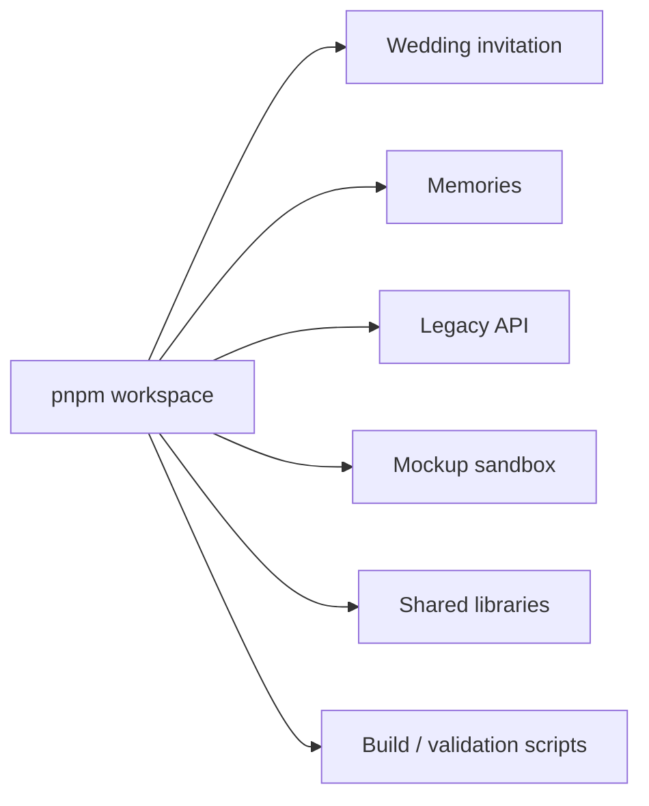
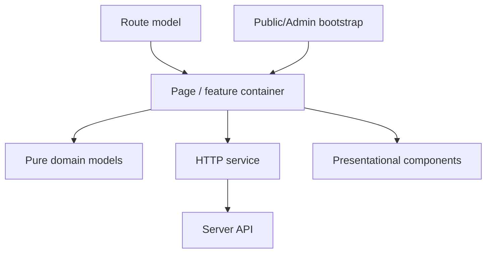

# 01｜技術棧與選型

## 1. 目前 repository 的核心技術棧

| 層級 | 技術 | 目前用途 | 從零建置建議 |
| --- | --- | --- | --- |
| Runtime | Node.js 24 | API、build、migration、tests | 使用 active LTS／repository 指定版本 |
| Package manager | pnpm 10 | Workspace、catalog、frozen lockfile | 不混用 npm／Yarn |
| Frontend | React 19 | 邀請站、Memories、Admin | 使用 component boundary，避免大檔案 |
| Build | Vite 7 | dev server、production bundle | 新功能直接寫 React，避免 exact-string transform |
| Language | JavaScript／TypeScript | 現有 artifact 混合 | 新 domain code 優先 TypeScript 或有 runtime validator |
| API | Node HTTP／Express boundaries | Memories 與 legacy API | 明確區分 public/admin/private routes |
| Database | PostgreSQL | Metadata、settings、messages、batch | 使用 immutable migration |
| Query layer | SQL repositories／Drizzle in shared packages | DB access | Repository/service boundary，不讓 UI 組 SQL |
| Media | Google Drive + Replit Connector | Originals、attachments、thumbnails | 建立 provider-independent adapter |
| Image | Sharp | Orientation、WebP、hero、favicon | 針對 native binary 做 deployment test |
| Rich text | Tiptap | Process content editor | 嚴格 sanitization 與 controlled nodes |
| Word import | Mammoth、docx-preview | Word 內容匯入與顯示 | 不把 PDF/PPT 混進同一 contract |
| Upload parsing | Busboy | Streaming multipart | 限制 bytes、count、field depth、timeout |
| Tests | Node test runner | Unit、API、source contract | 行為測試優先 |
| Browser tests | Playwright | Chromium、Firefox、WebKit、In-App profiles | Production bundle gate + real-device evidence |
| CI | GitHub Actions | Impact CI、full CI、legacy boundary | PR 快、main 完整、artifact 可追蹤 |
| Hosting | Replit Autoscale | Current production model | 其他雲端以 container 為共通交付物 |

## 2. Monorepo 架構

```text
/
├─ artifacts/
│  ├─ wedding-invitation/
│  ├─ memories-album/
│  ├─ api-server/
│  └─ mockup-sandbox/
├─ lib/
├─ scripts/
├─ docs/
├─ package.json
├─ pnpm-workspace.yaml
└─ pnpm-lock.yaml
```



### 為什麼使用 monorepo

| 優點 | 代價 | 控制方法 |
| --- | --- | --- |
| 共用版本與 CI | 變更可能跨 package | impact analysis + full main gate |
| 一次 typecheck/build | lockfile 變大 | frozen install + SCA |
| 共用 UI／schema | 容易錯誤耦合 | legacy boundary workflow |
| 統一 release evidence | build 時間增加 | selective PR validation |

## 3. Frontend 分層

推薦結構：

```text
src/client/
├─ app/             # routing、bootstrap、providers
├─ features/        # albums、messages、upload、admin
├─ components/      # 可重用 presentation components
├─ domain/          # pure models、sorting、validation
├─ services/        # HTTP client、upload coordinator
└─ styles/          # shared tokens and feature CSS
```



### 目前需避免的模式

- 多個 Vite transform 修改同一份 JSX。
- UI component 直接知道 provider storage API。
- 設定 key 在 UI、API、repository 重複手寫。
- 上傳完成後由 browser 連續 PATCH 多個分類動作。
- 只測生成 source string，不在 browser 執行。

## 4. Server 分層

```text
HTTP route
  → validation/authentication
  → application service / command
  → repository + media adapter
  → PostgreSQL / Google Drive / object store
```

| 層 | 責任 | 不應做什麼 |
| --- | --- | --- |
| Route | parse、auth、status code | 商業流程散落 |
| Validator | type、range、format | 存取 DB |
| Service | transaction、workflow、idempotency | 回傳 provider credential |
| Repository | SQL persistence | 決定 UI 文案 |
| Media adapter | upload/read/delete/list | 回傳 raw provider response 到 browser |

## 5. Database 選型

PostgreSQL 適合此站，因為需要：

- album／label／process 多對多關聯；
- upload batch 與 durable state；
- visibility、sorting、pagination；
- messages moderation；
- transaction；
- immutable migration；
- backup 與跨雲移植。

不建議把核心 metadata 只放在：

- browser localStorage；
- ephemeral container filesystem；
- Google Drive folder name；
- 未版本化 JSON file。

## 6. Media storage 選型

| 選項 | 優點 | 缺點 | 適合情境 |
| --- | --- | --- | --- |
| Google Drive | 新人易人工查看；目前已整合 | API/permission 複雜；非典型 CDN | Current Replit deployment |
| S3-compatible | 標準 API；presigned URL；versioning | 需要 adapter 與 lifecycle | 多雲與 On-premise |
| Provider object store | IAM、CDN、monitoring 整合 | provider lock-in | 單一雲端正式環境 |
| Local disk | 簡單 | 容器重建會遺失；難 scale | 僅 development |

## 7. Browser 與 mobile strategy

自動化 profile：

- Chromium desktop/mobile
- Firefox desktop
- WebKit desktop/mobile
- Samsung Internet representative
- WeChat Android/iOS representative
- LINE Android/iOS representative
- Facebook Android/iOS representative
- Instagram Android/iOS representative

自動化 user-agent 只能證明 engine、viewport 與程式行為，不等於真實 app webview。真機 evidence 必須另外記錄。

## 8. Container 作為可攜式交付物

從零建置時應加入：

```dockerfile
FROM node:24-bookworm-slim AS build
WORKDIR /app
RUN corepack enable
COPY package.json pnpm-lock.yaml pnpm-workspace.yaml ./
COPY artifacts ./artifacts
COPY lib ./lib
COPY scripts ./scripts
RUN pnpm install --frozen-lockfile
RUN pnpm --filter @workspace/memories-album build

FROM node:24-bookworm-slim
WORKDIR /app
ENV NODE_ENV=production
COPY --from=build /app/artifacts/memories-album/dist ./dist
EXPOSE 8080
CMD ["node", "dist/server.mjs"]
```

此範例只說明 container pattern；實際 build dependency、workspace copy 範圍與 native Sharp runtime 必須由 production build 驗證。

## 9. 技術選型 checklist

- [ ] Runtime 與 package manager 固定版本
- [ ] Database 選 PostgreSQL-compatible provider
- [ ] Media adapter 選定
- [ ] Secret manager 選定
- [ ] Container registry 選定
- [ ] TLS／domain／reverse proxy 選定
- [ ] Logs／metrics／alerts 選定
- [ ] Backup provider 與 retention 選定
- [ ] CI runner 與 browser matrix 選定
- [ ] 開發、測試、正式環境隔離
