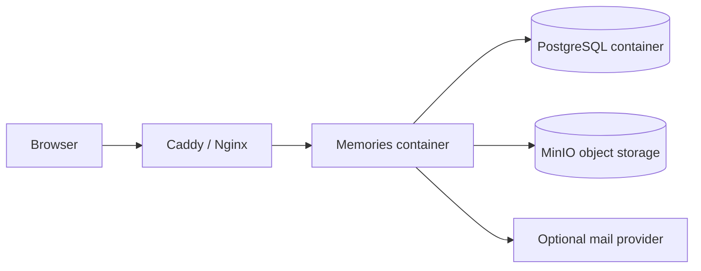

# 02｜前置工具與帳號

## 1. 最低開發環境

| 工具 | 建議版本 | 驗證指令 | 用途 |
| --- | --- | --- | --- |
| Git | 最新 stable | `git --version` | clone、branch、PR、rollback |
| Node.js | 24 | `node --version` | runtime、Vite、tests、scripts |
| Corepack | 隨 Node | `corepack --version` | 啟用 pnpm |
| pnpm | 10.x | `pnpm --version` | monorepo package manager |
| PostgreSQL client | 16+ | `psql --version` | migration、health、backup |
| Docker | 最新 stable | `docker version` | portable local stack／container build |
| Docker Compose | v2 | `docker compose version` | PostgreSQL、MinIO、reverse proxy |
| OpenSSL | 3+ | `openssl version` | secret 與 TLS 排錯 |
| jq | 最新 stable | `jq --version` | JSON／CLI automation |

### Windows

建議使用其中一種：

1. WSL2 + Ubuntu；或
2. Windows Terminal + Git + Node + Docker Desktop。

專案腳本偏向 POSIX shell。若使用純 PowerShell，遇到 shell script 時優先透過 WSL2 執行。

### Debian／Ubuntu

```bash
sudo apt update
sudo apt install -y git curl ca-certificates jq postgresql-client docker.io docker-compose-plugin
sudo usermod -aG docker "$USER"
```

登出再登入後確認：

```bash
docker run --rm hello-world
```

### macOS

```bash
brew install git node@24 pnpm postgresql@16 jq
brew install --cask docker
```

## 2. 安裝 Node.js 24 與 pnpm

推薦使用版本管理器，例如 `fnm`、`mise` 或 `nvm`。

```bash
fnm install 24
fnm use 24
corepack enable
corepack prepare pnpm@10.15.1 --activate
```

驗證：

```bash
node --version
pnpm --version
```

不要執行：

```bash
npm install
 yarn install
```

Repository 的 `preinstall` 會拒絕非 pnpm user agent，並移除 `package-lock.json` 與 `yarn.lock`。

## 3. GitHub 準備

需要：

- GitHub account；
- repository read/write 權限；
- Actions 可執行；
- branch protection／required checks；
- Secrets 或 OIDC cloud role；
- container registry 權限（部署到其他雲端時）。

建議設定：

| 設定 | 建議 |
| --- | --- |
| Default branch | `main` |
| PR required | 是 |
| Force push to main | 禁止 |
| Required checks | Full CI、cross-browser、legacy boundary |
| Secret authentication | 優先 OIDC，不存長期 cloud access key |
| Artifact retention | Browser evidence 14–30 天，依政策調整 |

## 4. 帳號與雲端資源

### Current Replit 路線

- Replit account
- Replit Project／Published App
- Replit PostgreSQL 或可連接的 PostgreSQL
- Google Drive Integration
- Google account 對婚禮 root folder 有 editor 權限
- Custom domain DNS 管理權限

### Portable cloud 路線

至少需要：

- cloud subscription／project／tenancy；
- container registry；
- managed PostgreSQL；
- object storage；
- secret manager；
- log／metric service；
- DNS 與 certificate 管理；
- IAM role／service account；
- private network 與 firewall 管理權限。

## 5. 本機服務選擇

### 最小：只連外部服務

```text
Node.js + pnpm
  ├─ External PostgreSQL
  └─ Replit/Google Drive integration only in Replit environment
```

此模式無法在普通本機直接模擬 Replit Connector，除非使用 mock 或另寫 Google Drive adapter。

### 完整 portable development



## 6. CLI 安裝

只需安裝實際使用 provider 的 CLI。

| Provider | CLI | 驗證 |
| --- | --- | --- |
| Google Cloud | `gcloud` | `gcloud version` |
| AWS | `aws` | `aws --version` |
| Azure | `az` | `az version` |
| Oracle Cloud | `oci` | `oci --version` |
| Kubernetes | `kubectl`、`helm` | `kubectl version --client` |

## 7. 權限分離

至少分三個 identity：

| Identity | 權限 |
| --- | --- |
| Developer | Development resources；無 Production delete |
| CI deployer | Pull image、deploy revision、read deployment secrets |
| Runtime identity | Database connect、media bucket read/write、read secrets |

Runtime identity 不需要：

- 建立 IAM user；
- 修改 billing；
- 刪除 project／subscription；
- 管理 GitHub repository；
- 讀取 unrelated buckets。

## 8. 預備資料夾與命名

建議先建立：

```text
wedding-platform-dev
wedding-platform-staging
wedding-platform-prod
```

每個環境分別有：

- Database
- Media bucket/root
- Secrets
- Domain/subdomain
- Logs
- Backup destination
- Runtime identity

不要讓 Development 使用 Production Drive root 或 production database。

## 9. 安裝後驗證

```bash
git --version
node --version
pnpm --version
psql --version
docker version
docker compose version
```

然後執行：

```bash
git clone <repository-url>
cd huang_yeh_wedding
pnpm install --frozen-lockfile
pnpm run typecheck
```

若 frozen install 失敗，不要立刻刪 lockfile。先確認：

1. Node／pnpm 版本；
2. `minimumReleaseAge`；
3. native package 平台 override；
4. lockfile 是否與 `package.json` 同步；
5. registry 是否可達。
