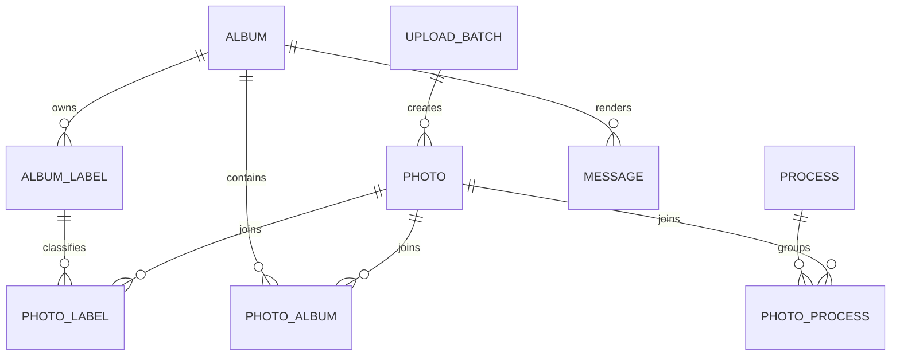
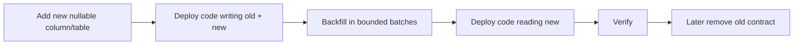

# 05｜PostgreSQL、Migration 與資料生命週期

## 1. Database responsibility

PostgreSQL 保存可查詢、需要 transaction 或權限控制的 application state：

| Domain | 代表資料 |
| --- | --- |
| Albums | title、type、visibility、sort、featured settings |
| Labels | album ownership、stable key、order、visibility |
| Processes | Drive mapping、bilingual title、video、content |
| Photos | opaque ID、author、capture time、visibility、media references |
| Messages | guestbook content、created time、moderation |
| Uploads | batch、clientUploadId、hash、retry/resume state |
| Settings | site copy、appearance、navigation、upload limits |
| Security | token hashes、login rate limit、migration checksum |

Binary image bytes 不應存 PostgreSQL，除非有明確理由與容量／backup 計畫。

## 2. Schema design principles



原則：

- Public route 使用 stable key/UUID，不使用 display order。
- 多對多關聯使用 join table。
- Provider IDs 只在 server-side table。
- Soft-delete／visibility 與 permanent delete 分開。
- JSON settings 只放 truly flexible config；核心 relation 使用 normalized table。

## 3. Migration contract

Current migration sequence 已延伸到：

```text
016_explicit_guest_album_membership.sql
```

Migration runner 應提供：

| 能力 | 目的 |
| --- | --- |
| Filename ordering | 保證順序 |
| SHA-256 checksum | 防止已套用檔被改 |
| Advisory lock | 防止多 instance 同時 migrate |
| Transaction where possible | 失敗可回滾 |
| Pending-only execution | 重啟 idempotent |
| Startup gate | migration 成功後才 listen |

### 建立 migration

```text
artifacts/memories-album/db/017_example_change.sql
```

範例：

```sql
begin;

alter table memories_albums
  add column if not exists example_flag boolean not null default false;

commit;
```

不要：

- 改 `001`～`016` 已套用檔；
- 刪 migration history；
- 對 Production 使用 `drizzle-kit push`；
- 在同一 release 同時做大 schema 破壞與大 UI rewrite；
- 沒有 backup 就執行 destructive migration。

## 4. Additive migration strategy

推薦 expand/contract：



優點：

- 舊版與新版短時間相容；
- rollback 比較安全；
- 避免長時間 lock；
- 可分批 backfill。

## 5. Index design

為實際 query 建 index：

| Query | Index candidate |
| --- | --- |
| Public photos by album + cursor | `(album_id, visibility, sort_key, id)` |
| Photos by label | join table `(label_id, photo_id)` |
| Messages by album + time | `(album_id, visibility, created_at, id)` |
| Upload idempotency | unique `(batch_id, client_upload_id)` |
| Content duplicate | hash + domain-specific scope |
| Stable key | unique normalized route key |

新增 index 前檢查：

- write amplification；
- index size；
- query plan；
- lock time；
- 是否可 `create index concurrently`。

## 6. Connection management

### Long-running VM/container

- 使用 pool。
- 限制 max connections。
- graceful shutdown 關閉 pool。

### Serverless／autoscale

每個 instance 都可能建立 pool：

```text
最大 DB connections ≈ max instances × pool max
```

範例：

| Max instances | Pool max | 潛在連線 |
| ---: | ---: | ---: |
| 3 | 5 | 15 |
| 10 | 5 | 50 |
| 20 | 10 | 200 |

需依 DB connection limit 設定，必要時使用 PgBouncer 或 provider connector。

## 7. TLS

Production connection 應驗證 certificate 與 hostname：

```text
sslmode=verify-full
```

若 provider 使用 private CA，將 CA 以 secret/config volume 提供，不要關閉驗證作為長期修正。

## 8. Backup

### Logical backup

```bash
pg_dump --format=custom --no-owner --no-acl "$DATABASE_URL" > memories-$(date +%F-%H%M).dump
sha256sum memories-*.dump
```

Restore 到新 database：

```bash
createdb memories_restore_test
pg_restore --no-owner --no-acl --dbname="$RESTORE_DATABASE_URL" memories-YYYY-MM-DD-HHMM.dump
```

### Provider snapshot/PITR

Production 建議同時有：

- automated snapshots；
- point-in-time recovery；
- logical export；
- cross-account/project backup（依風險）；
- 定期 restore drill。

## 9. Restore validation

Restore 成功不只看 `pg_restore` exit code：

```bash
psql "$RESTORE_DATABASE_URL" -c 'select count(*) from memories_albums;'
psql "$RESTORE_DATABASE_URL" -c 'select count(*) from memories_photos;'
psql "$RESTORE_DATABASE_URL" -c 'select count(*) from memories_messages;'
```

還要：

1. 對 restore DB 執行 migration。
2. 啟動 staging app。
3. 開 public routes。
4. 開 admin routes。
5. 抽樣 media reference 是否存在。
6. 比對重要 row counts。
7. 記錄 restore time 與問題。

## 10. Destructive change gate

看到以下 SQL 先停止：

```sql
DROP TABLE
DROP COLUMN
TRUNCATE
DELETE FROM ... -- 無 where 或超大範圍
ALTER TYPE ...
```

PR 必須包含：

- 影響資料量；
- backup timestamp；
- rollback 或 forward-fix；
- lock/timeout 評估；
- staging rehearsal；
- owner approval。

## 11. Monitoring

至少監控：

- connection usage；
- slow queries；
- lock wait；
- deadlocks；
- disk/storage growth；
- replication/PITR health；
- failed migrations；
- error rate by SQLSTATE。

## 12. Checklist

- [ ] Database 與 media 分開
- [ ] Migration immutable + checksum
- [ ] Advisory lock
- [ ] Pool max 依 autoscale instance 計算
- [ ] TLS verify-full
- [ ] Automated backup + PITR
- [ ] Logical backup
- [ ] Restore drill
- [ ] Destructive change review
- [ ] Slow query／connection alerts
