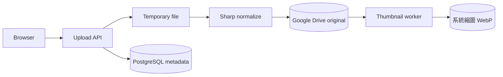
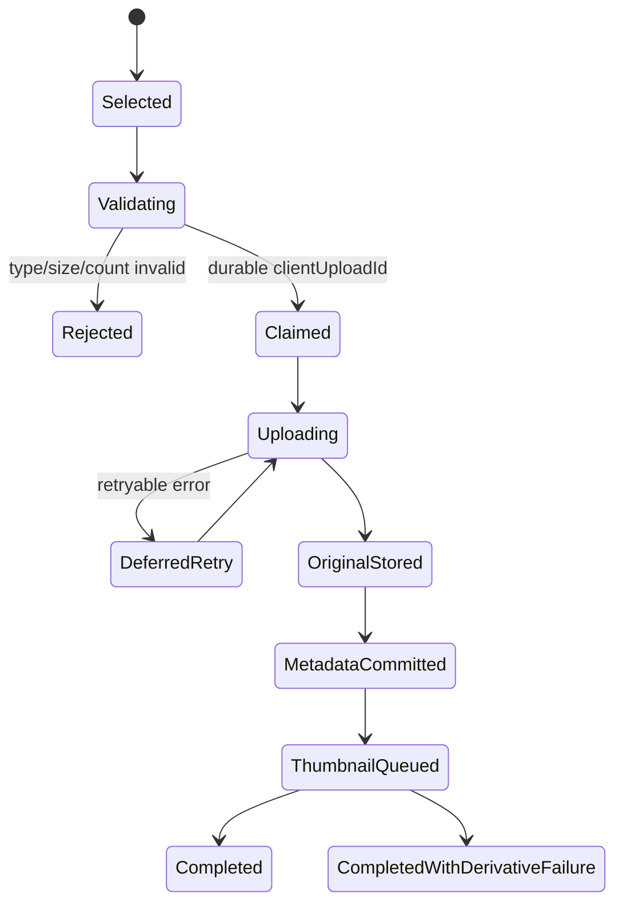
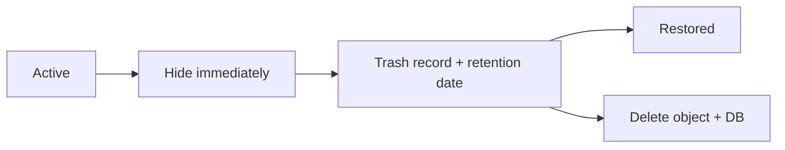

# 06｜媒體儲存、縮圖與可攜式 Adapter

## 1. Current media flow

目前 Standalone Memories 使用 Google Drive：



Current reserved folders：

```text
00 未分類
訪客上傳
生活照
系統縮圖
```

## 2. Storage responsibilities

| 層 | 保存內容 | 可否重建 |
| --- | --- | --- |
| Original store | 原始照片、process image attachments | 通常不可重建 |
| Derivative store | WebP thumbnails、hero derivative、site icon | 可從 original/settings 重建 |
| PostgreSQL | Provider ID、metadata、visibility、relationships | 需 database backup |
| Cache/CDN | 暫存 response | 可清除 |
| Temporary disk | 上傳中的暫存檔 | 必須自動清理，不可視為永久儲存 |

## 3. Provider-independent interface

其他雲端部署前，建議定義：

```ts
interface MediaStorage {
  putOriginal(input: {
    key: string;
    stream: NodeJS.ReadableStream;
    contentType: string;
    size?: number;
    checksum?: string;
  }): Promise<StoredObject>;

  putDerivative(input: PutObjectInput): Promise<StoredObject>;
  getObject(ref: StoredObjectRef): Promise<ReadableObject>;
  deleteObject(ref: StoredObjectRef): Promise<void>;
  findByDeterministicKey(key: string): Promise<StoredObject | null>;
}
```

Domain service 只知道：

- opaque object reference；
- content type；
- byte size；
- checksum；
- logical storage class。

不應知道：

- Drive file ID；
- S3 bucket ARN；
- Azure SAS token；
- OCI pre-authenticated URL；
- provider raw response。

## 4. Portable provider map

| Current concept | Google Cloud | AWS | Azure | OCI | On-premise |
| --- | --- | --- | --- | --- | --- |
| Original folder | GCS bucket/prefix | S3 bucket/prefix | Blob container/prefix | Object bucket/prefix | MinIO bucket |
| Thumbnail folder | `thumbnails/` | `thumbnails/` | `thumbnails/` | `thumbnails/` | `thumbnails/` |
| Resumable upload | GCS resumable | S3 multipart | Block Blob staged blocks | Multipart upload | S3 multipart |
| Private read | Signed URL or proxy | Presigned URL or proxy | User delegation SAS or proxy | PAR or proxy | Presigned URL or proxy |
| Versioning | Bucket versioning | S3 versioning | Blob versioning | Object versioning | MinIO versioning |

## 5. Object naming

使用 deterministic key，避免以原始檔名當唯一 identity：

```text
originals/{photoId}/{contentHash}.{ext}
thumbnails/{photoId}/v1-1600.webp
attachments/{processId}/{attachmentId}/{safeName}
settings/hero/{version}.webp
settings/icon/{version}.png
```

規則：

- 原始 filename 只作 display metadata。
- Key 不含 private token、email、database URL。
- Path segment 先 normalize。
- 不允許 `../`、null byte、absolute path。
- 同一 logical object 可有 version。

## 6. Upload pipeline



必須保證：

- `(batchId, clientUploadId)` idempotent；
- 同 filename 不代表 duplicate；
- checksum 用於內容 identity；
- retry 不建立第二份 original；
- DB 不得在 storage 失敗時回報完成；
- 失敗暫存檔自動清理。

## 7. Image normalization

Sharp pipeline 建議：

1. decode 與格式驗證；
2. auto-orient；
3. 限制 pixel count；
4. 清理不需要的 metadata；
5. 保留必要 color profile；
6. 產生 thumbnail；
7. 驗證 output 可讀；
8. upload derivative；
9. 更新 DB reference。

| Asset | 建議 output |
| --- | --- |
| Gallery thumbnail | WebP，依 viewport 產 480/960/1600 variants |
| Hero | 1600 × 900 WebP，center cover crop |
| Site icon | 192 × 192 PNG |
| Original | 保留高畫質；可依政策清理 EXIF |

Current repository 主要使用單一大型 WebP thumbnail；responsive variants 屬 portable enhancement，加入前需 migration/API/browser tests。

## 8. Cache strategy

| Response | Cache 建議 |
| --- | --- |
| Immutable versioned thumbnail | `public, max-age=31536000, immutable` |
| Original controlled route | private 或短期 cache，依授權 |
| Missing derivative fallback original | `no-store` 或極短 cache |
| Public album JSON | short cache + ETag |
| Admin/private API | `no-store` |

不要讓 private management response 經 shared CDN cache。

## 9. Delete semantics

完整永久刪除至少包含：

1. 驗證權限。
2. 移除 derivative。
3. 移除 original。
4. 移除 album/label/process relations。
5. 移除 pinned/featured references。
6. 移除 photo row。
7. 記錄 bounded audit result。

若 storage delete 回非「不存在」錯誤，不應先刪 DB row 再回成功。

Current product 無七天 trash。若新增 recovery：



## 10. Google Drive-specific cautions

- Replit Connector authorization 可能回 401/403。
- 429/5xx 應分類為 retryable。
- `系統縮圖` 需要 write permission。
- 手動刪 Drive original 不會完整清理 PostgreSQL。
- Shared Drive／ownership／scope 可能影響 read/write。
- Provider ID 不送到 public browser。

## 11. Object-store security

- Bucket/container 預設 private。
- Runtime role 只可存取指定 prefix。
- 啟用 encryption at rest。
- 啟用 versioning／soft delete（若需要 recovery）。
- 設 lifecycle 清除 abandoned multipart uploads。
- 不使用永久公開 bucket。
- Signed URL 時效短且 scope 單一 object。
- Logs 不記 signed query string。

## 12. Migration from Drive to object storage

1. 建立 portable adapter 與 tests。
2. 加入 dual-read，不先改 public contract。
3. 以 checksum 複製 originals。
4. 驗證 count、size、checksum。
5. 產生/複製 derivatives。
6. 更新 provider reference，保留 rollback mapping。
7. 切 read path。
8. 觀察 error rate。
9. 停止 dual-write。
10. 保留 Drive read-only recovery window。

## 13. Checklist

- [ ] Original 不在 ephemeral disk
- [ ] Provider adapter 隔離
- [ ] Deterministic keys
- [ ] Idempotent upload
- [ ] Pixel／byte／count limits
- [ ] Versioning／retention policy
- [ ] Private bucket
- [ ] Signed URL 不進 log
- [ ] Thumbnail 可重建
- [ ] Delete order 安全
- [ ] Abandoned multipart cleanup
- [ ] Media backup／inventory verification
