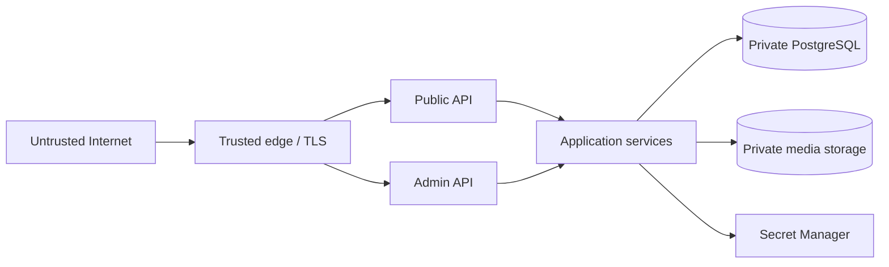
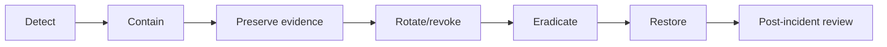

# 07｜Security、Privacy 與 Supply Chain

## 1. Threat model

| 資產 | 主要威脅 | 主要控制 |
| --- | --- | --- |
| 原始婚禮照片 | 未授權讀取、誤刪、公開 bucket | private storage、controlled route、versioning、backup |
| 管理後台 | brute force、session theft | rate limit、HttpOnly/Secure cookie、TLS、secret rotation |
| Upload API | oversized file、parser DoS、malware、duplicate storm | byte/count/type limits、streaming、timeout、idempotency |
| Private management | token leak、batch enumeration | random token、hash storage、fragment transport、opaque ID |
| Database | injection、credential leak、destructive migration | parameterized SQL、Secret Manager、least privilege、backup |
| Build pipeline | malicious package、compromised action | frozen lockfile、minimum release age、SCA/SBOM、pinned versions |
| Browser | XSS、unsafe rich text、clickjacking | sanitization、CSP、security headers、same-origin APIs |

## 2. Trust boundaries



任何從 browser、upload file、URL、header、database content 或 provider response 進來的資料都需視為不可信。

## 3. Authentication 與 session

Current admin model：

- Secret：`MEMORIES_ADMIN_TOKEN`
- 成功登入後建立 signed HttpOnly cookie
- `Secure`
- `SameSite=Strict`
- Path 限制在 `/Memories/admin`
- 約 30 分鐘有效
- login rate limit

若升級多人管理員：

| 功能 | 建議 |
| --- | --- |
| Identity | OIDC／managed identity provider |
| MFA | 管理員必須 |
| RBAC | Viewer、Content editor、Operator、Owner |
| Audit | actor、action、resource、timestamp、result |
| Recovery | break-glass account，離線保管 |

## 4. Private batch token

- 使用高 entropy random value。
- Database 只存 hash。
- Raw token 只在建立／rotate 時回傳。
- Token 放 URL fragment，不放 query string。
- Server logs 不得記 Authorization header。
- Rotate 後舊 token 立即失效。
- Batch ID 不能代替 token。

## 5. Upload validation

### Client validation 只是 UX

真正安全控制必須在 server：

```text
file count
file bytes
request bytes
MIME + magic bytes
pixel dimensions
parser field count/depth
timeout
concurrency
filename normalization
```

### 建議限制

| 項目 | Current/建議 |
| --- | --- |
| Per file | 25 MB current contract |
| Selection count | Guest/Admin 1–100 configurable |
| Parallel workers | 固定小數量，不隨 selection limit 增加 |
| MIME | JPEG、PNG、WebP、HEIC/HEIF current photos |
| Rich attachment | image only |
| Document import | Word-related only |

### Malware

若環境需要：

1. Upload 到 quarantine prefix。
2. Antivirus／content scanner。
3. Pass 才移到 public logical store。
4. Fail 時刪除 quarantine object 並記 bounded reason。

## 6. Rich text 與 XSS

- Tiptap node schema 使用 allowlist。
- 不保存任意 script/event handler。
- URL protocol allowlist：`https:` 等。
- iframe/video provider allowlist。
- HTML import 經 sanitization。
- 不直接 `dangerouslySetInnerHTML` 渲染未驗證 input。
- Attachment URL 使用 controlled route。

## 7. Security headers

建議：

```text
Content-Security-Policy
X-Content-Type-Options: nosniff
Referrer-Policy: strict-origin-when-cross-origin
Permissions-Policy
Strict-Transport-Security
Cross-Origin-Opener-Policy（依相容性）
frame-ancestors（透過 CSP）
```

CSP 要經 browser matrix 測試，尤其：

- YouTube embed；
- blob image URLs；
- In-App Browsers；
- dev error overlay；
- Word content assets。

## 8. CSRF 與 CORS

Admin API 使用 same-site cookie 時：

- `SameSite=Strict`；
- 驗證 Origin/Referer；
- mutation 使用非 GET；
- 必要時加入 CSRF token；
- CORS 不設 `*` + credentials；
- private management 使用 explicit Bearer token。

## 9. Database security

- App user 不應是 superuser。
- Migration role 與 runtime role 可分離。
- Runtime role 只需 CRUD 指定 schema。
- Production DB 放 private network。
- TLS verify-full。
- 定期 rotate credential。
- SQL 使用 parameters。
- Error 不回傳 query、table internals、credential。

## 10. Media security

- Bucket/folder 預設 private。
- Provider IDs server-side only。
- Signed URL 短時效。
- 原圖 route 做 authorization/visibility check。
- 防止 path traversal。
- Delete 與 read IAM 分開。
- 監控 bulk download、bulk delete 與 permission changes。

## 11. Dependency supply chain

Repository 現有控制：

- pnpm workspace；
- frozen lockfile；
- `minimumReleaseAge: 1440`；
- explicit overrides；
- SCA／CycloneDX evidence；
- GitHub Actions checks。

安全更新流程：

1. 對 current lockfile 重掃。
2. 分 production runtime、build、codegen、preview exposure。
3. 小批更新 parent package。
4. 完整測試與 browser gate。
5. 產生 post-change SBOM。
6. 部署觀察與 rollback。

不要直接執行：

```text
pnpm audit fix --force
```

## 12. GitHub Actions security

- Actions 使用明確 major 或 commit pin（依治理政策）。
- `permissions` 最小化。
- Fork PR 不取得 production secrets。
- Cloud deploy 優先 OIDC federation。
- Artifact 不含 `.env`、database dump、raw browser token。
- Logs redact secret。
- Self-hosted runner 需 isolation 與 patching。

## 13. Privacy

婚禮照片可能含：

- 臉部與生物特徵；
- 兒童；
- 時間與地點；
- EXIF GPS；
- 親友姓名；
- 私人留言。

至少決定：

| 決策 | 需要記錄 |
| --- | --- |
| Access | 公開、受邀、登入或 private link |
| Retention | 原圖、縮圖、自拍、log 保存多久 |
| Deletion | permanent、trash、grace period |
| EXIF | 保留、清除 GPS、全部清除 |
| Face processing | 是否允許、provider、consent、retention |
| Children | 是否需額外限制 |
| Region | Database/media/log 所在區域 |

## 14. Incident response



優先順序：

1. 記錄第一個錯誤與時間。
2. 阻止持續外洩／破壞。
3. Rotate token/credential。
4. 保存 logs、commit、deployment revision。
5. 檢查資料影響。
6. Restore 或 forward fix。
7. 通知必要人員。
8. 更新文件與 automated control。

## 15. Checklist

- [ ] TLS only
- [ ] Secret Manager
- [ ] Least privilege runtime identity
- [ ] Admin rate limit + secure cookie
- [ ] Upload byte/count/type/pixel limits
- [ ] Rich text sanitization
- [ ] Security headers
- [ ] Private media store
- [ ] Database private network + TLS
- [ ] Frozen lockfile + SCA/SBOM
- [ ] Backups encrypted
- [ ] Incident runbook
- [ ] Privacy retention decision
