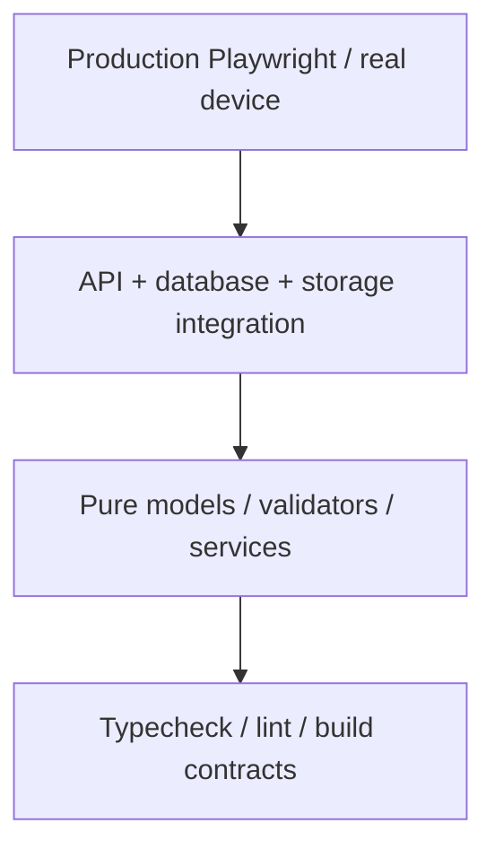
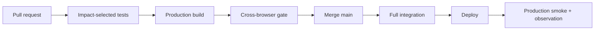

# 08｜測試、CI 與跨瀏覽器證據

## 1. 測試金字塔



| 層級 | 速度 | 目的 | 範例 |
| --- | --- | --- | --- |
| Static | 快 | 型別、build、import、config | TypeScript、Vite build |
| Unit | 快 | pure behavior | route model、sorting、normalization |
| API | 中 | HTTP contract、auth、status | albums、messages、upload |
| Integration | 中慢 | PostgreSQL、adapter、migration | repository、idempotency |
| Browser | 慢 | React runtime、layout、route | Playwright |
| Real device | 最慢 | 真實 webview、keyboard、resume | LINE／WeChat／Safari |

## 2. Current CI model

Repository 使用 Test Impact Analysis 與 Selective Test Execution：

- Draft PR：Fast CI。
- Ready PR：正式 impact-focused CI。
- Documentation-only：不安裝 dependency、不跑 executable tests。
- 無法判斷的 executable change：回退較完整測試。
- Push 到 `main`：完整 Node、focused Chrome、production build、health smoke。
- UI/Playwright 相關 change：cross-browser workflow。
- Legacy protected path：獨立 boundary workflow。

## 3. 必跑命令

```bash
pnpm install --frozen-lockfile
pnpm run typecheck
pnpm run build
pnpm --filter @workspace/memories-album test
pnpm --filter @workspace/memories-album run test:layout-browser
pnpm --filter @workspace/memories-album build
```

Production server smoke：

```bash
PORT=19316 pnpm --filter @workspace/memories-album start &
curl --fail http://127.0.0.1:19316/Memories/api/health
```

## 4. Unit test 原則

測試 public behavior，不測 implementation trivia：

```js
import test from "node:test";
import assert from "node:assert/strict";

test("hidden album label falls back to the album all-label", () => {
  const result = resolveActiveLabel({
    requested: "hidden-label",
    visibleLabels: ["all", "ceremony"],
  });
  assert.equal(result, "all");
});
```

避免只檢查：

- 某個變數名稱；
- source 中有某一段完整字串；
- CSS property 存在但不驗 layout；
- build 成功就代表 browser 成功。

Source-contract tests 只能作 transitional guard，尤其是尚未移除的 Vite exact-string transforms。

## 5. API test matrix

每個 endpoint 至少覆蓋：

| 類別 | 測試 |
| --- | --- |
| Happy path | valid request／expected response |
| Validation | missing、wrong type、out-of-range |
| Authentication | no session、invalid token、expired token |
| Authorization | wrong batch、hidden resource、protected author |
| Idempotency | repeated upload/save/delete |
| Error mapping | DB、media 404、media retryable、authorization |
| Privacy | response 不含 provider ID、hash、credential |
| Concurrency | duplicate claim、simultaneous save |

## 6. Playwright production gate

Current production cross-browser workflow：

- 先 build production bundle；
- 安裝 pinned Playwright runner；
- 安裝 Chromium、Firefox、WebKit；
- 啟動 production server；
- 使用 deterministic API fixtures；
- 失敗保存 screenshot、trace、video、HTML report。

代表性 profiles：

| Profile | Engine | 意義 |
| --- | --- | --- |
| Chromium desktop | Chromium | Chrome/Edge family |
| Firefox desktop | Firefox | Gecko behavior |
| WebKit desktop | WebKit | Desktop Safari representative |
| Chromium mobile | Chromium | Android Chrome representative |
| WebKit mobile | WebKit | iPhone Safari representative |
| Samsung Internet | Chromium + UA | Samsung browser-specific UA path |
| WeChat Android/iOS | Chromium/WebKit + UA | In-App representative |
| LINE Android/iOS | Chromium/WebKit + UA | In-App representative |
| Facebook Android/iOS | Chromium/WebKit + UA | In-App representative |
| Instagram Android/iOS | Chromium/WebKit + UA | In-App representative |

## 7. Browser assertions

每個 profile 應至少：

1. 開 `/Memories/` 與 `/Memories/en/`。
2. Fail on `pageerror`。
3. Fail on unexpected console error。
4. 確認無 React Error Boundary。
5. 切換 albums、labels、processes。
6. 驗證 bottom navigation 與 viewport。
7. 開關 photo viewer、upload、guestbook。
8. 驗證 admin login 與 tabs。
9. 檢查 horizontal overflow。
10. 保存 failure evidence。

## 8. Real-device evidence

Automated UA profile 不等於真機。真機記錄至少包含：

| 欄位 | 範例 |
| --- | --- |
| Device | iPhone 14 |
| OS | iOS 18.x |
| Browser/app | LINE |
| Version | exact version |
| Network | Wi-Fi / 4G / throttled |
| Orientation | Portrait + landscape |
| Date/tester | ISO date + name |
| Evidence | screenshot/screen recording |
| Result | Pass/Fail/Accepted risk |

真機測試：

- fresh launch；
- background/resume；
- deep link；
- keyboard overlap；
- orientation；
- bottom nav fixed position；
- scroll from first to final content；
- memory reload；
- upload picker；
- Back/Forward/refresh。

## 9. Visual regression

建議建立 baseline：

| Surface | Viewport |
| --- | --- |
| Public home | 320、390、430、768、1440 |
| Photo album | mobile + desktop |
| Guestbook | empty、loading、messages、modal |
| Upload | selection、progress、error |
| Admin | all tabs、accordions、modal |
| Word content | table、image、long filename |

Visual diff 只應對 intentional UI change 更新。不要用整體 tolerance 掩蓋水平溢出或 fixed navigation regression。

## 10. Test data

- 使用 synthetic photo metadata。
- 不把真實 private token 寫入 fixture。
- Browser fixture 不連 Production DB/Drive。
- Test admin token 固定但只存在 CI runtime。
- 對 upload 使用小型 generated image。
- Migration tests 使用 disposable database/schema。

## 11. CI security

- PR from fork 不取得 production secrets。
- `permissions: contents: read` 起步。
- Deploy 使用 OIDC。
- Artifact 不含 raw `.env`、DB dump、signed URL。
- Browser trace 中可能有 request headers，需避免真實 secret。
- Actions concurrency 取消過期 run。

## 12. Failure triage

| Failure | 第一個動作 |
| --- | --- |
| Unit | 看第一個 assertion 與 changed module |
| Build | 看 transform order、native dependency、base path |
| Health | 看 startup/migration/env/port |
| Browser | 看 pageerror、console、trace，而非先猜 CSS |
| WebKit only | 檢查 layout、event、CSS feature、cookie |
| In-App only | 真機重現、UA/viewport/keyboard/resume |
| Drive live | 分 authorization、retryable、individual file |

## 13. Release gate



## 14. Checklist

- [ ] Frozen install
- [ ] Typecheck
- [ ] Node tests
- [ ] API auth/error/privacy tests
- [ ] Migration tests
- [ ] Production build
- [ ] Health smoke
- [ ] Playwright Chromium/Firefox/WebKit
- [ ] In-App representatives
- [ ] Real-device matrix
- [ ] Failure evidence retention
- [ ] Legacy boundary
