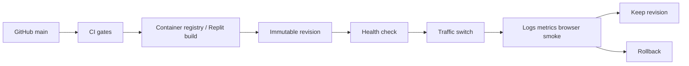
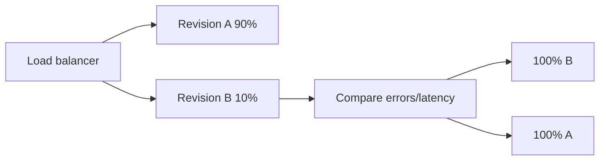

# 09｜Release、Health、Logs、Metrics 與 Alerts

## 1. Release architecture



## 2. Build artifact

理想 release artifact：

- immutable container digest；或
- Replit Published App revision tied to commit；
- production client/server build；
- exact lockfile；
- migration set；
- SBOM；
- test results；
- browser evidence；
- deployment metadata。

不要用無法追蹤內容的 `latest` 作唯一 production identity。

## 3. Health endpoints

### Liveness

```text
GET /Memories/api/health
```

只證明 process 可回應，不應依賴完整 DB/Drive 初始化。

範例：

```json
{
  "status": "ok",
  "service": "memories",
  "version": "<commit-or-build-id>"
}
```

### Readiness（建議新增）

```text
GET /Memories/api/ready
```

檢查：

- database connection；
- migration current；
- media provider credential；
- critical background service state。

不要在 public readiness response 輸出 host、bucket、folder ID、credential 或 provider raw error。

## 4. Structured logging

推薦欄位：

```json
{
  "timestamp": "2026-08-05T02:00:00Z",
  "level": "info",
  "service": "memories",
  "environment": "production",
  "revision": "git-sha",
  "requestId": "opaque-id",
  "route": "/Memories/api/photos",
  "method": "GET",
  "statusCode": 200,
  "durationMs": 42
}
```

Background job：

```json
{
  "event": "thumbnail_backfill_completed",
  "attempted": 12,
  "createdOrAttached": 10,
  "failureCount": 2,
  "failureCodes": ["DRIVE_RETRYABLE"]
}
```

`completed` 不等於全部成功；summary 必須保留 success/failure count。

## 5. 不可記錄

- `DATABASE_URL`
- Authorization header
- raw management token
- admin secret
- OAuth token
- signed URL query string
- Drive folder/file ID（非必要）
- image bytes
- full connector response
- rich private message content

## 6. Metrics

| Metric | 類型 | Alert idea |
| --- | --- | --- |
| Request count | Counter | traffic anomaly |
| 5xx rate | Rate | >1–5% sustained |
| p50/p95/p99 latency | Histogram | p95 over target |
| Active uploads | Gauge | stuck high |
| Upload failure by code | Counter | spike |
| Thumbnail backlog | Gauge | growing |
| Drive auth failures | Counter | any sustained batch |
| DB pool usage | Gauge | >80% |
| Migration failure | Counter | any production failure |
| Browser gate failures | Counter | release blocker |
| Process restart | Counter | repeated restart |

## 7. Suggested SLOs

範例，不是既有承諾：

| SLI | Initial target |
| --- | --- |
| Public request availability | 99.5% monthly |
| Health response p95 | < 250 ms |
| Public album API p95 | < 1 s excluding media |
| Thumbnail response p95 | < 2 s cold, lower cached |
| Upload success | > 98% excluding user validation |
| Recovery from failed revision | < 15 min |

先量測 baseline，再正式設定 SLO。

## 8. Alert routing

| Severity | Example | Response |
| --- | --- | --- |
| SEV-1 | data loss、credential exposure、site unavailable | immediate containment and rollback |
| SEV-2 | admin unavailable、upload broadly failing | respond promptly, stop risky writes |
| SEV-3 | subset thumbnails、one browser regression | investigate within maintenance window |
| SEV-4 | documentation、minor visual issue | backlog |

Alert 必須有：

- symptom；
- environment；
- revision；
- first occurrence；
- dashboard/log link；
- runbook link；
- owner。

## 9. Release procedure

1. Branch from current `main`。
2. Small scoped PR。
3. Required tests green。
4. Review migration plan。
5. Build immutable artifact。
6. Record candidate digest/commit。
7. Deploy staging。
8. Browser + admin + upload smoke。
9. Production deploy。
10. Verify health。
11. Verify Chinese/English, albums, labels, guestbook, photo viewer, admin tabs。
12. Observe logs/metrics for 30–60 minutes。
13. Mark release complete or rollback。

## 10. Canary / blue-green

Managed platforms：



注意 migration compatibility：新 revision 與舊 revision 同時存在時，schema 必須支援兩者。

## 11. Rollback

Rollback 準備：

- last-known-good commit/digest；
- previous revision retained；
- migration compatibility；
- database backup；
- media write behavior understood；
- rollback command documented。

若 migration 已不可逆，不能只把 code rollback 到不懂新 schema 的版本。使用 compatible rollback 或 forward fix。

## 12. Post-release smoke

```text
/Memories/api/health
/Memories/
/Memories/en/
/Memories/admin/login
```

檢查：

- direct routes；
- album/label/process navigation；
- guestbook load；
- fixed bottom navigation；
- one thumbnail and original；
- Word content width；
- admin login/tabs；
- one safe save；
- no unexpected console/page errors。

## 13. Capacity

至少記錄：

| Resource | Capacity question |
| --- | --- |
| CPU | Sharp concurrent transforms कितने? |
| Memory | Large image decode peak? |
| DB | Max instances × pool size? |
| Network | Original download/upload egress? |
| Storage | Original + versions + thumbnails? |
| Connector/API | Drive/object API rate limit? |
| Browser | DOM photo count before pagination? |

## 14. Checklist

- [ ] Immutable artifact/revision
- [ ] Build metadata
- [ ] Liveness + readiness
- [ ] Structured logs
- [ ] Secret redaction
- [ ] Metrics dashboard
- [ ] Alerts with runbooks
- [ ] Staging smoke
- [ ] Production observation window
- [ ] Rollback command
- [ ] Last-known-good revision
