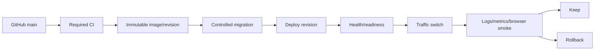
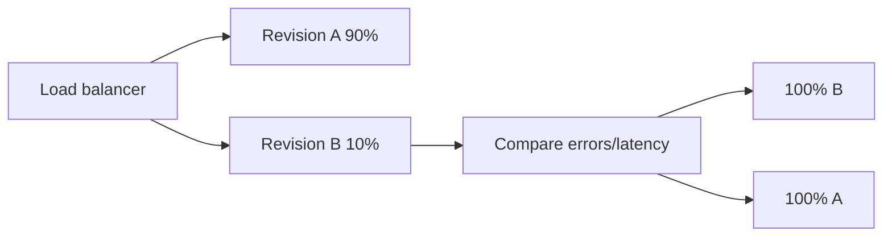

# 09｜Release、Health、Logs、Metrics 與 Alerts

## 1. Release flow



## 2. Release artifact

理想 artifact 應可追蹤：

| Evidence | 內容 |
| --- | --- |
| Source | Exact Git commit |
| Dependencies | Frozen `pnpm-lock.yaml` |
| Runtime | Image digest 或 Replit revision |
| Schema | Migration set/checksums |
| Security | SBOM/SCA（dependency change 時） |
| Quality | Node/build/Playwright results |
| Browser | Screenshots/traces/video on failure |
| Deployment | Environment、region、time、operator |

不要把 `latest` 作為唯一 production identity。

## 3. Health endpoints

### Liveness

```text
GET /Memories/api/health
```

只證明 process 可回應，不依賴完整 DB/Drive 初始化。

### Readiness（portable enhancement）

```text
GET /Memories/api/ready
```

可檢查：

- Database connection；
- Migration current；
- Media provider credential；
- Critical worker state。

Public readiness response 不輸出 host、bucket/folder ID、credential 或 provider raw error。

## 4. Structured logging

Request example：

```json
{
  "timestamp": "2026-08-05T02:00:00Z",
  "level": "info",
  "service": "memories",
  "environment": "production",
  "revision": "git-sha",
  "requestId": "opaque-id",
  "route": "/Memories/api/photos",
  "method": "GET",
  "statusCode": 200,
  "durationMs": 42
}
```

Background summary：

```json
{
  "event": "thumbnail_backfill_completed",
  "attempted": 12,
  "createdOrAttached": 10,
  "failureCount": 2,
  "failureCodes": ["DRIVE_RETRYABLE"]
}
```

`completed` 不等於全部成功；每次 job 必須明列 attempted/success/failure。

## 5. Log redaction

不可記錄：

- `DATABASE_URL`
- Authorization／cookie
- Raw management token／admin secret
- OAuth token
- Signed URL query
- Drive folder/file ID（除非 incident 必要且受控）
- Image bytes
- Full connector response
- Private guestbook content

## 6. Metrics

| Metric | Type | Initial alert idea |
| --- | --- | --- |
| HTTP requests | Counter | Traffic anomaly |
| HTTP 5xx | Rate | Sustained >1–5% |
| p50/p95/p99 latency | Histogram | p95 over target |
| Active uploads | Gauge | Stuck high |
| Upload failures by code | Counter | Sudden spike |
| Thumbnail backlog | Gauge | Continuously growing |
| Drive auth failures | Counter | Any sustained batch |
| DB pool usage | Gauge | >80% |
| Migration/job failure | Counter | Any production failure |
| Browser gate failure | Counter | Release blocker |
| Process restart | Counter | Repeated restart |

## 7. Suggested SLO baseline

以下是起始示例，不是現有承諾：

| SLI | Initial target |
| --- | --- |
| Public availability | 99.5% monthly |
| Health p95 | <250 ms |
| Public metadata API p95 | <1 s excluding media |
| Cached thumbnail p95 | 依實測設定 |
| Upload success | >98% excluding validation |
| Bad-revision recovery | <15 min |

先量測 baseline，再正式訂 SLO。

## 8. Alert severity

| Severity | Example | Response |
| --- | --- | --- |
| SEV-1 | Data loss、credential exposure、site unavailable | Immediate containment/rollback |
| SEV-2 | Admin unavailable、upload broadly failing | Stop risky writes, respond promptly |
| SEV-3 | Subset thumbnails、single-browser regression | Maintenance investigation |
| SEV-4 | Documentation/minor visual issue | Backlog |

Alert 應包含 symptom、environment、revision、first occurrence、dashboard/log、runbook、owner。

## 9. Release procedure

1. Branch from current `main`。
2. Small scoped PR。
3. Required tests green。
4. Review migration and backup。
5. Build immutable artifact。
6. Record digest/commit。
7. Deploy staging。
8. Browser/admin/upload smoke。
9. Run controlled migration。
10. Deploy production revision。
11. Health/readiness green。
12. Verify Chinese/English、albums、labels、guestbook、viewer、admin。
13. Observe 30–60 minutes。
14. Complete or rollback。

## 10. Canary／Blue-green



Old/new revision 同時存在時，schema 必須支援兩者。

## 11. Rollback preparation

- Last-known-good commit/digest；
- Previous revision retained；
- Migration compatibility；
- Database backup；
- Media write behavior；
- Provider-specific rollback command；
- Operator available。

不可逆 migration 後，舊 code 若不理解新 schema，使用 compatible rollback 或 forward fix。

## 12. Post-release smoke

```text
/Memories/api/health
/Memories/
/Memories/en/
/Memories/admin/login
```

檢查：

- Direct routes、Back/Forward/refresh；
- Albums/labels/process navigation；
- Guestbook load/sort/modal；
- Bottom navigation；
- Thumbnail/original/viewer；
- Word table/image width；
- Admin all tabs；
- One safe save；
- No unexpected console/page errors。

## 13. Capacity questions

| Resource | 必須回答 |
| --- | --- |
| CPU | Sharp 同時處理多少張圖片？ |
| Memory | Large image decode peak 是多少？ |
| DB | Max instances × pool size 是否低於 connection limit？ |
| Network | Original upload/download egress？ |
| Storage | Originals + versions + thumbnails growth？ |
| Provider API | Drive/object-store rate limit？ |
| Browser | Pagination 前 DOM photo count？ |

## 14. Checklist

- [ ] Immutable artifact/revision
- [ ] Build metadata
- [ ] Liveness/readiness
- [ ] Structured logs + redaction
- [ ] Metrics dashboard
- [ ] Alerts + runbook owner
- [ ] Staging smoke
- [ ] Production observation window
- [ ] Last-known-good revision
- [ ] Rollback command
