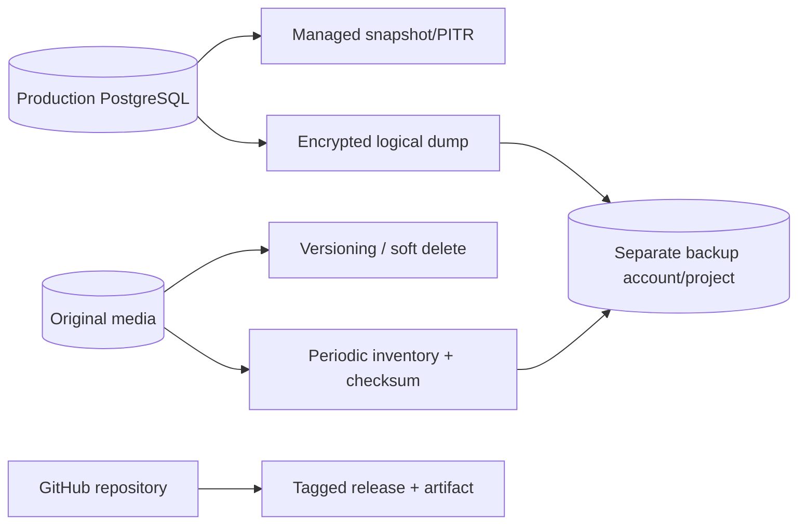

# 10｜Backup、RPO、RTO 與災難復原

## 1. 先定義目標

| 名稱 | 意義 | 範例 |
| --- | --- | --- |
| RPO | 最多可接受遺失多久資料 | 15 分鐘、1 小時、24 小時 |
| RTO | 最多可接受停機多久 | 30 分鐘、4 小時 |
| Retention | 備份保留多久 | 7 日、35 日、1 年 |
| Restore scope | 要復原什麼 | DB、原圖、縮圖、Secret、DNS、設定 |

婚禮原圖通常不可重建，RPO 應比縮圖更嚴格。

## 2. 資料分類

| 資料 | 可重建 | Backup priority |
| --- | --- | --- |
| 原始照片 | 否 | 最高 |
| Rich-content attachments | 通常否 | 最高 |
| PostgreSQL metadata | 部分無法 | 最高 |
| 縮圖 | 可以 | 中；可重建但耗時 |
| Build artifact | 可從 Git 重建 | 中；保留 last-known-good |
| Logs | 不影響功能 | 依 audit/incident policy |
| Secrets | 可 rotate，但需安全存取 | 高 |

## 3. Backup architecture



## 4. Database backup

至少兩層：

1. Provider automated backup／PITR。
2. Periodic logical `pg_dump`。

```bash
pg_dump \
  --format=custom \
  --no-owner \
  --no-acl \
  "$DATABASE_URL" \
  > "memories-$(date -u +%Y%m%dT%H%M%SZ).dump"

sha256sum memories-*.dump > memories-checksums.txt
```

將 dump：

- 加密；
- 上傳不同帳號／project 的 private storage；
- 設 retention；
- 限制 delete permission；
- 不留在 CI workspace。

## 5. Media backup

### Current Google Drive

- 使用 Drive trash／version/history 能力不能取代正式 backup。
- 定期產生 file inventory：provider ID、logical photo ID、size、checksum、modified time。
- 對 original root 做第二份備份或 export。
- 確認 shared folder ownership 與 account recovery。

### Object storage

啟用：

- versioning；
- object lock／retention（依需求）；
- cross-region replication（若 RPO 需要）；
- lifecycle rules；
- incomplete multipart cleanup；
- inventory reports。

## 6. Secrets 與 configuration recovery

不要備份 secret value 到一般文件。需保存：

| 項目 | 保存內容 |
| --- | --- |
| Secret inventory | 名稱、owner、rotation date、用途 |
| Recovery | 如何重新建立或 rotate |
| Runtime identity | IaC／policy definition |
| DNS | zone export／records inventory |
| TLS | provider-managed 或 renewal procedure |
| Environment config | 非敏感 template + versioned IaC |

## 7. Restore drill

每季或重大架構改動後執行：

1. 建立隔離 restore environment。
2. 從最新 backup 還原 PostgreSQL。
3. 執行 pending migrations。
4. 還原或掛載 media inventory。
5. 啟動 application。
6. 驗證 health/readiness。
7. 抽樣 albums、labels、messages、photos、attachments。
8. 驗證 admin login。
9. 驗證一筆 safe write。
10. 記錄實際 RTO、資料缺口與問題。

## 8. Restore validation table

| Check | Expected |
| --- | --- |
| Migration table | 所有已知 migration checksum 一致 |
| Album count | 與 backup baseline 接近/一致 |
| Photo count | 與 media inventory 對應 |
| Message count | 與 source snapshot 對應 |
| Missing originals | 0 或有明確清單 |
| Missing thumbnails | 可接受但進入重建 queue |
| Admin login | 成功 |
| Public routes | 中文／英文可開 |
| Deep links | stable route 正常 |

## 9. Failure scenarios

### Database unavailable

- 停止 destructive writes。
- 檢查 provider incident／network／credential。
- failover 或 restore。
- 不用空 database 啟動並誤認為正常。

### Media provider authorization lost

- 保留 DB，不重新上傳同一批。
- reconnect integration／rotate credential。
- 驗證 read/write test folder。
- resume thumbnail/upload jobs。

### Accidental delete

- 若有 versioning/trash，先 hide affected records。
- restore original object。
- 恢復 DB relationship/pinned references。
- 驗證 checksum。

### Bad deployment

- 回 last-known-good revision。
- 確認 schema compatibility。
- 若新 code 已寫入新格式，評估 forward fix。

### Credential leak

- 立即 revoke/rotate。
- 保留 audit logs。
- 檢查 unauthorized access。
- 重新部署所有使用該 secret 的 revision。

## 10. Backup ownership

| 任務 | Owner | Frequency |
| --- | --- | --- |
| DB automated backup check | Operator | weekly |
| Logical dump | Automated | daily/weekly |
| Media inventory | Automated | daily/weekly |
| Restore drill | Owner + operator | quarterly |
| Secret inventory | Security/operator | monthly |
| DNS/export review | Operator | quarterly |
| Recovery document review | Maintainer | after major change |

## 11. Checklist

- [ ] RPO/RTO 已決定
- [ ] Database PITR
- [ ] Encrypted logical dump
- [ ] Media versioning/backup
- [ ] Inventory + checksum
- [ ] Separate backup account/project
- [ ] Restore environment
- [ ] Quarterly restore drill
- [ ] Last-known-good artifact
- [ ] DNS/secret recovery procedure
- [ ] Backup alert and owner
