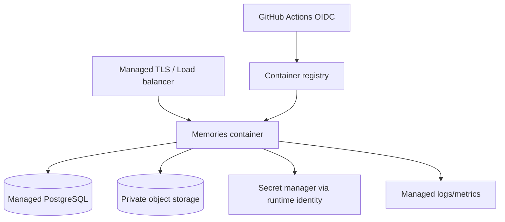

# 11｜從 Replit 專屬架構移植到多雲

## 1. 目前不能直接搬走的部分

Current repository 對 Replit 有幾個實際依賴：

| 依賴 | Current use | 其他雲端的替代 |
| --- | --- | --- |
| `.replit` artifacts/router | 多 app path routing、dev workflow、autoscale target | Reverse proxy／load balancer／single container routing |
| `@replit/connectors-sdk` | Google Drive Integration | Google Drive API client 或 object-store adapter |
| Published App Secrets | Production environment variables | Provider Secret Manager |
| Replit deployment | Build、routing、revision | Container registry + managed container service |
| Replit Object Storage | Legacy API | Provider object storage 或保留 legacy boundary |

因此「在 Cloud Run/ECS/Container Apps 指向 repository 然後完成」是不完整的說法。

## 2. Portable target



## 3. Portability work packages

### A. Containerize Memories

- Build production bundle。
- Start one Node process。
- Listen `0.0.0.0:$PORT`。
- No persistent local filesystem assumption。
- Graceful shutdown。
- Health endpoint。
- Native Sharp runtime test。

### B. Extract media adapter

- Replit Drive adapter remains current implementation。
- Add interface and contract tests。
- Add provider adapter。
- Keep browser/API response provider-neutral。
- Add migration/inventory tooling。

### C. Externalize routing

選項：

1. 只部署 Standalone Memories，domain root 仍使用 `/Memories`。
2. 同一 reverse proxy 同時部署 invitation、Memories、legacy API。
3. 拆 subdomain：`album.example.com`。

Route contract 改動需 redirect plan 與 SEO/share metadata 更新。

### D. Replace deployment secrets

- Provider Secret Manager。
- Runtime identity。
- OIDC deploy identity。
- No long-lived GitHub cloud key。

### E. Adapt background work

Current app 內有 background sync/thumbnail work。Serverless autoscale 可能：

- scale to zero；
- instance 隨時終止；
- 多 instance 同時執行 job；
- CPU 只在 request 時分配（依 provider config）。

Portable design：

| Work | 建議 |
| --- | --- |
| Request-bound thumbnail | Queue after upload |
| Periodic Drive sync | Scheduled job / Cloud Scheduler / EventBridge |
| Long backfill | Dedicated worker / job service |
| Idempotency | DB claim + lease + retry |
| Multi-instance | Advisory lock／queue visibility timeout |

## 4. Storage migration modes

| Mode | Read | Write | 用途 |
| --- | --- | --- | --- |
| Current | Drive | Drive | Replit production |
| Dual-read | Object store first, Drive fallback | Drive | Copy verification |
| Dual-write | Drive + object store | Both | Short migration window only |
| Cutover | Object store | Object store | Portable production |
| Recovery | Object store, Drive read-only | Object store | Rollback safety window |

Dual-write 複雜且容易 partial failure，時間應盡量短。

## 5. Database migration

PostgreSQL 可用：

```bash
pg_dump --format=custom "$SOURCE_DATABASE_URL" > source.dump
pg_restore --no-owner --no-acl --dbname="$TARGET_DATABASE_URL" source.dump
pnpm --filter @workspace/memories-album db:migrate
```

需驗證：

- PostgreSQL version；
- required extensions；
- timezone/encoding；
- TLS；
- max connections；
- row counts；
- large object（若有）；
- migration checksums。

## 6. Provider-neutral configuration

建議最終 config：

```text
DATABASE_URL
MEMORIES_ADMIN_TOKEN
MEMORIES_BASE_PATH=/Memories
MEDIA_PROVIDER=drive|s3|gcs|azure|oci|minio
MEDIA_BUCKET_OR_ROOT=...
MEDIA_REGION=...
MEDIA_ENDPOINT=...        # optional for MinIO/S3-compatible
MEDIA_FORCE_PATH_STYLE=... # optional
```

Credential 優先由 runtime identity 提供，而非新增更多 access-key environment variables。

## 7. Session 與 autoscale

Admin cookie 使用 HMAC secret 時，多 instance 必須共用相同 signing secret。若加入 server-side session store，使用 Redis/PostgreSQL，不用 instance memory。

Rate limit 也不能只存在單 instance memory，若 scale > 1，應使用 distributed store 或 edge control。

## 8. File system

Portable container 應視 filesystem 為 ephemeral：

可用於：

- request temporary file；
- build output；
- short-lived cache。

不可用於：

- originals；
- user attachments；
- database；
- durable upload state；
- long-term logs；
- secrets。

## 9. Network design

| Connection | 建議 |
| --- | --- |
| Internet → app | TLS、WAF/rate limit optional |
| App → PostgreSQL | private network、TLS |
| App → object storage | private endpoint/service endpoint where possible |
| App → Secret Manager | runtime identity + private endpoint optional |
| CI → cloud | OIDC |
| Operator → DB | bastion/VPN/identity-aware proxy |

## 10. Portability readiness checklist

- [ ] Production Dockerfile
- [ ] `.dockerignore`
- [ ] Container runs as non-root where possible
- [ ] `PORT` configurable
- [ ] Graceful SIGTERM
- [ ] No local persistent state
- [ ] Media adapter interface
- [ ] Provider-neutral browser contract
- [ ] Background jobs idempotent
- [ ] Distributed rate limit/session decision
- [ ] Managed PostgreSQL tested
- [ ] Secret manager integration
- [ ] Logs to stdout/stderr structured
- [ ] SBOM/image scanning
- [ ] Database/media migration plan
- [ ] Rollback mapping

## 11. Recommended order

1. Add production browser gate and keep green。
2. Add container build without changing current Replit deployment。
3. Add media adapter contract around current Drive implementation。
4. Add MinIO adapter for local tests。
5. Add first cloud object-store adapter。
6. Move scheduled/background work to explicit job boundary。
7. Deploy staging in target cloud。
8. Copy Development data only。
9. Run full acceptance。
10. Plan production cutover and rollback。
