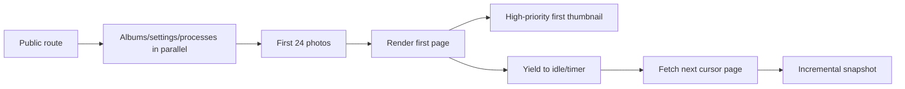

# 12｜效能、Web Vitals、Bundle 與圖片載入

> **Current gate:** Phase 2 performance work is active on `main` at `09293817935f5548aa4c7ef6918db9afd0a62b98`.  
> **Dated record:** [`../memories/phase-2-performance-gate-2026-08-05.md`](../memories/phase-2-performance-gate-2026-08-05.md)

## 1. Current performance changes

| Area | Current implementation |
| --- | --- |
| Public entry | Admin、login、private management use dynamic imports |
| First photo request | Reduced to 24 records |
| Progressive feed | First page exposed immediately；later cursor pages yield to idle/timer turn |
| First image | First thumbnail remains high priority |
| Web Vitals | Read-only browser snapshot at `window.__MEMORIES_WEB_VITALS__` |
| Debug | `?performance=1` logs current snapshot；no third-party transmission |
| Bundle evidence | Vite manifest + JSON/Markdown bundle reports |
| Build budgets | Public entry、single chunk、total JS gzip ceilings |

## 2. Loading model



Current implementation still accumulates later cursor pages in the background. Future server-driven on-demand loading should wait until the transform chain is reduced and browser regression coverage remains green.

## 3. Web Vitals

Current snapshot：

```js
window.__MEMORIES_WEB_VITALS__
```

It records：

| Metric | Meaning | Important interpretation |
| --- | --- | --- |
| LCP | Largest Contentful Paint | Identify hero/first meaningful image/text |
| CLS | Cumulative Layout Shift | Excludes recent-input shifts |
| INP diagnostic | Largest observed interaction duration | Remains `null` before eligible interaction |
| Navigation | Response/DOMContentLoaded/load | Lab page-load breakdown |
| Transfer | Transfer and encoded body timing | Cache/compression diagnosis |

Console diagnostic：

```text
/Memories/?performance=1
```

No metric is sent to a third party by the current diagnostic.

## 4. Measurement protocol

### Lab

Record：

- exact commit/revision；
- browser engine/profile；
- viewport；
- CPU/network throttling；
- cold/warm cache；
- album/label route；
- photo count；
- LCP/CLS/interaction diagnostic；
- bundle report；
- screenshot/trace。

### Physical device

Lab profile is insufficient for：

- low-end Android CPU/memory；
- Safari/WebKit scheduling；
- in-app browser viewport；
- background/resume；
- real network/cache；
- image decoder differences。

Record LCP、CLS、interaction timing together with the Phase 2 device matrix。

## 5. Current bundle budgets

Production build fails when：

| Budget | Ceiling |
| --- | ---: |
| Public entry gzip | 450 KiB |
| Any JS chunk gzip | 800 KiB |
| Total JS gzip | 2 MiB |
| Route splitting | Admin、login、private management must remain dynamic imports |

Reports：

```text
dist/performance/bundle-report.json
dist/performance/bundle-report.md
```

These are regression ceilings, not desired targets. Tighten only after several stable production baselines。

## 6. Code splitting rules

- Public archive must not eagerly download Admin application。
- Admin login and private batch-management remain separate lazy routes。
- Lazy fallback is `null` when visible DOM/spacing must remain unchanged。
- Avoid one giant shared chunk caused by broad barrel imports。
- Heavy editor/import packages should load only where needed。
- Verify both bundle report and runtime route behavior。

## 7. Image performance

Current strengths：

- lazy loading；
- first thumbnail high priority；
- WebP derivative；
- explicit pagination/progressive feed；
- original loaded only through controlled route/user action。

Next improvement：responsive variants。

```html

```

Before implementation, server/storage must persist multiple sizes and API must return safe controlled URLs。

## 8. Layout stability

Avoid CLS：

- set image aspect ratio/known dimensions；
- reserve hero/image/card space；
- avoid injecting late banners above content；
- load fonts predictably；
- keep lazy route fallback DOM-neutral when layout must not change；
- test Word tables/images；
- verify bottom navigation/safe-area behavior。

## 9. Interaction performance

Watch：

- album/label switching；
- wheel scroll/keyboard；
- masonry relayout；
- photo viewer open/close/zoom；
- admin accordion lazy load；
- large bulk selection；
- Word editor/import；
- upload progress updates。

Use：

- memoized pure models；
- abort stale requests；
- bounded DOM/page size；
- `requestIdleCallback`/timer fallback for non-critical work；
- worker/background service for image processing；
- avoid synchronous huge JSON/DOM operations。

## 10. Cache and network

| Resource | Suggested policy |
| --- | --- |
| Versioned immutable thumbnail | Long public immutable cache |
| Public metadata | Short cache + ETag |
| Controlled original | Private/short cache based on policy |
| Admin/private API | `no-store` |
| Missing derivative fallback | `no-store` or very short cache |
| JS/CSS hashed asset | Long immutable cache |

Avoid preloading every original or every future photo page。

## 11. Database/API performance

- Cursor pagination with stable order。
- Album/label filters executed server-side。
- Index active visibility/filter/sort columns。
- Abort stale browser requests after navigation。
- Bound query limit。
- Avoid N+1 provider/database calls。
- Record p95 latency and rows returned。
- Separate metadata response from image bytes。

## 12. Performance regression checklist

- [ ] Production bundle report generated
- [ ] Budgets pass
- [ ] Public entry excludes private route modules
- [ ] First photo request remains bounded
- [ ] First meaningful image high priority
- [ ] No unexpected horizontal overflow
- [ ] LCP/CLS snapshot captured
- [ ] Interaction performed before interpreting INP diagnostic
- [ ] Cold and warm cache measured
- [ ] Mobile/WebKit/In-App profiles run
- [ ] At least representative physical devices measured
- [ ] No third-party metric transmission without privacy decision

## 13. Remaining work

- Physical-device LCP/CLS/interaction baseline。
- Responsive image variants and `srcset`。
- Server-driven on-demand cursor loading。
- Real-user monitoring decision、consent、retention and vendor review。
- Tighten budgets after stable baselines。
- Continue removing exact-string transforms to improve tree-shaking and code ownership。
