# 詠葉婚禮網站｜從零建置與多雲部署手冊

> **狀態：** Current  
> **基準：** `main` commit `09293817935f5548aa4c7ef6918db9afd0a62b98`  
> **更新：** 2026-08-05（Asia/Taipei）

這個資料夾提供兩條閱讀路徑：

1. **從零建置同類型網站**：理解技術棧、資料模型、上傳流程、管理後台、測試、效能、資安與維運。
2. **部署目前 repository**：理解 Replit 原生部署，以及移植到 On-premise、Google Cloud、AWS、Azure、Oracle Cloud 或 Kubernetes 時需要更換的元件。

## 重要架構判斷

目前程式的媒體層使用 `@replit/connectors-sdk` 連接 Google Drive。這是 **Replit 專屬整合**。

因此：

- **Replit 部署**可以最少修改直接沿用目前架構。
- **其他雲端／On-premise**不能假設此 connector 存在，必須：
  1. 實作 Google Drive API adapter；或
  2. 實作 S3-compatible／Cloud Storage／Blob／OCI Object Storage adapter。

本手冊清楚區分：

| 類型 | 意義 |
| --- | --- |
| Current repository | 目前 `main` 已實作、可直接驗證的行為 |
| Portable target | 移植時建議架構，不代表 adapter 已完成 |
| Optional enhancement | 可加入，但不是目前啟動網站的必要條件 |

## 文件地圖

### 從零開始

| 順序 | 文件 | 你會完成什麼 |
| ---: | --- | --- |
| 0 | [`00-overview.md`](00-overview.md) | 產品、角色、系統邊界與資料流 |
| 1 | [`01-technology-stack.md`](01-technology-stack.md) | Node、React、Vite、PostgreSQL、媒體與測試工具 |
| 2 | [`02-prerequisites.md`](02-prerequisites.md) | Git、Node.js、pnpm、PostgreSQL、Docker 與雲端 CLI |
| 3 | [`03-local-development.md`](03-local-development.md) | Clone、本機啟動、build、測試與 healthcheck |
| 4 | [`04-configuration-and-secrets.md`](04-configuration-and-secrets.md) | Environment、Secret、權限與 rotation |
| 5 | [`05-database-and-migrations.md`](05-database-and-migrations.md) | PostgreSQL、migration、backup 與 restore |
| 6 | [`06-media-storage.md`](06-media-storage.md) | Google Drive、thumbnail、object storage 與 adapter |
| 7 | [`07-security-and-privacy.md`](07-security-and-privacy.md) | Session、token、upload、CSP、SCA、privacy |
| 8 | [`08-testing-and-ci.md`](08-testing-and-ci.md) | Node、Playwright、cross-browser、CI、device evidence |
| 9 | [`09-release-observability.md`](09-release-observability.md) | Build、health、logs、metrics、alerts、rollback |
| 10 | [`10-backup-and-disaster-recovery.md`](10-backup-and-disaster-recovery.md) | RPO/RTO、DB/media backup、restore drill |
| 11 | [`11-portability.md`](11-portability.md) | Replit 專屬元件改成 portable container architecture |
| 12 | [`12-performance.md`](12-performance.md) | LCP、CLS、INP diagnostic、code splitting、bundle/image budgets |

### 部署環境

| 環境 | 文件 | 建議運算 | Database | Media |
| --- | --- | --- | --- | --- |
| Replit | [`deployments/replit.md`](deployments/replit.md) | Autoscale／Reserved VM | Replit／external PostgreSQL | Google Drive Integration |
| On-premise／VPS | [`deployments/on-premise.md`](deployments/on-premise.md) | Docker Compose + Caddy | PostgreSQL | MinIO／Drive API |
| Google Cloud | [`deployments/google-cloud.md`](deployments/google-cloud.md) | Cloud Run | Cloud SQL PostgreSQL | Cloud Storage／Drive API |
| AWS | [`deployments/aws.md`](deployments/aws.md) | ECS Fargate + ALB | RDS PostgreSQL | S3 |
| Microsoft Azure | [`deployments/microsoft-azure.md`](deployments/microsoft-azure.md) | Container Apps | PostgreSQL Flexible Server | Blob Storage |
| Oracle Cloud | [`deployments/oracle-cloud.md`](deployments/oracle-cloud.md) | OCI Container Instances | OCI PostgreSQL | OCI Object Storage |
| Kubernetes | [`deployments/kubernetes.md`](deployments/kubernetes.md) | Deployment + Ingress | Managed PostgreSQL | S3-compatible object store |

### 參考與排錯

| 文件 | 用途 |
| --- | --- |
| [`reference/command-reference.md`](reference/command-reference.md) | pnpm、Git、PostgreSQL、Docker、測試與雲端命令 |
| [`reference/troubleshooting.md`](reference/troubleshooting.md) | Startup、migration、Drive、thumbnail、browser、deployment 排錯 |
| [`reference/release-checklists.md`](reference/release-checklists.md) | PR、production、rollback、restore checklist |

## 建置路線圖

```mermaid
flowchart LR
  A[需求與資料分類] --> B[本機工具鏈]
  B --> C[PostgreSQL + Migration]
  C --> D[媒體儲存 Adapter]
  D --> E[公開站與管理後台]
  E --> F[Node tests]
  F --> G[Playwright 跨瀏覽器]
  G --> P[Performance budgets]
  P --> H[Container build]
  H --> I[雲端部署]
  I --> J[Health / Logs / Metrics]
  J --> K[Backup / Restore drill]
```

## 最低可上線條件

| 領域 | 最低條件 |
| --- | --- |
| Runtime | Node.js 24；server 監聽 `process.env.PORT` 與 `0.0.0.0` |
| Package | pnpm 10；frozen lockfile；不使用 npm/Yarn lockfile |
| Database | PostgreSQL；migration checksum；可還原備份 |
| Storage | Original/derivative 不放 ephemeral filesystem |
| Security | TLS；Secret Manager；HttpOnly admin session；upload limits |
| Quality | typecheck、Node tests、production build、Playwright、health smoke |
| Performance | Bounded first photo page、route splitting、bundle report/budgets |
| Operations | logs、alerts、last-known-good revision、rollback procedure |
| Privacy | token 不記錄；provider IDs 不送 browser；retention policy |

## 不應該照抄的地方

- 不把 production credential 寫進 `.env.example`、README、Docker image 或 Actions log。
- 不把 Drive folder ID、OAuth token、private token 或 database URL 放 client bundle。
- 沒有 adapter 時，不把 Replit Connector 直接搬到其他雲端並宣稱可用。
- 不使用 `drizzle-kit push` 修改 Memories production schema。
- 不把 `/Memories/` full page 當 liveness；使用 `/Memories/api/health`。
- 不把 automated user-agent profile 誤稱為真機驗證。
- 不把 bundle regression ceiling 當 performance target。

## 官方文件與版本漂移

雲端服務、CLI、SKU 與價格會改變。各部署文件附官方參考，但執行前仍應：

1. 檢查 provider 最新文件與支援 region。
2. 檢查 CLI 指令／API 是否仍為 stable。
3. 確認 Node 24、PostgreSQL、container runtime 相容。
4. 先在 Development／Staging 驗證。
5. 記錄 provider、region、SKU、版本、日期與 image digest。
