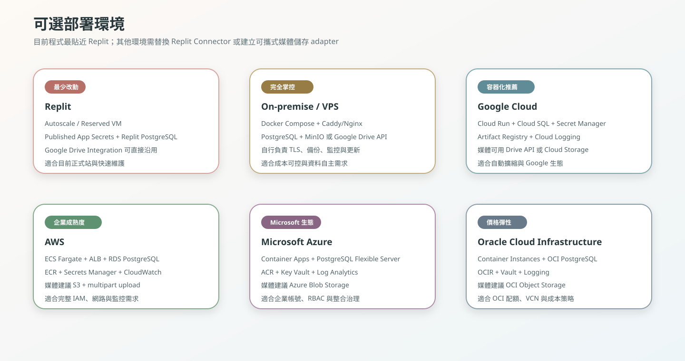
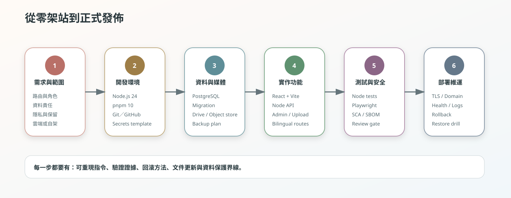

# 詠葉婚禮網站｜從零建置與多雲部署手冊

> **狀態：** Current  
> **基準：** `main` commit `21dc25543de6dd2bfa7e9019a2a9244c8a2ef186`  
> **更新：** 2026-08-05（Asia/Taipei）

這個資料夾提供兩條閱讀路徑：

1. **從零建置同類型網站**：理解技術棧、資料模型、上傳流程、管理後台、測試、資安與維運。
2. **部署目前 repository**：理解 Replit 的原生部署，以及移植到 On-premise、Google Cloud、AWS、Azure、Oracle Cloud 或 Kubernetes 時需要更換的元件。

## 重要架構判斷

目前程式的媒體層使用 `@replit/connectors-sdk` 連接 Google Drive。這是 **Replit 專屬整合**。

因此：

- **Replit 部署**可以最少修改直接沿用目前架構。
- **其他雲端／On-premise**不能假設此 connector 存在。必須選擇其一：
  1. 實作 Google Drive API adapter；或
  2. 實作 S3-compatible／Cloud Storage／Blob／OCI Object Storage adapter。

本手冊會清楚區分：

| 類型 | 意義 |
| --- | --- |
| Current repository | 目前 `main` 已實作、可直接驗證的行為 |
| Portable target | 移植到其他環境時建議的架構，不代表目前程式已完成該 adapter |
| Optional enhancement | 可加入但不是啟動網站的必要條件 |

## 文件地圖

### 從零開始

| 順序 | 文件 | 你會完成什麼 |
| ---: | --- | --- |
| 0 | [`00-overview.md`](00-overview.md) | 理解產品、角色、系統邊界與資料流 |
| 1 | [`01-technology-stack.md`](01-technology-stack.md) | 選定 Node、React、Vite、PostgreSQL、媒體與測試工具 |
| 2 | [`02-prerequisites.md`](02-prerequisites.md) | 安裝 Git、Node.js、pnpm、PostgreSQL、Docker 與雲端 CLI |
| 3 | [`03-local-development.md`](03-local-development.md) | 從 clone 到本機啟動、build、測試與 healthcheck |
| 4 | [`04-configuration-and-secrets.md`](04-configuration-and-secrets.md) | 建立環境變數、Secret、權限與設定分層 |
| 5 | [`05-database-and-migrations.md`](05-database-and-migrations.md) | 建立 PostgreSQL、執行 migration、備份與復原 |
| 6 | [`06-media-storage.md`](06-media-storage.md) | 理解 Google Drive、縮圖、object storage 與 adapter 邊界 |
| 7 | [`07-security-and-privacy.md`](07-security-and-privacy.md) | 管理 session、token、上傳安全、CSP、SCA 與資料保留 |
| 8 | [`08-testing-and-ci.md`](08-testing-and-ci.md) | 建立 Node、Playwright、cross-browser、CI 與 evidence gate |
| 9 | [`09-release-observability.md`](09-release-observability.md) | 設定 build、health、logs、metrics、alerts 與 rollback |
| 10 | [`10-backup-and-disaster-recovery.md`](10-backup-and-disaster-recovery.md) | 設定 RPO/RTO、資料庫與媒體備份、restore drill |
| 11 | [`11-portability.md`](11-portability.md) | 將 Replit 專屬元件改成可攜式 container 架構 |

### 部署環境

| 環境 | 文件 | 建議運算 | Database | Media |
| --- | --- | --- | --- | --- |
| Replit | [`deployments/replit.md`](deployments/replit.md) | Autoscale 或 Reserved VM | Replit PostgreSQL／外部 PostgreSQL | Google Drive Integration |
| On-premise / VPS | [`deployments/on-premise.md`](deployments/on-premise.md) | Docker Compose + Caddy | PostgreSQL | MinIO 或 Google Drive API |
| Google Cloud | [`deployments/google-cloud.md`](deployments/google-cloud.md) | Cloud Run | Cloud SQL for PostgreSQL | Cloud Storage 或 Drive API |
| AWS | [`deployments/aws.md`](deployments/aws.md) | ECS Fargate + ALB | RDS for PostgreSQL | S3 |
| Microsoft Azure | [`deployments/microsoft-azure.md`](deployments/microsoft-azure.md) | Azure Container Apps | PostgreSQL Flexible Server | Blob Storage |
| Oracle Cloud | [`deployments/oracle-cloud.md`](deployments/oracle-cloud.md) | OCI Container Instances | OCI Database with PostgreSQL | OCI Object Storage |
| Kubernetes | [`deployments/kubernetes.md`](deployments/kubernetes.md) | Deployment + Ingress | Managed PostgreSQL | S3-compatible object store |

### 參考與排錯

| 文件 | 用途 |
| --- | --- |
| [`reference/command-reference.md`](reference/command-reference.md) | 常用 pnpm、Git、PostgreSQL、Docker、測試與維運命令 |
| [`reference/troubleshooting.md`](reference/troubleshooting.md) | 啟動、migration、Drive、縮圖、browser、deployment 排錯 |
| [`reference/release-checklists.md`](reference/release-checklists.md) | 開發、PR、正式發布、回滾與 restore checklist |

## 建置路線圖

```mermaid
flowchart LR
  A[需求與資料分類] --> B[本機工具鏈]
  B --> C[PostgreSQL + Migration]
  C --> D[媒體儲存 Adapter]
  D --> E[公開站與管理後台]
  E --> F[Node tests]
  F --> G[Playwright 跨瀏覽器]
  G --> H[Container build]
  H --> I[雲端部署]
  I --> J[Health / Logs / Metrics]
  J --> K[Backup / Restore drill]
```

## 最低可上線條件

| 領域 | 最低條件 |
| --- | --- |
| Runtime | Node.js 24；server 監聽 `process.env.PORT` 與 `0.0.0.0` |
| Package | pnpm 10；frozen lockfile；不使用 npm/Yarn lockfile |
| Database | PostgreSQL；migration checksum；可還原備份 |
| Storage | 原圖與衍生圖不放在 ephemeral filesystem |
| Security | TLS；Secret manager；HttpOnly admin session；upload limits |
| Quality | typecheck、Node tests、production build、Playwright、health smoke |
| Operations | logs、alerts、last-known-good commit、rollback procedure |
| Privacy | 管理 token 不記錄；Drive/object IDs 不送到 browser；資料保留規則 |

## 不應該照抄的地方

- 不要把 production credential 寫進 `.env.example`、README、Docker image 或 GitHub Actions log。
- 不要把 Google Drive folder ID、OAuth token、private management token 或 database URL 放進 client bundle。
- 不要在沒有 adapter 的情況下，把 Replit Connector 程式直接搬到其他雲端並宣稱可用。
- 不要使用 `drizzle-kit push` 修改 Memories production schema。
- 不要把 `/Memories/` 頁面本身當 liveness healthcheck；使用 `/Memories/api/health`。
- 不要把 automated user-agent profile 誤稱為真機驗證。

## 官方文件與版本漂移

雲端服務、CLI 與價格會改變。各部署文件包含官方參考連結，但執行前仍應：

1. 檢查 provider 最新文件與支援區域。
2. 檢查 CLI 指令是否仍為 stable。
3. 重新確認 Node 24、PostgreSQL 與 container runtime 相容性。
4. 先在 Development／Staging 驗證。
5. 記錄實際使用的 provider、region、SKU、版本與日期。
