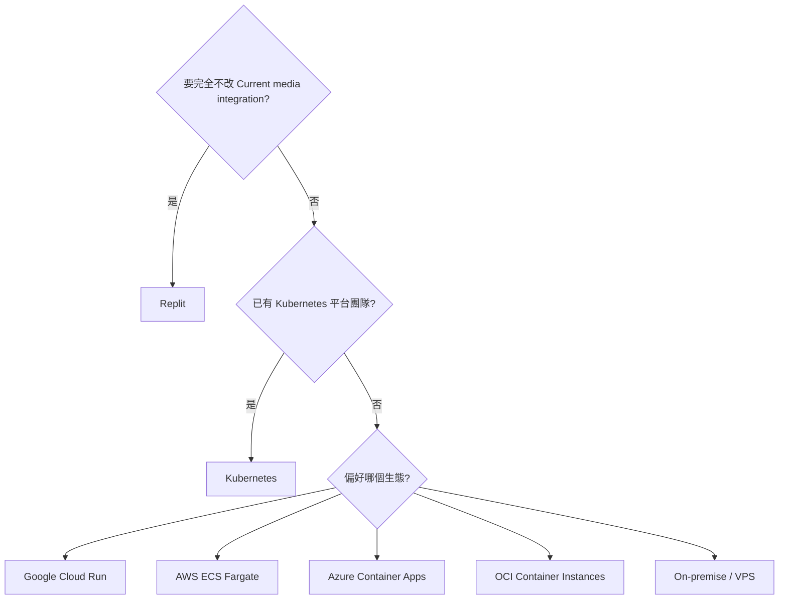
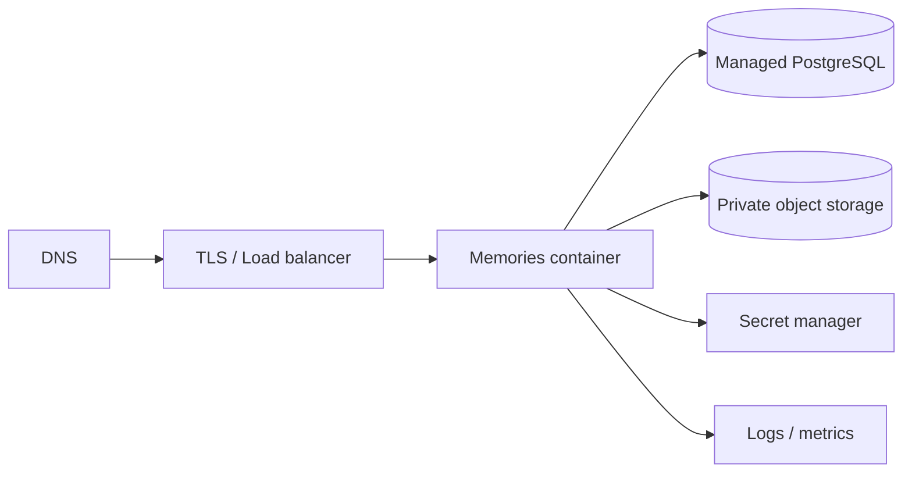

# 部署環境總覽

## 1. 快速比較

| 環境 | Current code 改動 | 維運負擔 | 自動擴縮 | 建議 media | 適合 |
| --- | --- | --- | --- | --- | --- |
| Replit | 最少 | 低 | Autoscale | Current Google Drive | 現有正式站、快速維護 |
| On-premise/VPS | 中～高 | 高 | 自行處理 | MinIO/Drive API | 資料自主、固定成本 |
| Google Cloud | 中 | 中 | Cloud Run | GCS/Drive API | Google 生態、serverless |
| AWS | 中～高 | 中高 | ECS Service | S3 | 企業 IAM、完整服務 |
| Azure | 中～高 | 中 | Container Apps | Blob Storage | Microsoft 生態 |
| Oracle Cloud | 中～高 | 中 | Container Instances/OKE | OCI Object Storage | OCI 成本與 tenancy |
| Kubernetes | 高 | 很高 | HPA/KEDA | S3-compatible | 已有平台團隊 |

## 2. 所有環境共通條件

```text
Node.js 24 runtime
pnpm frozen build
PostgreSQL
private durable media storage
Secret manager
TLS
healthcheck
structured logs
backup + restore
```

## 3. Current-code compatibility

| 能力 | Replit | 其他環境 |
| --- | --- | --- |
| `@replit/connectors-sdk` Google Drive | 可用 | 不可假設可用 |
| `.replit` application router | 可用 | 需 reverse proxy/load balancer |
| Published App Secrets | 可用 | 改 provider Secret Manager |
| `process.env.PORT` | 可用 | 共通需求 |
| PostgreSQL | 可用 | 換 managed/self-hosted PostgreSQL |
| Production build | 可用 | Container 化後可攜 |

## 4. 選擇流程



## 5. 建議最小 production topology



## 6. Environment isolation

每個 provider 都應有：

```text
dev
staging
prod
```

分離：

- project/account/resource group/compartment（可行時）；
- database；
- bucket；
- runtime identity；
- secrets；
- domain；
- logs；
- backups。

## 7. Deployment completion criteria

- [ ] Container/Published revision tied to Git commit
- [ ] `/Memories/api/health` green
- [ ] Database migration complete
- [ ] Media read/write test complete
- [ ] Chinese/English public routes work
- [ ] Albums/labels/processes/guestbook work
- [ ] Admin login and tabs work
- [ ] Browser gate green
- [ ] Logs and alerts active
- [ ] Backup active
- [ ] Rollback tested
- [ ] Real-device residual risks recorded
