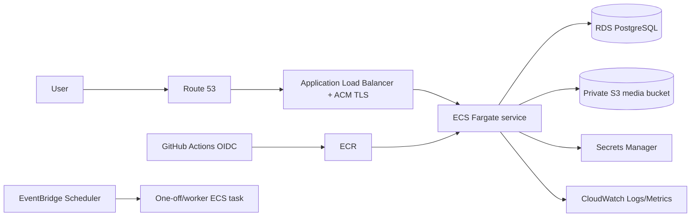

# AWS 部署

> **推薦 topology：** ECS Fargate + Application Load Balancer + ECR + RDS for PostgreSQL + Secrets Manager + S3 + CloudWatch。  
> **Media prerequisite：** 實作 S3 adapter；Replit Google Drive Connector 不能直接沿用。  
> **不推薦新採用 App Runner：** AWS 官方文件已公告自 2026-03-31 起不再對新客戶開放；新部署使用 ECS Fargate。

## 1. 架構



## 2. 前置條件

```bash
aws configure sso
aws sts get-caller-identity
export AWS_REGION=ap-southeast-2
export AWS_ACCOUNT_ID=$(aws sts get-caller-identity --query Account --output text)
```

Production 建議：

- VPC 至少兩個 Availability Zones；
- ALB public subnets；
- ECS tasks 與 RDS private subnets；
- NAT gateway 或 VPC endpoints；
- RDS security group 只允許 ECS task security group；
- S3/Secrets/ECR/CloudWatch endpoints 依成本與安全需求。

## 3. ECR

```bash
aws ecr create-repository \
  --repository-name wedding-memories \
  --image-scanning-configuration scanOnPush=true

aws ecr get-login-password --region "$AWS_REGION" | \
  docker login --username AWS --password-stdin \
  "$AWS_ACCOUNT_ID.dkr.ecr.$AWS_REGION.amazonaws.com"

IMAGE="$AWS_ACCOUNT_ID.dkr.ecr.$AWS_REGION.amazonaws.com/wedding-memories:$(git rev-parse --short HEAD)"
docker build -t "$IMAGE" .
docker push "$IMAGE"
```

Production task definition 應使用 image digest。

## 4. S3 media bucket

需要 S3 adapter。

```bash
BUCKET="wedding-media-prod-$AWS_ACCOUNT_ID"
aws s3api create-bucket \
  --bucket "$BUCKET" \
  --region "$AWS_REGION" \
  --create-bucket-configuration LocationConstraint="$AWS_REGION"

aws s3api put-public-access-block \
  --bucket "$BUCKET" \
  --public-access-block-configuration \
'BlockPublicAcls=true,IgnorePublicAcls=true,BlockPublicPolicy=true,RestrictPublicBuckets=true'

aws s3api put-bucket-versioning \
  --bucket "$BUCKET" \
  --versioning-configuration Status=Enabled
```

建議設定：

- SSE-KMS 或 SSE-S3；
- lifecycle 清 incomplete multipart uploads；
- version retention；
- inventory report；
- access logs／CloudTrail data events（依風險）；
- runtime role 只存取指定 bucket/prefix。

## 5. RDS PostgreSQL

建立：

- PostgreSQL 16 或 repository 驗證版本；
- private DB subnet group；
- encrypted storage；
- automated backups/PITR；
- Multi-AZ 依 RTO；
- deletion protection；
- performance insights／Enhanced Monitoring（依需要）。

CLI 骨架：

```bash
aws rds create-db-instance \
  --db-instance-identifier wedding-postgres \
  --engine postgres \
  --engine-version 16 \
  --db-instance-class db.t4g.small \
  --allocated-storage 20 \
  --storage-type gp3 \
  --storage-encrypted \
  --master-username memories_admin \
  --manage-master-user-password \
  --db-subnet-group-name wedding-db-subnets \
  --vpc-security-group-ids sg-REPLACE \
  --backup-retention-period 7 \
  --no-publicly-accessible \
  --deletion-protection
```

不要讓 app 使用 master user。建立 runtime user，只授予 application schema 權限。

## 6. Secrets Manager

```bash
aws secretsmanager create-secret \
  --name wedding/prod/database-url \
  --secret-string 'postgresql://...'

aws secretsmanager create-secret \
  --name wedding/prod/admin-token \
  --secret-string "$(openssl rand -base64 48)"
```

ECS 有兩種模式：

1. Task definition `secrets` 注入 environment；更新 secret 後需新 task 才取得。
2. App 透過 AWS SDK 於 runtime 讀 Secrets Manager；需 cache 與 rotation strategy。

Task execution role 用於 pull image/logs/injected secrets；task role 用於 app 的 S3/Secrets access。兩者分開。

## 7. IAM task role

最小 S3 policy 範例：

```json
{
  "Version": "2012-10-17",
  "Statement": [
    {
      "Effect": "Allow",
      "Action": [
        "s3:GetObject",
        "s3:PutObject",
        "s3:DeleteObject",
        "s3:AbortMultipartUpload",
        "s3:ListBucketMultipartUploads",
        "s3:ListMultipartUploadParts"
      ],
      "Resource": [
        "arn:aws:s3:::BUCKET",
        "arn:aws:s3:::BUCKET/*"
      ]
    }
  ]
}
```

再加 Secrets Manager read 指定 ARNs，不使用 `Resource: *`。

## 8. ECS task definition

核心設定：

```json
{
  "family": "wedding-memories",
  "networkMode": "awsvpc",
  "requiresCompatibilities": ["FARGATE"],
  "cpu": "1024",
  "memory": "2048",
  "containerDefinitions": [
    {
      "name": "memories",
      "image": "ACCOUNT.dkr.ecr.REGION.amazonaws.com/wedding-memories@sha256:DIGEST",
      "essential": true,
      "portMappings": [{"containerPort": 8080,"protocol": "tcp"}],
      "environment": [
        {"name": "NODE_ENV", "value": "production"},
        {"name": "MEMORIES_BASE_PATH", "value": "/Memories"},
        {"name": "MEDIA_PROVIDER", "value": "s3"},
        {"name": "MEDIA_BUCKET_OR_ROOT", "value": "BUCKET"},
        {"name": "MEDIA_REGION", "value": "REGION"}
      ],
      "secrets": [
        {"name": "DATABASE_URL", "valueFrom": "DATABASE_SECRET_ARN"},
        {"name": "MEMORIES_ADMIN_TOKEN", "valueFrom": "ADMIN_SECRET_ARN"}
      ],
      "logConfiguration": {
        "logDriver": "awslogs",
        "options": {
          "awslogs-group": "/wedding/memories",
          "awslogs-region": "REGION",
          "awslogs-stream-prefix": "app"
        }
      },
      "healthCheck": {
        "command": ["CMD-SHELL", "node -e \"fetch('http://127.0.0.1:8080/Memories/api/health').then(r=>process.exit(r.ok?0:1)).catch(()=>process.exit(1))\""],
        "interval": 30,
        "timeout": 5,
        "retries": 3,
        "startPeriod": 60
      }
    }
  ]
}
```

## 9. ALB 與 ECS service

ALB：

- HTTPS 443 listener；
- ACM certificate；
- HTTP 80 redirect to HTTPS；
- target type `ip`；
- health path `/Memories/api/health`；
- deregistration delay 支援 graceful shutdown；
- WAF optional。

ECS service：

```bash
aws ecs create-service \
  --cluster wedding \
  --service-name wedding-memories \
  --task-definition wedding-memories:REVISION \
  --desired-count 2 \
  --launch-type FARGATE \
  --network-configuration 'awsvpcConfiguration={subnets=[subnet-a,subnet-b],securityGroups=[sg-app],assignPublicIp=DISABLED}' \
  --load-balancers 'targetGroupArn=arn:...,containerName=memories,containerPort=8080' \
  --health-check-grace-period-seconds 60
```

Application Load Balancer 支援 HTTP/HTTPS path routing，適合把 invitation、Memories 與 legacy API 分別導向不同 target group。

## 10. Migration one-off task

建立 migration task definition/revision，command 改為 migration entrypoint：

```bash
aws ecs run-task \
  --cluster wedding \
  --launch-type FARGATE \
  --task-definition wedding-memories-migrate:REVISION \
  --network-configuration 'awsvpcConfiguration={subnets=[subnet-a,subnet-b],securityGroups=[sg-app],assignPublicIp=DISABLED}'
```

等待 task 成功：

```bash
aws ecs wait tasks-stopped --cluster wedding --tasks TASK_ARN
aws ecs describe-tasks --cluster wedding --tasks TASK_ARN
```

Migration 成功後才 update ECS service。

## 11. Background work

- EventBridge Scheduler → ECS `RunTask`；
- SQS for thumbnail/upload jobs；
- visibility timeout + DB idempotency；
- DLQ；
- CloudWatch alarm；
- worker 與 web service 可使用不同 task definition。

## 12. Autoscaling

ECS Service Auto Scaling 可依：

- CPU；
- memory；
- ALB request count；
- custom queue/backlog metric。

Database pool 必須按最大 task count 計算。

## 13. DNS/TLS

- Route 53 Alias A/AAAA → ALB。
- ACM certificate 與 ALB 同 region。
- `X-Forwarded-Proto` 正確。
- Admin Secure cookie 驗證。
- CloudFront optional；private/admin responses 不 shared-cache。

## 14. Monitoring

- CloudWatch Logs Insights；
- ECS task stopped/restarts；
- ALB target health、5xx、latency；
- RDS connections/storage/CPU/replica lag；
- S3 access/4xx/5xx；
- EventBridge/ECS task failures；
- app custom metrics；
- CloudTrail IAM/secret/bucket changes。

## 15. Deployment/rollback

Update service：

```bash
aws ecs update-service \
  --cluster wedding \
  --service wedding-memories \
  --task-definition wedding-memories:NEW_REVISION
```

Enable deployment circuit breaker/rollback。Rollback 時改回 previous task definition revision，先確認 migration compatibility。

## 16. 官方參考

- ECS on Fargate getting started: https://docs.aws.amazon.com/AmazonECS/latest/developerguide/getting-started-fargate.html
- ECS Application Load Balancer: https://docs.aws.amazon.com/AmazonECS/latest/developerguide/alb.html
- ECS service load balancing: https://docs.aws.amazon.com/AmazonECS/latest/developerguide/service-load-balancing.html
- ECS and Secrets Manager: https://docs.aws.amazon.com/AmazonECS/latest/developerguide/secrets-app-secrets-manager.html
- RDS for PostgreSQL: https://docs.aws.amazon.com/AmazonRDS/latest/UserGuide/CHAP_PostgreSQL.html
- S3 multipart upload: https://docs.aws.amazon.com/AmazonS3/latest/userguide/mpuoverview.html
- App Runner availability notice: https://docs.aws.amazon.com/apprunner/latest/api/API_StartDeployment.html
