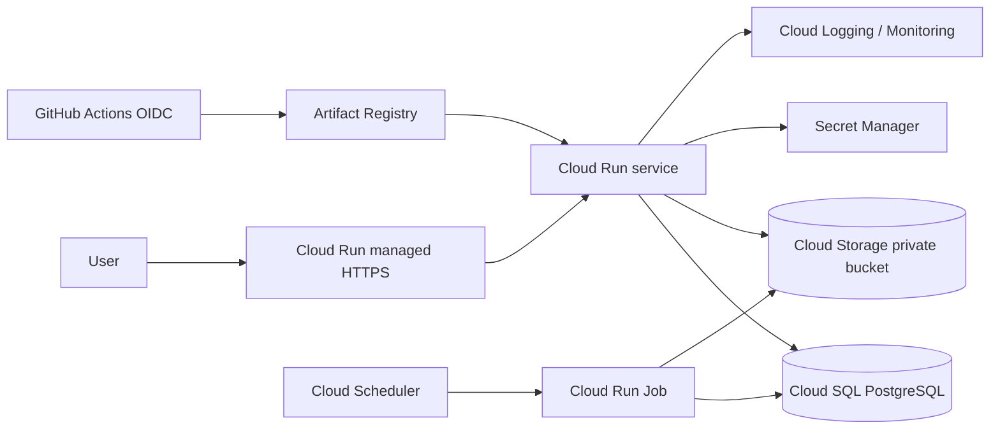
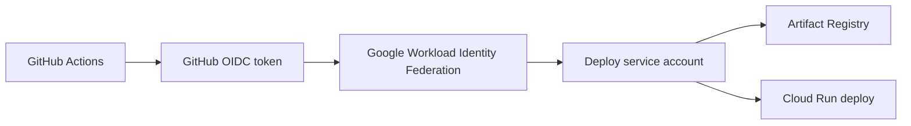

# Google Cloud 部署

> **推薦 topology：** Cloud Run + Artifact Registry + Cloud SQL for PostgreSQL + Secret Manager + Cloud Logging。  
> **Media prerequisite：** 實作 Google Cloud Storage adapter，或實作直接 Google Drive API adapter；Replit Connector 不能直接沿用。  
> **適合：** 想使用 serverless container、自動擴縮與 Google 生態。

## 1. 架構



## 2. 前置條件

```bash
gcloud auth login
gcloud auth application-default login
gcloud config set project PROJECT_ID
gcloud config set run/region asia-east1
```

選擇 region 時同時考慮：

- 使用者位置；
- Cloud Run、Cloud SQL、Artifact Registry、Storage 是否同 region/附近；
- data residency；
- egress；
- provider availability。

啟用 APIs：

```bash
gcloud services enable \
  run.googleapis.com \
  artifactregistry.googleapis.com \
  sqladmin.googleapis.com \
  secretmanager.googleapis.com \
  cloudbuild.googleapis.com \
  storage.googleapis.com
```

## 3. 建立 Artifact Registry

```bash
REGION=asia-east1
REPOSITORY=wedding

gcloud artifacts repositories create "$REPOSITORY" \
  --repository-format=docker \
  --location="$REGION" \
  --description="Wedding platform container images"

gcloud auth configure-docker "$REGION-docker.pkg.dev"
```

Build/push：

```bash
IMAGE="$REGION-docker.pkg.dev/$GOOGLE_CLOUD_PROJECT/$REPOSITORY/memories:$(git rev-parse --short HEAD)"
docker build -t "$IMAGE" .
docker push "$IMAGE"
```

正式 release 應記錄 image digest，不只 tag。

## 4. 建立 Cloud SQL PostgreSQL

```bash
INSTANCE=wedding-postgres
DB=memories
DB_USER=memories

gcloud sql instances create "$INSTANCE" \
  --database-version=POSTGRES_16 \
  --region="$REGION" \
  --cpu=2 \
  --memory=7680MiB \
  --storage-type=SSD \
  --storage-size=20GB \
  --storage-auto-increase \
  --backup-start-time=18:00 \
  --enable-point-in-time-recovery

gcloud sql databases create "$DB" --instance="$INSTANCE"
gcloud sql users create "$DB_USER" --instance="$INSTANCE" --password="<temporary-secret>"
```

Production 建議：

- private IP／VPC connector 或官方 connector；
- automated backups + PITR；
- deletion protection；
- HA 依 RTO；
- max instances × pool size 低於 DB limit。

## 5. Secret Manager

建立 secret：

```bash
printf '%s' 'postgresql://...' | \
  gcloud secrets create DATABASE_URL --data-file=-

openssl rand -base64 48 | \
  gcloud secrets create MEMORIES_ADMIN_TOKEN --data-file=-
```

若使用 GCS media adapter，runtime 通常透過 service account IAM，不需要 storage access key。

建立 runtime service account：

```bash
gcloud iam service-accounts create wedding-memories-runtime \
  --display-name="Wedding Memories runtime"
```

授權：

```bash
RUNTIME_SA="wedding-memories-runtime@$GOOGLE_CLOUD_PROJECT.iam.gserviceaccount.com"

gcloud projects add-iam-policy-binding "$GOOGLE_CLOUD_PROJECT" \
  --member="serviceAccount:$RUNTIME_SA" \
  --role="roles/cloudsql.client"

gcloud secrets add-iam-policy-binding DATABASE_URL \
  --member="serviceAccount:$RUNTIME_SA" \
  --role="roles/secretmanager.secretAccessor"

gcloud secrets add-iam-policy-binding MEMORIES_ADMIN_TOKEN \
  --member="serviceAccount:$RUNTIME_SA" \
  --role="roles/secretmanager.secretAccessor"
```

## 6. Cloud Storage media bucket

這一步要求程式已有 GCS adapter。

```bash
BUCKET="$GOOGLE_CLOUD_PROJECT-wedding-media-prod"

gcloud storage buckets create "gs://$BUCKET" \
  --location="$REGION" \
  --uniform-bucket-level-access

gcloud storage buckets update "gs://$BUCKET" --versioning
```

授予 runtime：

```bash
gcloud storage buckets add-iam-policy-binding "gs://$BUCKET" \
  --member="serviceAccount:$RUNTIME_SA" \
  --role="roles/storage.objectUser"
```

Production 建議：

- public access prevention；
- versioning；
- lifecycle 清 abandoned multipart/resumable state；
- inventory/checksum；
- retention/soft delete 依 recovery policy。

## 7. Cloud Run deploy

取得 Cloud SQL connection name：

```bash
INSTANCE_CONNECTION_NAME=$(gcloud sql instances describe "$INSTANCE" --format='value(connectionName)')
```

部署：

```bash
gcloud run deploy wedding-memories \
  --image="$IMAGE" \
  --region="$REGION" \
  --service-account="$RUNTIME_SA" \
  --allow-unauthenticated \
  --port=8080 \
  --set-env-vars="NODE_ENV=production,MEMORIES_BASE_PATH=/Memories,MEDIA_PROVIDER=gcs,MEDIA_BUCKET_OR_ROOT=$BUCKET" \
  --set-secrets="DATABASE_URL=DATABASE_URL:latest,MEMORIES_ADMIN_TOKEN=MEMORIES_ADMIN_TOKEN:latest" \
  --add-cloudsql-instances="$INSTANCE_CONNECTION_NAME" \
  --min=0 \
  --max=5 \
  --memory=1Gi \
  --cpu=1 \
  --concurrency=20 \
  --timeout=300
```

Cloud Run container 必須：

- listen `0.0.0.0:$PORT`；
- 不依賴 persistent local filesystem；
- 處理 SIGTERM；
- health route 快速回應；
- Sharp native runtime 可用。

## 8. Database migration

不要讓多個 new instances 同時自行執行破壞性 migration。Current runner 有 advisory lock，但 portable production 更推薦 controlled job。

建立 Cloud Run Job：

```bash
gcloud run jobs create wedding-memories-migrate \
  --image="$IMAGE" \
  --region="$REGION" \
  --service-account="$RUNTIME_SA" \
  --set-secrets="DATABASE_URL=DATABASE_URL:latest" \
  --add-cloudsql-instances="$INSTANCE_CONNECTION_NAME" \
  --command=pnpm \
  --args="--filter,@workspace/memories-album,db:migrate" \
  --max-retries=0 \
  --task-timeout=10m
```

執行並等待：

```bash
gcloud run jobs execute wedding-memories-migrate --region="$REGION" --wait
```

實際 production image 若不含 pnpm/workspace source，需提供 `node dist/...migrate...` 的 runtime migration entrypoint。

## 9. Background jobs

Drive sync／thumbnail backfill 不應依賴 scale-to-zero web instance 常駐。

建議：

- Cloud Run Jobs；
- Cloud Scheduler；
- Pub/Sub／Cloud Tasks；
- DB lease/advisory lock；
- idempotent job。

## 10. Custom domain

Cloud Run 可使用 domain mapping 或 External Application Load Balancer。

對 production 建議：

- managed certificate；
- CDN/WAF（如需要）；
- path `/Memories/*` 保持 canonical；
- `X-Forwarded-Proto` 正確；
- cookie secure path 驗證。

## 11. Monitoring

Cloud Logging structured logs + Cloud Monitoring：

- request 5xx；
- p95 latency；
- instance count/cold start；
- memory/CPU；
- Cloud SQL connections/storage/replication；
- GCS authorization errors；
- migration/job failures；
- thumbnail backlog。

建立 uptime check：

```text
https://<domain>/Memories/api/health
```

## 12. GitHub Actions OIDC

不要存長期 service account JSON key。使用 Workload Identity Federation：



Deploy role 與 runtime role 分開。

## 13. Rollback

列 revisions：

```bash
gcloud run revisions list --service=wedding-memories --region="$REGION"
```

將 traffic 回 previous revision：

```bash
gcloud run services update-traffic wedding-memories \
  --region="$REGION" \
  --to-revisions="PREVIOUS_REVISION=100"
```

先確認 database schema compatibility。

## 14. 驗收

- [ ] Health 200
- [ ] Cloud SQL read/write
- [ ] GCS original/thumbnail read/write
- [ ] Chinese/English routes
- [ ] Albums/labels/guestbook/photo viewer
- [ ] Admin login/tabs
- [ ] Browser gate
- [ ] Structured logs
- [ ] Backup/PITR
- [ ] Previous revision rollback

## 15. 官方參考

- Deploy container images to Cloud Run: https://cloud.google.com/run/docs/deploying
- Configure Cloud Run secrets: https://cloud.google.com/run/docs/configuring/services/secrets
- Connect Cloud Run to Cloud SQL for PostgreSQL: https://cloud.google.com/sql/docs/postgres/connect-run
- Cloud Run Jobs: https://cloud.google.com/run/docs/create-jobs
- Artifact Registry Docker: https://cloud.google.com/artifact-registry/docs/docker
- Cloud Storage IAM: https://cloud.google.com/storage/docs/access-control/iam
