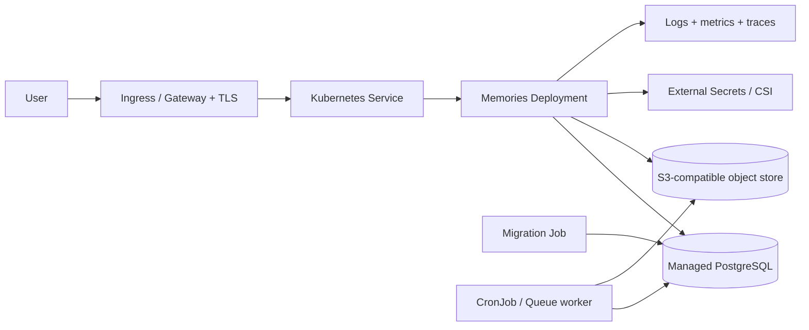

# Kubernetes 部署

> **相容性：** 需要 production container、portable media adapter 與 explicit background-job model。  
> **建議：** 只有已具備 Kubernetes 平台、監控、備份與值班能力時採用。  
> **Database：** 優先 managed PostgreSQL，不在同一 cluster 自架 production DB，除非有成熟 operator/backup 能力。

## 1. 架構



## 2. 前置條件

- Managed cluster 或成熟 on-prem cluster。
- Container registry。
- Ingress Controller 或 Gateway API。
- cert-manager／managed certificate。
- ExternalDNS（optional）。
- External Secrets Operator 或 Secrets Store CSI Driver。
- Managed PostgreSQL。
- S3-compatible object storage adapter。
- Metrics Server／Prometheus。
- Central logs。
- Backup/restore tooling。

## 3. Namespace

```yaml
apiVersion: v1
kind: Namespace
metadata:
  name: wedding-prod
  labels:
    app.kubernetes.io/part-of: wedding-platform
```

```bash
kubectl apply -f namespace.yaml
```

Dev、staging、prod 建議分 cluster/account；至少分 namespace、database、bucket、identity 與 secrets。

## 4. Runtime identity

使用 cloud workload identity：

| Cloud | Pattern |
| --- | --- |
| GKE | Workload Identity Federation for GKE |
| EKS | IAM Roles for Service Accounts／Pod Identity |
| AKS | Microsoft Entra Workload ID |
| OKE | Workload identity/resource principal patterns |
| On-prem | Vault、short-lived credentials、MinIO service account |

不要把 long-lived cloud key 放 Kubernetes Secret，除非沒有更安全替代且有 rotation。

ServiceAccount：

```yaml
apiVersion: v1
kind: ServiceAccount
metadata:
  name: wedding-memories
  namespace: wedding-prod
  annotations:
    provider-specific-workload-identity: runtime-role
```

## 5. Config 與 Secret

ConfigMap 只放非敏感設定：

```yaml
apiVersion: v1
kind: ConfigMap
metadata:
  name: wedding-memories-config
  namespace: wedding-prod
data:
  NODE_ENV: production
  PORT: "8080"
  MEMORIES_BASE_PATH: /Memories
  MEDIA_PROVIDER: s3
  MEDIA_BUCKET_OR_ROOT: wedding-media-prod
```

Secret 建議由 External Secrets 產生：

```yaml
apiVersion: external-secrets.io/v1beta1
kind: ExternalSecret
metadata:
  name: wedding-memories-secrets
  namespace: wedding-prod
spec:
  refreshInterval: 1h
  secretStoreRef:
    name: production-secret-store
    kind: ClusterSecretStore
  target:
    name: wedding-memories-secrets
  data:
    - secretKey: DATABASE_URL
      remoteRef:
        key: wedding/prod/database-url
    - secretKey: MEMORIES_ADMIN_TOKEN
      remoteRef:
        key: wedding/prod/admin-token
```

## 6. Deployment

```yaml
apiVersion: apps/v1
kind: Deployment
metadata:
  name: wedding-memories
  namespace: wedding-prod
spec:
  replicas: 2
  revisionHistoryLimit: 5
  strategy:
    type: RollingUpdate
    rollingUpdate:
      maxUnavailable: 0
      maxSurge: 1
  selector:
    matchLabels:
      app: wedding-memories
  template:
    metadata:
      labels:
        app: wedding-memories
    spec:
      serviceAccountName: wedding-memories
      terminationGracePeriodSeconds: 30
      securityContext:
        runAsNonRoot: true
        seccompProfile:
          type: RuntimeDefault
      containers:
        - name: app
          image: registry.example.com/wedding-memories@sha256:REPLACE
          imagePullPolicy: IfNotPresent
          ports:
            - name: http
              containerPort: 8080
          envFrom:
            - configMapRef:
                name: wedding-memories-config
            - secretRef:
                name: wedding-memories-secrets
          resources:
            requests:
              cpu: 250m
              memory: 512Mi
            limits:
              cpu: "1"
              memory: 2Gi
          readinessProbe:
            httpGet:
              path: /Memories/api/health
              port: http
            initialDelaySeconds: 5
            periodSeconds: 10
            timeoutSeconds: 3
            failureThreshold: 6
          livenessProbe:
            httpGet:
              path: /Memories/api/health
              port: http
            initialDelaySeconds: 30
            periodSeconds: 20
            timeoutSeconds: 3
            failureThreshold: 3
          startupProbe:
            httpGet:
              path: /Memories/api/health
              port: http
            periodSeconds: 5
            failureThreshold: 24
          securityContext:
            allowPrivilegeEscalation: false
            readOnlyRootFilesystem: true
            capabilities:
              drop: ["ALL"]
          volumeMounts:
            - name: tmp
              mountPath: /tmp
      volumes:
        - name: tmp
          emptyDir:
            sizeLimit: 2Gi
```

若 image 目前必須以 root 或需其他 writable path，先修 container，再啟用 strict security context。不要盲目套用造成 production crash。

## 7. Service

```yaml
apiVersion: v1
kind: Service
metadata:
  name: wedding-memories
  namespace: wedding-prod
spec:
  selector:
    app: wedding-memories
  ports:
    - name: http
      port: 80
      targetPort: http
```

## 8. Ingress

以 generic Ingress 為例：

```yaml
apiVersion: networking.k8s.io/v1
kind: Ingress
metadata:
  name: wedding
  namespace: wedding-prod
  annotations:
    cert-manager.io/cluster-issuer: letsencrypt-prod
spec:
  tls:
    - hosts: [wedding.example.com]
      secretName: wedding-tls
  rules:
    - host: wedding.example.com
      http:
        paths:
          - path: /Memories
            pathType: Prefix
            backend:
              service:
                name: wedding-memories
                port:
                  name: http
```

Ingress Controller 必須保留 canonical `/Memories` path。若要同時服務 invitation/legacy API，加入獨立 services 與 paths。

## 9. Migration Job

```yaml
apiVersion: batch/v1
kind: Job
metadata:
  name: wedding-memories-migrate-RELEASE
  namespace: wedding-prod
spec:
  backoffLimit: 0
  ttlSecondsAfterFinished: 86400
  template:
    spec:
      restartPolicy: Never
      serviceAccountName: wedding-memories
      containers:
        - name: migrate
          image: registry.example.com/wedding-memories@sha256:REPLACE
          command: ["pnpm"]
          args: ["--filter", "@workspace/memories-album", "db:migrate"]
          envFrom:
            - secretRef:
                name: wedding-memories-secrets
```

Production image 若不含 pnpm/workspace source，改用 Node migration entrypoint。

執行：

```bash
kubectl apply -f migration-job.yaml
kubectl wait --for=condition=complete job/wedding-memories-migrate-RELEASE \
  -n wedding-prod --timeout=10m
kubectl logs job/wedding-memories-migrate-RELEASE -n wedding-prod
```

Migration 成功後才 rollout Deployment。

## 10. Background work

### CronJob

```yaml
apiVersion: batch/v1
kind: CronJob
metadata:
  name: wedding-thumbnail-backfill
  namespace: wedding-prod
spec:
  schedule: "*/5 * * * *"
  concurrencyPolicy: Forbid
  successfulJobsHistoryLimit: 2
  failedJobsHistoryLimit: 3
  jobTemplate:
    spec:
      backoffLimit: 2
      template:
        spec:
          restartPolicy: Never
          serviceAccountName: wedding-memories
          containers:
            - name: worker
              image: registry.example.com/wedding-memories@sha256:REPLACE
              command: ["node", "dist/worker.mjs"]
```

Current repository 若尚無 portable worker entrypoint，不能直接使用此範例。需先抽離 background service。

更佳方案：queue + worker Deployment + KEDA。

## 11. HPA 與 capacity

```yaml
apiVersion: autoscaling/v2
kind: HorizontalPodAutoscaler
metadata:
  name: wedding-memories
  namespace: wedding-prod
spec:
  scaleTargetRef:
    apiVersion: apps/v1
    kind: Deployment
    name: wedding-memories
  minReplicas: 2
  maxReplicas: 10
  metrics:
    - type: Resource
      resource:
        name: cpu
        target:
          type: Utilization
          averageUtilization: 65
```

Database connection budget：

```text
maxReplicas × poolMax + migration/jobs + operator connections < DB limit
```

## 12. PodDisruptionBudget

```yaml
apiVersion: policy/v1
kind: PodDisruptionBudget
metadata:
  name: wedding-memories
  namespace: wedding-prod
spec:
  minAvailable: 1
  selector:
    matchLabels:
      app: wedding-memories
```

## 13. NetworkPolicy

```yaml
apiVersion: networking.k8s.io/v1
kind: NetworkPolicy
metadata:
  name: wedding-memories
  namespace: wedding-prod
spec:
  podSelector:
    matchLabels:
      app: wedding-memories
  policyTypes: [Ingress, Egress]
  ingress:
    - from:
        - namespaceSelector:
            matchLabels:
              kubernetes.io/metadata.name: ingress-nginx
      ports:
        - protocol: TCP
          port: 8080
  egress:
    - to:
        - ipBlock:
            cidr: DB_PRIVATE_CIDR
      ports:
        - protocol: TCP
          port: 5432
```

Object store/Secret Manager egress 需依 provider endpoints 補上。先確保 CNI 支援 NetworkPolicy。

## 14. Observability

- Prometheus metrics；
- kube-state-metrics；
- container CPU/memory/restart；
- Ingress request/5xx/latency；
- centralized stdout logs；
- OpenTelemetry optional；
- external uptime check；
- alert on Job/CronJob failure；
- database/object-store provider metrics。

## 15. GitOps

推薦：

- Helm/Kustomize；
- Argo CD/Flux；
- image digest update；
- environment overlays；
- sealed/external secrets；
- PR review；
- policy-as-code；
- rollout history。

不要讓 CI 使用 cluster-admin。

## 16. Rollout/rollback

```bash
kubectl rollout status deployment/wedding-memories -n wedding-prod
kubectl rollout history deployment/wedding-memories -n wedding-prod
kubectl rollout undo deployment/wedding-memories -n wedding-prod
```

先確認 schema compatibility。更成熟可使用 Argo Rollouts 做 canary/blue-green。

## 17. Backup

- Managed PostgreSQL backup/PITR；
- object storage versioning/replication；
- GitOps repository；
- Secret Manager recovery；
- cluster manifests；
- Velero 只補 cluster resources，不取代 DB/media backups。

## 18. 驗收

- [ ] Pods ready / no restart loop
- [ ] Ingress TLS
- [ ] Health probes
- [ ] Database private connection
- [ ] Object storage read/write
- [ ] Secret workload identity
- [ ] Migration Job success
- [ ] Albums/labels/guestbook/admin
- [ ] Browser gate
- [ ] HPA/PDB/NetworkPolicy
- [ ] Logs/metrics/alerts
- [ ] Rollback and restore drill

## 19. 官方參考

- Deployments: https://kubernetes.io/docs/concepts/workloads/controllers/deployment/
- Services: https://kubernetes.io/docs/concepts/services-networking/service/
- Ingress: https://kubernetes.io/docs/concepts/services-networking/ingress/
- Liveness/readiness/startup probes: https://kubernetes.io/docs/concepts/configuration/liveness-readiness-startup-probes/
- Jobs: https://kubernetes.io/docs/concepts/workloads/controllers/job/
- CronJobs: https://kubernetes.io/docs/concepts/workloads/controllers/cron-jobs/
- Secrets: https://kubernetes.io/docs/concepts/configuration/secret/
- NetworkPolicy: https://kubernetes.io/docs/concepts/services-networking/network-policies/
