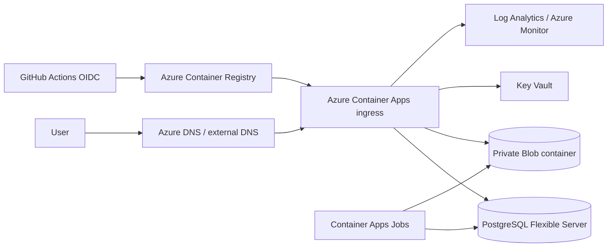

# Microsoft Azure 部署

> **推薦 topology：** Azure Container Apps + Azure Container Registry + Azure Database for PostgreSQL Flexible Server + Key Vault + Blob Storage + Log Analytics。  
> **Media prerequisite：** 實作 Azure Blob Storage adapter；Replit Connector 不能直接沿用。  
> **適合：** Microsoft Entra ID、managed identity、RBAC 與企業 Azure 治理環境。

## 1. 架構



## 2. CLI 與變數

```bash
az login
az account set --subscription SUBSCRIPTION_ID
az extension add --name containerapp --upgrade

export LOCATION=australiaeast
export RESOURCE_GROUP=wedding-prod
export ACR_NAME=weddingregistry123
export ENVIRONMENT=wedding-prod-env
export APP_NAME=wedding-memories
```

建立 resource group：

```bash
az group create --name "$RESOURCE_GROUP" --location "$LOCATION"
```

## 3. Log Analytics 與 Container Apps environment

```bash
LOG_WORKSPACE=wedding-prod-logs

az monitor log-analytics workspace create \
  --resource-group "$RESOURCE_GROUP" \
  --workspace-name "$LOG_WORKSPACE" \
  --location "$LOCATION"

WORKSPACE_ID=$(az monitor log-analytics workspace show \
  --resource-group "$RESOURCE_GROUP" \
  --workspace-name "$LOG_WORKSPACE" \
  --query customerId -o tsv)

WORKSPACE_KEY=$(az monitor log-analytics workspace get-shared-keys \
  --resource-group "$RESOURCE_GROUP" \
  --workspace-name "$LOG_WORKSPACE" \
  --query primarySharedKey -o tsv)

az containerapp env create \
  --name "$ENVIRONMENT" \
  --resource-group "$RESOURCE_GROUP" \
  --location "$LOCATION" \
  --logs-workspace-id "$WORKSPACE_ID" \
  --logs-workspace-key "$WORKSPACE_KEY"
```

Production 若要求 private network，建立 VNet-integrated environment 與 private endpoints。

## 4. Azure Container Registry

```bash
az acr create \
  --resource-group "$RESOURCE_GROUP" \
  --name "$ACR_NAME" \
  --sku Standard \
  --admin-enabled false

az acr login --name "$ACR_NAME"

IMAGE="$ACR_NAME.azurecr.io/wedding-memories:$(git rev-parse --short HEAD)"
docker build -t "$IMAGE" .
docker push "$IMAGE"
```

Production 以 digest 部署；啟用 Defender/image scanning 依治理需求。

## 5. PostgreSQL Flexible Server

```bash
PG_SERVER=wedding-prod-pg
PG_DB=memories
PG_ADMIN=memoriesadmin

az postgres flexible-server create \
  --resource-group "$RESOURCE_GROUP" \
  --name "$PG_SERVER" \
  --location "$LOCATION" \
  --admin-user "$PG_ADMIN" \
  --admin-password '<temporary-secret>' \
  --sku-name Standard_B2ms \
  --tier Burstable \
  --version 16 \
  --storage-size 32 \
  --backup-retention 14 \
  --database-name "$PG_DB" \
  --public-access none
```

Production 建議：

- private access/VNet integration；
- zone-redundant HA 依 RTO；
- geo-redundant backup 依 region；
- TLS；
- app runtime user，不用 admin user；
- pool max 依 Container Apps max replicas 計算。

## 6. Key Vault

```bash
KEY_VAULT=wedding-prod-kv-123

az keyvault create \
  --name "$KEY_VAULT" \
  --resource-group "$RESOURCE_GROUP" \
  --location "$LOCATION" \
  --enable-rbac-authorization true

az keyvault secret set \
  --vault-name "$KEY_VAULT" \
  --name DATABASE-URL \
  --value 'postgresql://...'

az keyvault secret set \
  --vault-name "$KEY_VAULT" \
  --name MEMORIES-ADMIN-TOKEN \
  --value "$(openssl rand -base64 48)"
```

## 7. Blob Storage

需要 Azure adapter。

```bash
STORAGE_ACCOUNT=weddingmedia123
CONTAINER=wedding-prod

az storage account create \
  --name "$STORAGE_ACCOUNT" \
  --resource-group "$RESOURCE_GROUP" \
  --location "$LOCATION" \
  --sku Standard_ZRS \
  --kind StorageV2 \
  --allow-blob-public-access false \
  --min-tls-version TLS1_2

az storage container create \
  --name "$CONTAINER" \
  --account-name "$STORAGE_ACCOUNT" \
  --auth-mode login

az storage account blob-service-properties update \
  --account-name "$STORAGE_ACCOUNT" \
  --enable-versioning true
```

建議：

- private endpoint；
- soft delete/versioning；
- lifecycle；
- user delegation SAS only when needed；
- managed identity data role；
- no account key in app environment。

## 8. 建立 Container App 與 managed identity

快速建立：

```bash
az containerapp create \
  --name "$APP_NAME" \
  --resource-group "$RESOURCE_GROUP" \
  --environment "$ENVIRONMENT" \
  --image "$IMAGE" \
  --target-port 8080 \
  --ingress external \
  --min-replicas 0 \
  --max-replicas 5 \
  --cpu 1.0 \
  --memory 2Gi \
  --system-assigned \
  --env-vars \
    NODE_ENV=production \
    MEMORIES_BASE_PATH=/Memories \
    MEDIA_PROVIDER=azure \
    MEDIA_BUCKET_OR_ROOT="$CONTAINER" \
    AZURE_STORAGE_ACCOUNT="$STORAGE_ACCOUNT"
```

取得 identity：

```bash
PRINCIPAL_ID=$(az containerapp show \
  --name "$APP_NAME" \
  --resource-group "$RESOURCE_GROUP" \
  --query identity.principalId -o tsv)
```

授予 Key Vault read：

```bash
KV_ID=$(az keyvault show --name "$KEY_VAULT" --query id -o tsv)
az role assignment create \
  --assignee-object-id "$PRINCIPAL_ID" \
  --assignee-principal-type ServicePrincipal \
  --role "Key Vault Secrets User" \
  --scope "$KV_ID"
```

授予 Blob data：

```bash
STORAGE_ID=$(az storage account show \
  --name "$STORAGE_ACCOUNT" \
  --resource-group "$RESOURCE_GROUP" \
  --query id -o tsv)

az role assignment create \
  --assignee-object-id "$PRINCIPAL_ID" \
  --assignee-principal-type ServicePrincipal \
  --role "Storage Blob Data Contributor" \
  --scope "$STORAGE_ID"
```

## 9. Key Vault references

Container Apps secret 可引用 Key Vault：

```bash
az containerapp secret set \
  --name "$APP_NAME" \
  --resource-group "$RESOURCE_GROUP" \
  --secrets \
    database-url="keyvaultref:https://$KEY_VAULT.vault.azure.net/secrets/DATABASE-URL,identityref:system" \
    admin-token="keyvaultref:https://$KEY_VAULT.vault.azure.net/secrets/MEMORIES-ADMIN-TOKEN,identityref:system"

az containerapp update \
  --name "$APP_NAME" \
  --resource-group "$RESOURCE_GROUP" \
  --set-env-vars \
    DATABASE_URL=secretref:database-url \
    MEMORIES_ADMIN_TOKEN=secretref:admin-token
```

Key Vault reference syntax/CLI behavior會更新；執行前以 current Microsoft Learn 與 `az containerapp secret set --help` 驗證。

## 10. Health、scale 與 revision

設定 ingress health probes 可用 ARM/Bicep/Terraform 或 YAML：

```yaml
probes:
  - type: Liveness
    httpGet:
      path: /Memories/api/health
      port: 8080
    initialDelaySeconds: 30
    periodSeconds: 20
  - type: Readiness
    httpGet:
      path: /Memories/api/health
      port: 8080
    initialDelaySeconds: 10
    periodSeconds: 10
```

Container Apps revisions 支援 traffic split。使用 multiple revision mode 做 canary，再將 100% traffic 指向驗證後 revision。

## 11. Migration Job

建立 Container Apps Job，使用相同 image/identity/network/secrets，command 改為 migration entrypoint：

```bash
az containerapp job create \
  --name wedding-memories-migrate \
  --resource-group "$RESOURCE_GROUP" \
  --environment "$ENVIRONMENT" \
  --trigger-type Manual \
  --replica-timeout 600 \
  --replica-retry-limit 0 \
  --image "$IMAGE" \
  --cpu 1 \
  --memory 2Gi \
  --command pnpm \
  --args --filter @workspace/memories-album db:migrate
```

如果 production image 不含 pnpm/workspace source，提供 Node migration entrypoint。

執行：

```bash
az containerapp job start \
  --name wedding-memories-migrate \
  --resource-group "$RESOURCE_GROUP"
```

確認成功後才 deploy new app revision。

## 12. Background work

使用：

- Container Apps Jobs scheduled/event-driven；
- Service Bus／Storage Queue；
- KEDA scaler；
- DB lease/idempotency；
- Log Analytics alerts。

不要依賴 scale-to-zero web replica 常駐執行 sync。

## 13. Custom domain/TLS

1. 將 custom domain 加到 Container App。
2. 建 DNS validation records。
3. 使用 managed certificate 或 Key Vault certificate。
4. 驗證 `/Memories` base path、forwarded headers、Secure cookie。

## 14. Monitoring

- Container Apps system/console logs；
- revision/replica restart；
- HTTP 5xx/latency；
- PostgreSQL connections/storage/CPU；
- Blob authorization/transactions；
- Key Vault access failures；
- Job failures；
- custom app metrics。

Log query 範例：

```kusto
ContainerAppConsoleLogs_CL
| where ContainerAppName_s == "wedding-memories"
| order by TimeGenerated desc
```

## 15. Rollback

列 revisions：

```bash
az containerapp revision list \
  --name "$APP_NAME" \
  --resource-group "$RESOURCE_GROUP" \
  -o table
```

將 traffic 切回 previous revision，或 activate previous/deactivate bad revision。先確認 migration compatibility。

## 16. 驗收

- [ ] Managed identity 可讀 Key Vault
- [ ] PostgreSQL private connection
- [ ] Blob read/write/versioning
- [ ] Health probe green
- [ ] Chinese/English routes
- [ ] Albums/labels/guestbook/photo viewer
- [ ] Admin login/tabs
- [ ] Browser gate
- [ ] Logs/alerts
- [ ] Backup/PITR
- [ ] Revision rollback

## 17. 官方參考

- Azure Container Apps overview: https://learn.microsoft.com/azure/container-apps/overview
- Deploy with `az containerapp up`: https://learn.microsoft.com/azure/container-apps/containerapp-up
- Deploy an existing container image: https://learn.microsoft.com/azure/container-apps/get-started-existing-container-image
- Container Apps secrets: https://learn.microsoft.com/azure/container-apps/manage-secrets
- Azure Database for PostgreSQL Flexible Server: https://learn.microsoft.com/azure/postgresql/flexible-server/overview
- Key Vault references in Container Apps: https://learn.microsoft.com/azure/container-apps/manage-secrets#reference-secret-from-key-vault
- Blob Storage security: https://learn.microsoft.com/azure/storage/blobs/security-recommendations
