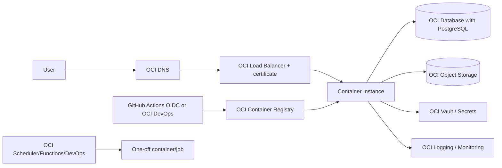

# Oracle Cloud Infrastructure 部署

> **推薦 topology：** OCI Container Instances + OCI Container Registry + OCI Database with PostgreSQL + Vault + Object Storage + Logging。  
> **Media prerequisite：** 實作 OCI Object Storage adapter；Replit Connector 不能直接沿用。  
> **適合：** 已使用 OCI tenancy、compartment、VCN 與 OCI 成本方案。

## 1. 架構



## 2. 前置條件

設定 OCI CLI：

```bash
oci setup config
oci iam region list
oci iam availability-domain list --compartment-id TENANCY_OCID
```

準備：

- tenancy；
- production compartment；
- VCN；
- public/private subnets；
- security lists/network security groups；
- service gateway、NAT gateway、internet gateway（依 topology）；
- DNS zone；
- runtime dynamic group/resource principal strategy。

## 3. Network

推薦：

| Resource | Subnet |
| --- | --- |
| Public Load Balancer | public subnet |
| Container Instance | private subnet |
| PostgreSQL | private subnet；注意 provider subnet constraints |
| Object Storage | service gateway/private access |
| Vault | service endpoint |

Container Instance 使用 private image registry 時，subnet 必須能存取 OCIR。OCI 官方文件指出：使用 OCIR 時可透過 VCN service gateway；使用外部 registry 則需 NAT 或 internet access。

Network Security Group：

- Load Balancer → app port 8080；
- App → PostgreSQL 5432；
- App → OCI service endpoints；
- 不公開 PostgreSQL；
- SSH 通常不需要進 container instance。

## 4. OCIR

取得 namespace：

```bash
NAMESPACE=$(oci os ns get --query data --raw-output)
REGION_KEY=<region-key>
REPOSITORY=wedding/memories
```

建立 repository：

```bash
oci artifacts container repository create \
  --compartment-id "$COMPARTMENT_OCID" \
  --display-name "$REPOSITORY" \
  --is-public false
```

登入：

```bash
docker login "$REGION_KEY.ocir.io"
```

通常 username 是 `<namespace>/<identity>`，password 使用 auth token。CI 更推薦 OIDC/federation 或 OCI DevOps，避免長期 user auth token。

Build/push：

```bash
IMAGE="$REGION_KEY.ocir.io/$NAMESPACE/$REPOSITORY:$(git rev-parse --short HEAD)"
docker build -t "$IMAGE" .
docker push "$IMAGE"
```

## 5. OCI Database with PostgreSQL

OCI Database with PostgreSQL 需要先準備：

- private subnet；
- Vault；
- key；
- database admin password secret；
- IAM policy；
- backup destination/retention。

建立可透過 Console、CLI、API 或 IaC。執行前確認 current region 支援與 subnet 限制。官方文件目前指出 database system subnet 不可啟用 IPv6；建立時需遵守 current service requirements。

建立後：

1. 建 `memories` database。
2. 建 application runtime user。
3. 只授予指定 schema CRUD。
4. 取得 private endpoint。
5. 建立 TLS connection string。
6. 存入 Vault。
7. 開 automated backups/PITR（依 provider current capability）。

## 6. Vault 與 Secret

建立 Vault、master encryption key、Secrets：

```text
DATABASE_URL
MEMORIES_ADMIN_TOKEN
```

Runtime identity 透過 resource principal 讀指定 secret。不要在 container definition 放 plaintext secret。

IAM policy concept：

```text
Allow dynamic-group wedding-memories-runtime to read secret-bundles in compartment wedding-prod
Allow dynamic-group wedding-memories-runtime to manage objects in compartment wedding-prod where target.bucket.name='wedding-media-prod'
Allow dynamic-group wedding-memories-runtime to read repos in compartment wedding-prod
```

實際 policy syntax 與 resource principal 支援需依 current OCI service/IAM docs 驗證。

## 7. Object Storage

需要 OCI adapter。

```bash
BUCKET=wedding-media-prod
NAMESPACE=$(oci os ns get --query data --raw-output)

oci os bucket create \
  --compartment-id "$COMPARTMENT_OCID" \
  --namespace-name "$NAMESPACE" \
  --name "$BUCKET" \
  --public-access-type NoPublicAccess \
  --storage-tier Standard \
  --versioning Enabled
```

建議：

- no public access；
- versioning；
- lifecycle；
- multipart upload；
- customer-managed key（依要求）；
- object inventory/checksum；
- retention rule（若需要）；
- Pre-Authenticated Request 只作短期/有限 scope，或由 app proxy media。

## 8. Container Instance

OCI CLI 需要 availability domain、shape、containers JSON、VNIC JSON：

```bash
SHAPE=CI.Standard.E4.Flex
SHAPE_CONFIG='{"ocpus":2,"memoryInGBs":4}'
CONTAINERS=$(cat <<JSON
[
  {
    "displayName": "wedding-memories",
    "imageUrl": "$IMAGE",
    "environmentVariables": {
      "NODE_ENV": "production",
      "PORT": "8080",
      "MEMORIES_BASE_PATH": "/Memories",
      "MEDIA_PROVIDER": "oci",
      "MEDIA_BUCKET_OR_ROOT": "$BUCKET",
      "OCI_NAMESPACE": "$NAMESPACE"
    }
  }
]
JSON
)

VNICS="[{\"subnetId\":\"$PRIVATE_SUBNET_OCID\"}]"

oci container-instances container-instance create \
  --compartment-id "$COMPARTMENT_OCID" \
  --availability-domain "$AVAILABILITY_DOMAIN" \
  --shape "$SHAPE" \
  --shape-config "$SHAPE_CONFIG" \
  --containers "$CONTAINERS" \
  --vnics "$VNICS" \
  --display-name wedding-memories-prod
```

Secret 注入需透過 application runtime 讀 Vault，或使用 OCI-supported secure config pattern。不要把 raw secret 放入 shell history/CLI JSON。

Container Instance ephemeral storage 不能保存 originals/database/logs。

## 9. Load Balancer

建立 OCI Flexible Load Balancer：

- public subnet；
- HTTPS listener 443；
- certificate；
- backend set 指向 Container Instance private IP:8080；
- health check `/Memories/api/health`；
- HTTP → HTTPS redirect；
- idle timeout 依 upload size/time；
- WAF optional。

若同時部署 invitation、Memories、legacy API，使用 path route policies 或分開 hostname。

## 10. Migration

Container Instance 不等於適合 one-off migration 的 orchestrator。選項：

1. OCI DevOps deployment stage 執行 migration container；
2. 臨時 Container Instance，成功後刪除；
3. OKE Job；
4. 管理 VM 內執行 audited migration image。

流程：

```text
backup → run migration once → inspect exit/log → deploy new app → verify
```

Migration identity 只需 DB 權限，不需要 broad tenancy admin。

## 11. Background work

選項：

- OCI Functions + Events/Scheduler；
- OCI DevOps scheduled build/deploy；
- OKE CronJob；
- Dedicated Container Instance worker；
- Queue service + idempotent worker。

Current background sync 若留在 web container，需確保 single-worker lock、no scale-to-zero assumption 與 restart recovery。

## 12. Logs 與 Monitoring

- OCI Logging for Container Instances/load balancer；
- Monitoring metrics；
- Alarms + Notifications；
- Database metrics/backups；
- Object Storage auth/operation audit；
- Audit service for IAM/Vault/bucket changes；
- synthetic health check。

Alerts：

- LB unhealthy backend；
- container restart；
- HTTP 5xx/latency；
- DB connection/storage；
- Vault access denied；
- Object Storage 4xx/5xx；
- migration/background job failed。

## 13. DNS/TLS

- OCI DNS A/AAAA/CNAME → Load Balancer。
- Certificate managed through Certificates service or load balancer config。
- Verify forwarded protocol、Secure cookie、base path。

## 14. Rollback

Container Instances 不像 revision-based serverless service 自帶 traffic revision。建議：

1. 每個 image 使用 immutable digest/tag。
2. 建新 Container Instance 或 update container image。
3. Load Balancer backend set 做 blue/green。
4. 驗證新 backend。
5. 切 traffic。
6. 保留舊 instance recovery window。
7. Rollback 時切回舊 backend。

Schema 必須 compatible。

## 15. 驗收

- [ ] Container 可從 private subnet pull OCIR image
- [ ] Runtime 可讀 Vault
- [ ] PostgreSQL private/TLS connection
- [ ] Object Storage read/write/versioning
- [ ] Load Balancer health green
- [ ] Chinese/English routes
- [ ] Albums/labels/guestbook/photo viewer
- [ ] Admin login/tabs
- [ ] Browser gate
- [ ] Logs/alarms
- [ ] Backup/restore
- [ ] Blue/green rollback

## 16. 官方參考

- Creating a Container Instance: https://docs.oracle.com/en-us/iaas/Content/container-instances/creating-a-container-instance.htm
- OCI Container Instances CLI: https://docs.oracle.com/en-us/iaas/tools/oci-cli/latest/oci_cli_docs/cmdref/container-instances/container-instance.html
- OCI Database with PostgreSQL create: https://docs.oracle.com/en-us/iaas/Content/postgresql/create-db.htm
- OCI Container Registry: https://docs.oracle.com/en-us/iaas/Content/Registry/home.htm
- OCI Object Storage: https://docs.oracle.com/en-us/iaas/Content/Object/home.htm
- OCI Vault: https://docs.oracle.com/en-us/iaas/Content/KeyManagement/home.htm
- OCI Load Balancer: https://docs.oracle.com/en-us/iaas/Content/Balance/home.htm
