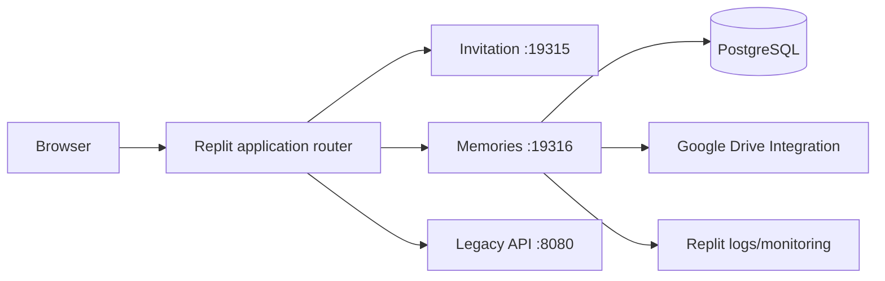

# Replit 部署

> **相容性：** Current repository 的首選與最少改動部署方式。  
> **Current target：** Replit application router + Autoscale deployment。  
> **Media：** Replit Google Drive Integration。

## 1. 架構



## 2. 前置條件

- Replit project 已連 GitHub repository。
- `.replit` 保留 current artifacts 與 workflow。
- Published App 可使用 Node.js 24 build/runtime。
- PostgreSQL 可用。
- Google Drive Integration 已連接正確 Google account。
- 該 account 對 production wedding root 與 `系統縮圖` 有 read/write 權限。
- Custom domain DNS 可管理。

## 3. Current `.replit` contract

Current configuration：

```toml
modules = ["nodejs-24", "python-base-3.13"]

[deployment]
router = "application"
deploymentTarget = "autoscale"
```

Memories workflow：

```toml
args = "pnpm --filter @workspace/memories-album run dev"
waitForPort = 19316

[workflows.workflow.tasks.env]
PORT = "19316"
MEMORIES_BASE_PATH = "/Memories"
```

不要把 production secret 寫進 `.replit`。

## 4. 建立 Secrets

在 Published App deployment settings 建立：

```text
DATABASE_URL
MEMORIES_DRIVE_PHOTOS_FOLDER_ID
MEMORIES_ADMIN_TOKEN
```

可選：

```text
MEMORIES_DRIVE_SYNC_INTERVAL_MS
MEMORIES_THUMBNAIL_BATCH_SIZE
MEMORIES_THUMBNAIL_MAX_PER_RUN
MEMORIES_TRUST_PROXY
```

重要：Workspace Secrets 不應被假設會自動成為 Published App Secrets。發佈前要在 deployment configuration 逐一確認。

## 5. 連接 Google Drive Integration

1. 在 Replit Integrations 連接 Google Drive。
2. 使用具有婚禮 root folder editor 權限的 account。
3. 確認可讀寫：

```text
00 未分類
訪客上傳
生活照
系統縮圖
```

4. 在 Development 使用安全測試 folder。
5. 發佈後用 production runtime 做一筆非破壞性 read/write 驗證。

錯誤分類：

| Code | 意義 | 處理 |
| --- | --- | --- |
| `DRIVE_AUTHORIZATION_REQUIRED` | 401/403、account/scope/folder permission | reconnect、確認 account 與 folder access |
| `DRIVE_RETRYABLE` | 429、5xx、timeout | bounded retry、檢查 quota/provider incident |

## 6. Database

1. 建立或連接 PostgreSQL。
2. 將 connection string 存為 `DATABASE_URL`。
3. 發布前 review migration。
4. Production startup 會在 listen 前執行 migration runner。
5. 不使用 `drizzle-kit push`。

手動驗證：

```bash
pnpm --filter @workspace/memories-album db:migrate
```

如果 Publish plan 顯示意外 `DROP TABLE`、`DROP COLUMN` 或 constraint removal，取消發佈。

## 7. Build 與發佈

在 repository root 驗證：

```bash
pnpm install --frozen-lockfile
pnpm run typecheck
pnpm run build
pnpm --filter @workspace/memories-album test
pnpm --filter @workspace/memories-album run test:layout-browser
pnpm --filter @workspace/memories-album build
```

Replit Published App 應使用 repository 已定義的 build/start contract。若 deployment UI 要求明確 command：

```text
Build: pnpm --filter @workspace/memories-album build
Run:   pnpm --filter @workspace/memories-album start
```

Application router 同時服務多 artifacts 時，保留 `.replit` 與 artifact routing config 為 source of truth。

## 8. Autoscale 或 Reserved VM

| 選項 | 適合 | 注意 |
| --- | --- | --- |
| Autoscale | 流量不固定、想降低 idle cost | background sync、cold start、多 instance DB pool |
| Reserved VM | 需要常駐 worker、固定資源 | 固定成本、需要 sizing |

Current `.replit` 使用 Autoscale。若 background synchronization 必須持續執行，需評估：

- 是否會 scale to zero；
- job 是否 idempotent；
- 多 instance advisory lock；
- 是否改用 Reserved VM 或外部 scheduler/job。

## 9. Custom domain

1. 在 Published App 加入 custom domain。
2. 依 Replit 顯示建立 DNS records。
3. 等待 DNS 與 certificate provisioning。
4. 驗證：

```text
https://<domain>/
https://<domain>/Memories/
https://<domain>/Memories/api/health
```

5. 驗證 cookie `Secure`、share preview、canonical route 與 redirect。

## 10. 發佈後驗收

- [ ] `/Memories/api/health` 200
- [ ] 中文與 English routes
- [ ] Albums、labels、processes、guestbook
- [ ] Bottom navigation fixed to visible viewport
- [ ] Thumbnail 與 original
- [ ] Upload dialog
- [ ] Admin login 與四個 tabs
- [ ] Google Drive read/write
- [ ] Logs 無 migration/Drive/browser error
- [ ] Custom domain TLS

## 11. Monitoring

觀察：

- deployment/restart；
- request 5xx；
- latency；
- PostgreSQL errors；
- Drive authorization/retryable errors；
- thumbnail backlog；
- memory/CPU；
- browser error reports。

Logs 不記：raw token、database URL、OAuth、folder ID、signed URL query。

## 12. Rollback

1. 記錄 last-known-good Git commit／deployment revision。
2. 確認 migration compatibility。
3. 在 Replit deployment history 選 previous revision 或重新 deploy known-good commit。
4. 驗證 health、public、admin、Drive。
5. 若 schema 已向前變更且舊 code 不相容，使用 forward fix。

## 13. 官方參考

- Replit Deployments overview: https://docs.replit.com/cloud-services/deployments/about-deployments
- Autoscale Deployments: https://docs.replit.com/cloud-services/deployments/autoscale-deployments
- Reserved VM Deployments: https://docs.replit.com/cloud-services/deployments/reserved-vm-deployments
- Custom domains: https://docs.replit.com/cloud-services/deployments/custom-domains
- Deployment troubleshooting: https://docs.replit.com/cloud-services/deployments/troubleshooting
