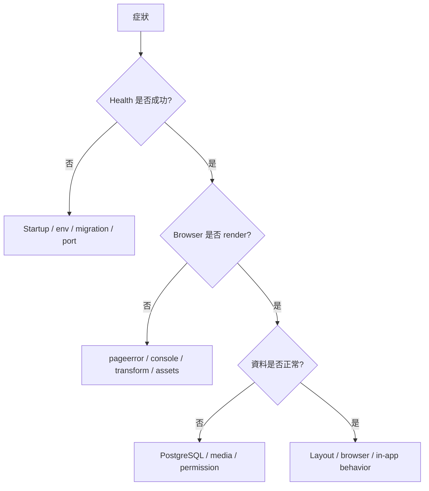

# 跨環境排錯手冊

## 1. 排錯原則

1. 記錄第一個真正錯誤、時間、environment、revision。
2. 先分類，不先改程式。
3. 保存 logs、trace、request ID、deployment event。
4. 只修已證明的 root cause。
5. 修後執行相關測試、production build、browser validation。
6. 更新 runbook。



## 2. Process 無法啟動

| 症狀 | 檢查 | 修正 |
| --- | --- | --- |
| `EADDRINUSE` | port 被占用 | 停舊 process 或使用 provider `PORT` |
| 立即 exit | missing env、native module、migration | 看第一段 stderr |
| Provider health timeout | listen address/path | listen `0.0.0.0:$PORT`，health path 正確 |
| Sharp load failure | platform binary/Node version | rebuild image for target architecture |
| Permission denied | non-root + writable path | 提供 `/tmp` 或修 filesystem permission |

## 3. Health 失敗

```bash
curl -v http://127.0.0.1:PORT/Memories/api/health
```

檢查：

- server 是否 listen；
- base path；
- reverse proxy 是否 strip path；
- health 是否需要 authentication（不應）；
- migration 是否阻擋 startup；
- liveness timeout 是否太短。

不要使用 `/Memories/admin`、redirect route 或 full public page 作 liveness。

## 4. Health 正常但畫面空白

優先看 browser：

1. DevTools Console 第一個 exception。
2. Network 中 JS/CSS 404。
3. `pageerror`。
4. React Error Boundary。
5. production source map/transform output。
6. base path 與 asset URL。
7. CSP blocked resource。

Build/health 只能證明檔案可以送出，不能證明 React render 成功。

## 5. Database connection

| Error | 意義 |
| --- | --- |
| `ECONNREFUSED` | host/port/network/service 未開 |
| timeout | firewall/security group/private route |
| password authentication failed | wrong credential/user/rotation |
| certificate error | CA/hostname/sslmode |
| too many connections | pool × replicas 超限 |
| relation does not exist | migration 未執行/錯 DB |

檢查：

```bash
psql "$DATABASE_URL" -c 'select now(), current_database(), current_user;'
```

Serverless/container：

```text
max instances × pool max + jobs + operators < DB connection limit
```

## 6. Migration 問題

### Checksum mismatch

代表已套用 migration 被修改。修正：還原原檔，新增下一個 migration。不要更新 checksum 欺騙 runner。

### Advisory lock timeout

- 是否多個 release 同時 deploy；
- 是否 stuck migration session；
- 是否 background job 誤用同 lock。

### Publish plan 有 DROP

停止，取得 backup，比對 migration/schema，不直接繼續。

## 7. Google Drive

### `DRIVE_AUTHORIZATION_REQUIRED`

- Integration 需 reconnect；
- 連錯 account；
- root／`系統縮圖` 無 editor；
- scope/Shared Drive restriction。

若整批都相同 code，優先 account/permission，不把每張視為壞檔。

### `DRIVE_RETRYABLE`

- 429；
- 5xx；
- connector timeout。

使用 bounded retry/backoff，觀察 provider status/quota。

### 同步 completed 但有 failures

看：

```text
attempted
createdOrAttached
failureCount
failureCodes
```

`completed` 只代表 job 結束。

## 8. Object storage

| 問題 | 檢查 |
| --- | --- |
| 403 | runtime IAM、bucket policy、KMS key、prefix |
| 404 | key mapping、version、eventual consistency assumption |
| multipart stuck | upload ID state、lifecycle、retry |
| signed URL invalid | clock、region、credential、encoding、expiry |
| CORS | browser direct-upload origin/method/header |
| public exposure | public access block/container policy |

App proxy media 時通常不需要 public bucket CORS。

## 9. Thumbnail 問題

1. Original 存在嗎？
2. Media adapter read 可以嗎？
3. Sharp decode 是否支援格式？
4. Pixel/memory limit？
5. Derivative write permission？
6. Output 可讀嗎？
7. DB thumbnail reference 是否成功 commit？
8. Cache 是否仍保留 404？

大批 backfill 要限制 concurrency，避免 memory、provider rate limit 與 egress spike。

## 10. Upload 問題

| 症狀 | 方向 |
| --- | --- |
| 413 | edge/app byte limit |
| 400 unsupported | MIME/magic bytes/format |
| request abort | parser cleanup/timeout |
| duplicate | clientUploadId/content hash/idempotency |
| original exists classification missing | 補 relation，不重傳 original |
| mobile picker fails | in-app browser permissions/HEIC/input behavior |
| stuck retry | durable state/lease/deferred pass |

檢查 proxy、load balancer、platform request timeout 是否小於 upload 所需時間。

## 11. Admin login

- Secret 是否在 deployment environment；
- HTTPS；
- `Secure` cookie；
- proxy `X-Forwarded-Proto`；
- cookie Path `/Memories/admin`；
- rate limit；
- multiple replicas 是否共用 signing secret；
- clock skew；
- old session expired。

不要把 session 改存 localStorage 作修正。

## 12. Fixed bottom navigation／In-App Browser

- CSS ancestor 是否有 `transform`、`filter`、`perspective`、containment，造成 fixed containing block；
- dynamic viewport units；
- safe-area inset；
- keyboard；
- visual viewport vs layout viewport；
- orientation；
- background/resume；
- nested scrolling container。

Automated UA profile pass 後仍需真機 screen recording。

## 13. Horizontal overflow

在 browser console：

```js
[...document.querySelectorAll('*')]
  .filter((el) => el.getBoundingClientRect().right > document.documentElement.clientWidth + 1)
  .map((el) => ({ el, rect: el.getBoundingClientRect() }));
```

常見來源：

- imported Word table/image fixed width；
- `100vw` 加 scrollbar；
- absolute/fixed element；
- long filename/URL；
- grid min-content；
- process selector outside content column。

## 14. Cloud-specific quick checks

### Replit

- Published App Secrets 是否存在；
- Drive Integration 是否連到 Published runtime；
- artifact port/router；
- deployment logs；
- autoscale cold start。

### Google Cloud

```bash
gcloud run services describe SERVICE --region REGION
gcloud run revisions list --service SERVICE --region REGION
gcloud logging read 'resource.type="cloud_run_revision"' --limit 50
```

### AWS

```bash
aws ecs describe-services --cluster CLUSTER --services SERVICE
aws ecs describe-tasks --cluster CLUSTER --tasks TASK_ARN
aws elbv2 describe-target-health --target-group-arn ARN
```

### Azure

```bash
az containerapp revision list -g RG -n APP -o table
az containerapp logs show -g RG -n APP --follow
```

### OCI

```bash
oci container-instances container-instance get --container-instance-id OCID
oci lb backend-health get --load-balancer-id LB_OCID --backend-set-name NAME
```

### Kubernetes

```bash
kubectl get pods -n wedding-prod
kubectl describe pod POD -n wedding-prod
kubectl logs POD -n wedding-prod --previous
kubectl get events -n wedding-prod --sort-by=.lastTimestamp
```

## 15. 回滾判斷

立即 rollback 若：

- broad blank page；
- data corruption；
- upload destructive behavior；
- admin auth bypass；
- significant 5xx；
- native module crash loop；
- migration 以外 code regression 且 previous revision compatible。

不要 rollback 到無法理解 current schema 的 code。
